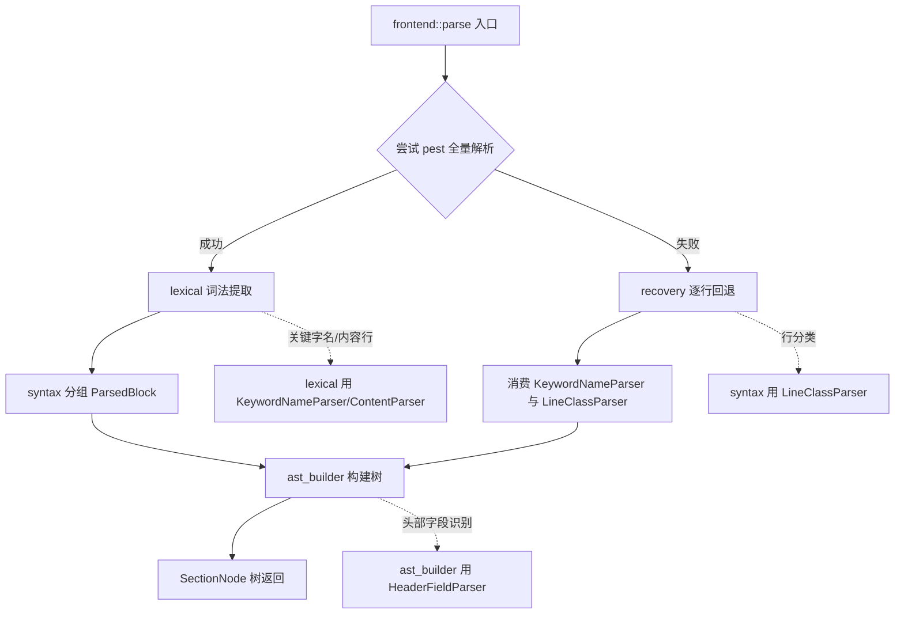

# Frontend 功能特性架构（v3：统一功能 trait）

## 1. 核心思路

不再保留独立的 `compat` 模块，也不区分 `Compat*` 与普通 struct。
每个流水线步骤把自身的能力定义为**功能特性 trait**，由一个步骤载体
（carrier）实现；功能特性的组织方式由该步骤的**接口函数**（如
`extract_line_content`）负责。只有真正需要适配特殊需求时才新增不同的 trait。

## 2. 各步骤的功能特性

| 步骤 | 载体 (carrier) | 功能特性 trait | 接口函数 |
|------|----------------|----------------|----------|
| [`lexical_analysis`](crates/ibis2ibstoml/src/frontend/lexical_analysis.rs:1) | `LexicalAnalysis` | `KeywordNameParser`（读关键字名） | `extract_keyword_name` |
| [`lexical_analysis`](crates/ibis2ibstoml/src/frontend/lexical_analysis.rs:1) | `LexicalAnalysis` | `ContentParser`（读内容行规整文本） | `extract_line_content` |
| [`syntax_analysis`](crates/ibis2ibstoml/src/frontend/syntax_analysis.rs:1) | `SyntaxAnalysis` | `LineClassParser`（行分类：续行/注释） | — |
| [`ast_builder`](crates/ibis2ibstoml/src/frontend/ast_builder.rs:1) | `AstBuilder` | `HeaderFieldParser`（文件头字段识别） | `header_detection::is_file_header_field` |

## 3. 时机门控

[`frontend::parse`](crates/ibis2ibstoml/src/frontend/mod.rs:67) 持有各步骤的
载体实例（`LexicalAnalysis`、`SyntaxAnalysis`），按时机选择路径：

- **主路径**：pest 全量解析（lexical → syntax → AST）。
- **回退路径**：pest 失败时由 [`recovery`](crates/ibis2ibstoml/src/frontend/recovery.rs:1)
  消费 `KeywordNameParser` 与 `LineClassParser` 逐行解析，再复用同一 AST 构建器。

```rust
pub fn parse(content: &str) -> Result<Vec<SectionNode>, String> {
    let lexical = lexical_analysis::LexicalAnalysis;
    let syntax = syntax_analysis::SyntaxAnalysis;
    let blocks = match lexical_analysis::IbisParser::parse(Rule::ibis_file, content) {
        Ok(pairs) => syntax_analysis::group_pairs_to_blocks(pairs),
        Err(_) => recovery::recover_blocks(content, &lexical, &syntax),
    };
    Ok(build_tree_from_blocks(&blocks))
}
```

## 4. 语义约定

1. **大小写不敏感**：keyword 匹配一律按小写比对（`[ibis ver]` ≡ `[IBIS ver]`）。
   空格/特殊符号差异导致的匹配不上是输入文件问题，程序不纠错。
2. **下划线仅属 TOML 输出层**：分析层不解析/还原下划线；仅 emitter 在输出时
   `replace(' ', "_")`。
3. **`[Comment Char]` 中途改注释符：out-of-scope**，`|` 硬编码。
   `LineClassParser::parse_continuation_content` 作为保留能力，
   供未来多行字段 / `[Comment Char]` 处理使用（当前仅被单测覆盖）。

## 5. 注释规范

- 功能 trait / 接口函数注释说明：**功能是什么、为什么设计、属于哪一层级**。
- 不写"我如何实现/如何想到"的过程性描述。

## 6. 明确不做（out-of-scope）

- `[Comment Char]` 中途更换注释符号。
- 分析层对下划线的解析/还原。
- 由空格/特殊符号差异导致的 keyword 不匹配纠错。
- 为尚未出现的新需求预先定义 trait（需要时再加）。

## 7. Mermaid 流程图


