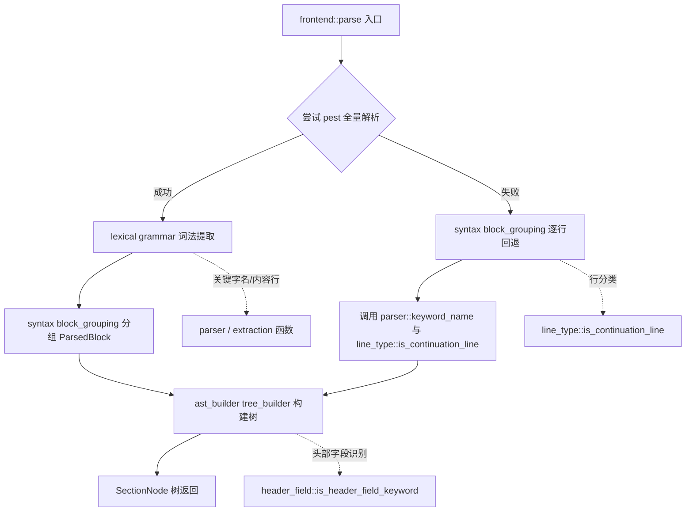

# Frontend 功能特性架构（v4：模块化普通函数）

## 1. 核心思路

不再保留独立的 `compat` 模块，也**不再使用 trait + carrier 抽象**。
每个流水线步骤把自身能力组织为**模块内的普通函数**（`fn`），各步骤通过显式
函数调用协作；只有跨阶段被消费的函数才通过 `pub use` / `pub(crate) use`
**re-export** 到阶段顶层。无状态的单函数能力（判断、提取、分组）直接用函数
表达，不需要 trait。

## 2. 各步骤的模块结构

| 步骤 | 顶层模块 | 内部组织 | 函数 / 类型 | 可见性 |
|------|----------|----------|-------------|--------|
| [`lexical_analysis`](crates/ibis2ibstoml/src/frontend/lexical_analysis.rs:1) | `grammar` | pest 语法绑定 | `IbisParser`、`Rule` | `pub` |
| | `parser` | 底层读取原语 | `keyword_name`、`parse_content_line` | `pub(crate)` |
| | `extraction` | pest-pair 适配 | `extract_keyword_name`、`extract_line_content` | `pub`（顶层 re-export） |
| [`syntax_analysis`](crates/ibis2ibstoml/src/frontend/syntax_analysis.rs:1) | `line_type` | 行类型分类（续行/注释等） | `is_continuation_line`、`parse_continuation_content` | `pub(crate)` |
| | `block_grouping` | 块分组（主路径 + 逐行回退） | `group_pairs_to_blocks`、`recover_blocks` | `pub`（顶层 re-export） |
| [`ast_builder`](crates/ibis2ibstoml/src/frontend/ast_builder.rs:1) | `ast_types` | 数据结构 | `NodeKind`、`SectionNode`、`ParsedBlock` | `pub` |
| | `header_field` | 文件头字段识别 | `is_header_field_keyword`、`is_file_header_field` | `pub(super)` |
| | `tree_builder` | 树构建 | `build_section_tree` | `pub`（顶层 re-export） |

**re-export 汇总**：

```rust
// lexical_analysis
pub use grammar::{IbisParser, Rule};
pub use extraction::{extract_keyword_name, extract_line_content};

// syntax_analysis
pub(crate) use block_grouping::group_pairs_to_blocks;
pub(crate) use block_grouping::recover_blocks;

// ast_builder
pub use ast_types::{NodeKind, ParsedBlock, SectionNode};
pub use tree_builder::build_section_tree;
```

## 3. 时机门控

[`frontend::parse`](crates/ibis2ibstoml/src/frontend/mod.rs:66) 不持有任何载体，
直接按时机选择路径：

- **主路径**：pest 全量解析（lexical → syntax → AST）。
- **回退路径**：pest 失败时由 syntax 阶段的
  [`syntax_analysis::recover_blocks`](crates/ibis2ibstoml/src/frontend/syntax_analysis.rs:1)
  直接调用 `parser::keyword_name` 与 `line_type::is_continuation_line`
  逐行解析，再复用同一 AST 构建器。

```rust
pub fn parse(content: &str) -> Result<Vec<SectionNode>, String> {
    let blocks = match lexical_analysis::IbisParser::parse(Rule::ibis_file, content) {
        Ok(pairs) => syntax_analysis::group_pairs_to_blocks(pairs),
        Err(_) => syntax_analysis::recover_blocks(content),
    };
    Ok(build_tree_from_blocks(&blocks))
}
```

## 4. 语义约定

1. **大小写不敏感**：keyword 匹配一律按小写比对（`[ibis ver]` ≡ `[IBIS ver]`）。
   空格/特殊符号差异导致的匹配不上是输入文件问题，程序不纠错。
2. **下划线仅属 TOML 输出层**：分析层不解析/还原下划线；仅 emitter 在输出时
   `replace(' ', "_")`。
3. **`[Comment Char]` 中途改注释符：out-of-scope**，`|` 硬编码。
   `line_type::parse_continuation_content` 作为保留能力，
   供未来多行字段 / `[Comment Char]` 处理使用（当前仅被单测覆盖）。

## 5. 注释规范

- `pub` 函数：完整 rustdoc 结构（`# Parameters` / `# Returns` / `# Errors` 等）。
- 私有函数（`pub(crate)` / `pub(super)` / 无修饰 `fn`）：精简注释，不超过 5 行、
  大部分 3 行左右，只强调输入输出。详见
  [`coding_standards.md`](coding_standards.md) §7.1.1。
- 不写"我如何实现/如何想到"的过程性描述。

## 6. 明确不做（out-of-scope）

- `[Comment Char]` 中途更换注释符号。
- 分析层对下划线的解析/还原。
- 由空格/特殊符号差异导致的 keyword 不匹配纠错。
- 为尚未出现的新需求预先定义抽象（trait / 接口层，需要时再加）。

## 7. Mermaid 流程图


