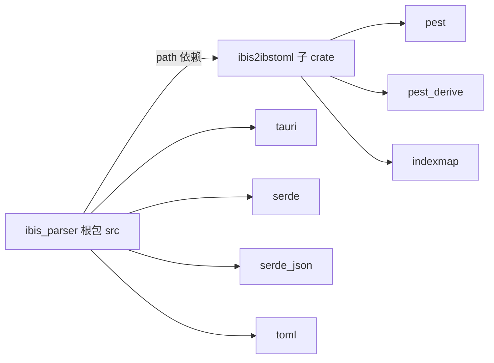
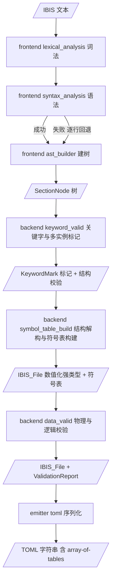
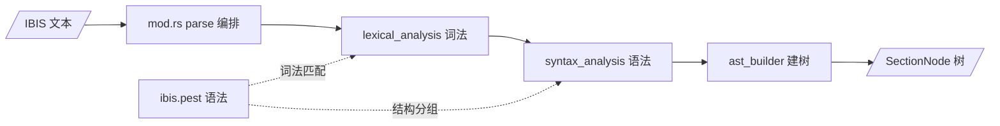
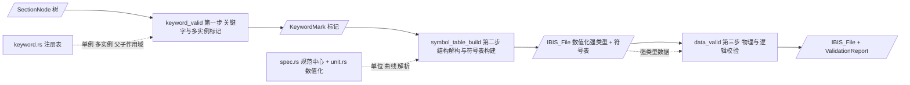
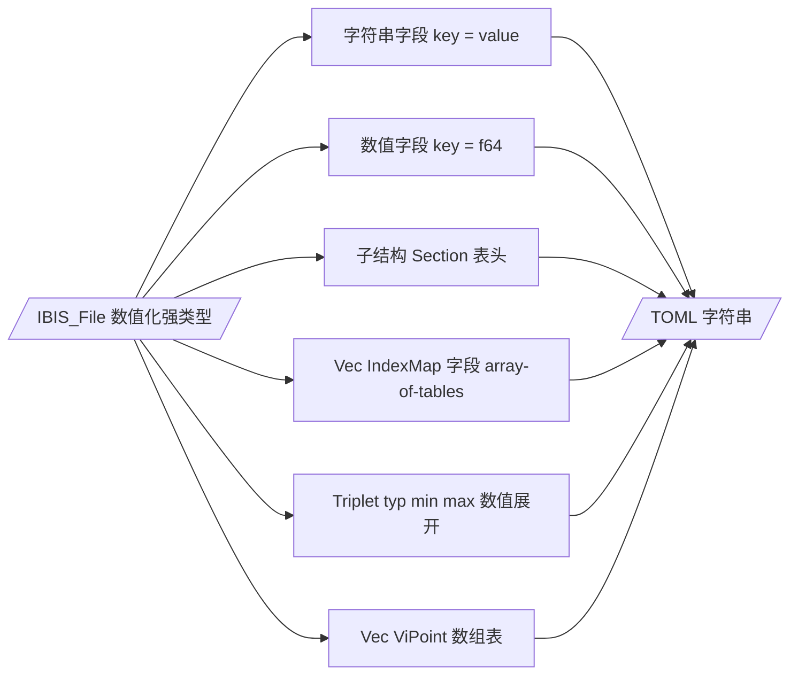

# ibis2ibstoml 架构书

> **本文档定位**：描述 `ibis2ibstoml` 独立 crate 的架构设计，是仓库中关于该 crate 的权威架构说明。
> 本文档描述**完整的三阶段流水线**：frontend（文本 → AST 树）→ backend（语义层：树 → 强类型 → 校验）→ emitter（强类型 → TOML）。
> 根包 `ibis_parser`（re-export 兼容层）另见 [`ibis_parser_architecture.md`](ibis_parser_architecture.md:1)。

---

## 目录

1. [总体架构说明](#1-总体架构说明)
   - [1.1 设计概述](#11-设计概述)
   - [1.2 目录结构](#12-目录结构)
   - [1.3 公共 API](#13-公共-api)
   - [1.4 数据流总览](#14-数据流总览)
2. [frontend](#2-frontend)
   - [2.1 模块设计思路](#21-模块设计思路)
   - [2.2 模块结构](#22-模块结构)
   - [2.3 数据结构](#23-数据结构)
   - [2.4 输入输出](#24-输入输出)
3. [backend](#3-backend)
   - [3.1 模块设计思路](#31-模块设计思路)
   - [3.2 模块结构](#32-模块结构)
   - [3.3 数据结构](#33-数据结构)
   - [3.4 输入输出](#34-输入输出)
4. [emitter](#4-emitter)
   - [4.1 模块设计思路](#41-模块设计思路)
   - [4.2 模块结构](#42-模块结构)
   - [4.3 数据结构](#43-数据结构)
   - [4.4 输入输出](#44-输入输出)
5. [测试策略](#5-测试策略)
6. [附录](#6-附录)
   - [6.1 语义约定](#61-语义约定)
   - [6.2 明确不做（out-of-scope）](#62-明确不做out-of-scope)
   - [6.3 关键决策记录（ADR）](#63-关键决策记录adr)
   - [6.4 参考文件](#64-参考文件)

---

# 1. 总体架构说明

## 1.1 设计概述

`ibis2ibstoml` 是从主 crate 拆分出的**第一遍格式整形层**，读入 IBIS 文本，输出**语义化 TOML** 字符串。

**核心能力**：frontend 把所有值保留为原始字符串；backend 语义层在此基础上执行**结构解构、数值化重建与语义校验**，产出数值化的强类型领域模型与符号表（[`IBIS_File`](../crates/ibis2ibstoml/src/backend/ibis_structure.rs:1)）；emitter 从强类型输出 TOML（含 `[[array-of-tables]]`）。

采用**三阶段流水线**：

1. **frontend** — 唯一公开接口 [`frontend::parse`](../crates/ibis2ibstoml/src/frontend/mod.rs:75)：IBIS 文本 → `SectionNode` AST 树。内部按词法 → 语法 → AST 建树三段式组织，各阶段能力为**模块内普通函数**（`fn`），不引入 trait / carrier 抽象。
2. **backend** — 语义层：消费 `SectionNode` 树，按「关键字与多实例标记（`keyword_valid`）→ 结构解构与符号表构建（`symbol_table_build`）→ 物理与逻辑数据校验（`data_valid`）」三阶段处理，产出数值化强类型 [`IBIS_File`](../crates/ibis2ibstoml/src/backend/ibis_structure.rs:1)。校验提供严格 / 宽松双模式。
3. **emitter** — 将强类型 `IBIS_File` 递归序列化为 TOML 字符串（含 `[[array-of-tables]]`）。

**backend 两条核心设计原则**（区别于旧版「字符串承载」推导）：

- **Rebuild 而非原地修改（In-place）**：AST 仅用作**一次性语法结构**，backend 只读解构它、不保留、不原地改写。在第二步中将其彻底解构并**重新构建（Rebuild）**为干净、强类型的领域模型与符号表（推荐使用 `indexmap` 以同时保证 $O(1)$ 查找和顺序保留）。
- **零字符串污染**：进入 backend 后，所有带工程单位的文本（如 `1.12p`、`10mA`、`3.3V`）**必须**被解析为标准浮点数（`f64`）；IV 曲线被解析为结构化的 [`Vec<ViPoint>`](../crates/ibis2ibstoml/src/backend/ibis_structure.rs:1)。字符串仅保留在**标识符类**字段（`model_name`、`signal_name`、文件名等）与**非数值文本**字段（`Model_type`、`Polarity`、`Notes` 等）。

> **命名约定**：强类型**沿用旧版命名**（`IBIS_File` / `IBIS_Component` / `IBIS_Model` / `PinInfo` / `Triplet<f64>` 等），仅新增 `ViPoint`（IV 曲线数据点）类型。重构的重点是**三步走流水线**与**零字符串污染**，而非类型改名。

**拆分动机**：

- **独立演进** — `ibis2ibstoml` 独立版本化、独立测试、独立发布
- **职责清晰** — 按 frontend → backend → emitter 分层，符合管道模型
- **编译隔离** — 主 crate 不再直接编译 pest 语法生成代码
- **可复用** — 其他工具链可直接依赖该 crate


## 1.2 目录结构

[`Cargo.toml`](../Cargo.toml:1) 定义 workspace：`members = ["crates/ibis2ibstoml"]`，`resolver = "3"`。根包 `ibis_parser` 通过 path 依赖 [`ibis2ibstoml`](../crates/ibis2ibstoml/Cargo.toml:1)。

| 引用方 | 用法 |
|--------|------|
| 根 [`src/lib.rs`](../src/lib.rs:31) | `pub use ibis2ibstoml;` — 根包重导出，兼容旧引用路径 |
| 根 [`src/main.rs`](../src/main.rs:8) | `use ibis2ibstoml::ibs2ibstoml;` 直接调用 |
| 根 [`src/ibis_parser/mod.rs`](../src/ibis_parser/mod.rs:8) | re-export 子 crate 数值化强类型（`ibis_parser::ibis_structure` 路径兼容） |
| 根 [`tests/header_parse_test.rs`](../tests/header_parse_test.rs:22) | `use ibis2ibstoml::frontend::{parse, NodeKind, SectionNode};` |
| crate 内部 [`tests/examples_compat_test.rs`](../crates/ibis2ibstoml/tests/examples_compat_test.rs:12) | `use ibis2ibstoml::parse_to_toml;` |

**依赖说明**：

- `pest` / `pest_derive` **仅存在于** ibis2ibstoml crate 内（语法生成只在其中发生）
- `indexmap` 提供保序集合（强类型模型与符号表中的 `IndexMap` 字段）
- TOML 输出为**手写序列化**，不依赖 `toml` crate
- **强类型领域模型** 定义于 `backend/ibis_structure.rs`，backend 各阶段与 emitter 共享
- 根包持有 `tauri` / `serde` / `serde_json` / `toml`，与 ibis2ibstoml 解耦



**crate 目录结构**：

```text
crates/ibis2ibstoml/
├── Cargo.toml                  # name = "ibis2ibstoml"，deps: pest, pest_derive, indexmap, serde, toml, validator
├── tests/
│   └── examples_compat_test.rs # 集成测试：真实样本 → 强类型 → 对照参考 .ibs.toml
└── src/
    ├── lib.rs                  # Crate 入口：parse_to_toml / ibs2ibstoml（流水线编排点）
    ├── schema/                 # ★ IBIS 规范唯一数据源（"抄手册"集中地）
    │   ├── mod.rs              # 加载 ibis_schema.toml → SectionSpec 树 + 辅助（normalize_keyword / find_root / find_child）
    │   ├── ibis_schema.toml    # IBIS 7.0 结构：keyword 树 + 同名 section + 字段类型（抄手册格式）
    │   └── model.rs            # 数值化强类型结构体（IBISFile/IBISModel/...）+ validator 声明式校验
    ├── frontend/
    │   ├── mod.rs              # 唯一公开接口 parse：IBIS 文本 → SectionNode 树
    │   ├── lexical_analysis.rs # 词法阶段（grammar / parser / extraction 子模块）
    │   ├── syntax_analysis.rs  # 语法阶段（line_type / block_grouping 子模块，含 recovery）
    │   ├── ast_builder.rs      # AST 阶段（ast_types / header_field / tree_builder 子模块；header_field 从 schema 读取）
    │   └── ibis.pest           # pest 语法文件（kw_* 规则，规范以 ibis_schema.toml 为准）
    ├── backend/
    │   ├── mod.rs              # 语义层编排入口 semantic_parse / semantic_parse_lenient
    │   ├── spec.rs             # 数值单位 / 3.2 语法规则（解析原语）
    │   ├── unit.rs             # 数值化解析封装（parse_opt_f64 / parse_triplet / parse_vi_points / NA 语义）
    │   ├── keyword_valid.rs    # 第一步：关键字与多实例标记 + 结构层级合法性校验（数据源 = schema）
    │   ├── symbol_table_build.rs # 第二步：结构解构与符号表构建（Rebuild + 数值化 → schema::model）
    │   └── data_valid.rs       # 第三步：validator validate() + 符号引用校验
    └── emitter/
        ├── mod.rs              # 暴露导出接口
        └── toml.rs             # serialize_ibis_file（schema::model → TOML）
```

> 旧版 backend 的 `semantic.rs` / `symbol.rs` / `reference.rs` / `content.rs` 已废弃，职责并入 `keyword_valid.rs` / `symbol_table_build.rs` / `data_valid.rs`。

## 1.3 公共 API

[`lib.rs`](../crates/ibis2ibstoml/src/lib.rs:80) 作为 crate 入口即流水线编排点，对外提供**完整流水线**与**分段暴露**两类 API。

**完整流水线 API**：

```rust
/// Parse IBIS content and produce semantically-typed TOML in a single pass.
pub fn parse_to_toml(content: &str) -> Result<String, String> {
    // Phase 1: frontend parsing → AST tree.
    let tree = frontend::parse(content)?;
    // Phase 2: backend semantic analysis → numerically-typed IBIS_File.
    let file = backend::semantic_parse(&tree)?;
    // Phase 3: emitter serialization → TOML.
    Ok(emitter::toml::serialize_ibis_file(&file))
}

/// Read an IBIS file and produce a `.ibs.toml` representation.
pub fn ibs2ibstoml<P: AsRef<Path>>(path: P) -> Result<String, String> {
    let content = fs::read_to_string(&path)
        .map_err(|e| format!("Failed to read file: {}", e))?;
    parse_to_toml(&content)
}
```

| 入口 | 作用 |
|------|------|
| [`parse_to_toml`](../crates/ibis2ibstoml/src/lib.rs:80) | 纯文本 → 语义化 TOML 字符串（三阶段一次完成，严格校验） |
| [`parse_to_toml_lenient`](../crates/ibis2ibstoml/src/lib.rs:115) | 同 `parse_to_toml`，但校验宽松（问题写入 `ValidationReport`，不阻断转换） |
| [`ibs2ibstoml`](../crates/ibis2ibstoml/src/lib.rs:113) | 文件级 API，读盘后委托 `parse_to_toml` |

**分段暴露（供强类型消费者 / 调试）**：

```rust
pub fn parse_to_ast(content: &str) -> Result<Vec<SectionNode>, String>;            // frontend
pub fn semantic_parse(tree: &[SectionNode]) -> Result<IBIS_File, SemanticError>;   // backend（严格）
pub fn semantic_parse_lenient(tree: &[SectionNode])
    -> Result<(IBIS_File, ValidationReport), SemanticError>;                        // backend（宽松）
pub fn serialize_ibis_file(file: &IBIS_File) -> String;                            // emitter
```

| 分段入口 | 所属阶段 | 作用 |
|----------|----------|------|
| [`parse_to_ast`](../crates/ibis2ibstoml/src/lib.rs:139) | frontend | IBIS 文本 → `SectionNode` 树 |
| [`semantic_parse`](../crates/ibis2ibstoml/src/backend/mod.rs) | backend | `SectionNode` 树 → 数值化强类型 `IBIS_File`（严格：首个错误即返回） |
| [`semantic_parse_lenient`](../crates/ibis2ibstoml/src/backend/mod.rs) | backend | `SectionNode` 树 → 数值化强类型 `IBIS_File` + `ValidationReport`（宽松：记录问题不阻断） |
| [`serialize_ibis_file`](../crates/ibis2ibstoml/src/emitter/toml.rs) | emitter | 强类型 `IBIS_File` → TOML 字符串 |

模块导出：`pub mod backend; pub mod emitter; pub mod frontend;`

## 1.4 数据流总览

三阶段通过公共 API 首尾相接，形成完整流水线：



**阶段职责边界**：

| 阶段 | 职责 | 不承担 |
|------|------|--------|
| frontend | 文本 → `SectionNode` 树（全部值保留原始字符串） | 不做语义分析、数值转换、`[[...]]` 区分 |
| backend | 树 → 数值化强类型 `IBIS_File`；按三步走做标记 / 重建 / 校验 | 不做文本解析（复用 frontend 树）；不做 TOML 序列化 |
| emitter | 强类型 → TOML（含 `[[...]]`） | 不做语义处理、不解析文本 |

> backend 内部三步走：第一步 `keyword_valid`（关键字与多实例标记 + 结构层级校验）→ 第二步 `symbol_table_build`（结构解构与符号表构建，数值化）→ 第三步 `data_valid`（物理与逻辑数据校验）。严格模式任一处出错即返回；宽松模式把问题写入 `ValidationReport` 后继续。

**边界原则**：阶段间通过公共 API 通信；backend 只读 frontend 产出的 `SectionNode` 树与 `Rule` 枚举，禁止反向引用 frontend 内部类型；emitter 只消费强类型，不接触 `SectionNode` 树。

---

# 2. frontend

## 2.1 模块设计思路

`frontend` 是流水线的第一段：读入 IBIS 文本，输出 [`SectionNode`](../crates/ibis2ibstoml/src/frontend/ast_builder.rs:17) 树。

**划分思路**：按「读取 → 分组 → 建树」三段式组织为三个文件——`lexical_analysis` 只负责**读取**，`syntax_analysis` 只负责**分组**（折叠为扁平块列表，含容错回退），`ast_builder` 只负责**建树**（扁平块 → 层级树）。三个文件在 [`mod.rs`](../crates/ibis2ibstoml/src/frontend/mod.rs:28) 中声明为私有子模块，由 `parse` 按顺序编排调用；各阶段能力以模块内普通函数暴露，不引入 trait / carrier 抽象。



**时机门控**：`parse` 先尝试 pest 全量解析（主路径：lexical → syntax → ast）；失败时由 `syntax_analysis` 内部逐行回退，两条路径复用同一批词法/语法原语与同一 AST 构建器，保证行为一致。

> 各文件的职责与关键能力见 2.2 模块结构；具体函数与调用细节见源码注释。

## 2.2 模块结构

三个文件在 [`mod.rs`](../crates/ibis2ibstoml/src/frontend/mod.rs:28) 中声明为私有子模块，仅通过 `pub fn parse` 暴露能力；跨阶段被消费的函数以 `pub use` / `pub(crate) use` re-export 到阶段顶层。

```text
src/frontend/
├── mod.rs              # 编排入口 parse：IBIS 文本 → SectionNode 树
├── lexical_analysis.rs # 词法阶段（grammar / parser / extraction 子模块）
├── syntax_analysis.rs  # 语法阶段（line_type / block_grouping 子模块，含 recovery）
├── ast_builder.rs      # AST 阶段（ast_types / header_field / tree_builder 子模块）
└── ibis.pest           # pest 语法文件
```

| 文件 | 职责 | 关键能力 |
|------|------|----------|
| [`mod.rs`](../crates/ibis2ibstoml/src/frontend/mod.rs:28) | 编排 `parse`：按词法 → 语法 → 建树顺序调用各文件，对外 re-export 公共类型 | `parse`、`NodeKind` / `SectionNode` / `ParsedBlock` / `Rule` |
| [`lexical_analysis.rs`](../crates/ibis2ibstoml/src/frontend/lexical_analysis.rs) | 词法阶段：绑定 [`ibis.pest`](../crates/ibis2ibstoml/src/frontend/ibis.pest) 语法生成 `Rule` / `IbisParser`，提供关键词名与内容行的读取原语，并适配到 pest pair 供各阶段共用 | `IbisParser`、`Rule`、`keyword_name`、`parse_content_line`、`extract_keyword_name`、`extract_line_content` |
| [`syntax_analysis.rs`](../crates/ibis2ibstoml/src/frontend/syntax_analysis.rs) | 语法阶段：分类行角色（`\|` 续行/注释），把输入折叠为扁平 `ParsedBlock` 列表；主路径消费 pest pairs，失败时逐行回退 | `group_pairs_to_blocks`、`recover_blocks`、`is_continuation_line` |
| [`ast_builder.rs`](../crates/ibis2ibstoml/src/frontend/ast_builder.rs) | AST 阶段：定义 AST 数据结构，识别文件头字段（大小写不敏感），把扁平块递归建为层级树 | `NodeKind` / `SectionNode` / `ParsedBlock`、`build_section_tree`、`is_header_field_keyword` |
| [`ibis.pest`](../crates/ibis2ibstoml/src/frontend/ibis.pest) | pest 语法文件：定义词法原语（`si_number` 等）与关键词规则，仅供 `lexical_analysis` 绑定 | 词法 / 语法规则定义 |

> 各文件内部子模块（`grammar` / `parser` / `extraction` / `line_type` / `block_grouping` / `ast_types` / `header_field` / `tree_builder`）的组成与可见性、`parse` 编排的调用细节见源码注释。

## 2.3 数据结构

定义于 [`ast_builder::ast_types`](../crates/ibis2ibstoml/src/frontend/ast_builder.rs)：

```rust
/// Role of a section node in the TOML output.
#[derive(Debug, Clone, PartialEq)]
pub enum NodeKind {
    FileHeader,  // `[File_Header]` — virtual container for file header fields.
    Regular,     // `[Section]` or `[Parent.Child]` — regular section.
}

/// A node in the hierarchical IBIS section tree.
#[derive(Debug, Clone)]
pub struct SectionNode {
    pub keyword: String,       // Keyword name (e.g., "Component", "IBIS ver", "Pin").
    pub kind: NodeKind,        // Role determining TOML output format.
    pub content: Vec<String>,  // Content lines belonging directly to this section.
    pub line_number: usize,    // 1-based source line of the section header (for diagnostics).
    pub children: Vec<SectionNode>, // Child sections nested under this node.
}

/// A parsed keyword block with its content lines.
#[derive(Debug, Clone)]
pub struct ParsedBlock {
    pub keyword: String,   // Raw keyword name (e.g., "Component", "IBIS ver", "Package").
    pub rule: Rule,        // Pest rule variant that matched this keyword header.
    pub content: Vec<String>, // Content lines belonging to this block.
    pub line_number: usize,   // 1-based source line of the keyword header (for diagnostics).
}
```

**设计要点**：

- `NodeKind` 仅区分 `FileHeader`（虚拟容器）与 `Regular`——`[[array-of-tables]]` 与 `[...]` 的区分**由 backend 的强类型化隐式决定**（`Vec` / `IndexMap` 字段序列化为 `[[...]]`）
- `FileHeader` 虚拟父节点在[树构建 Phase A](../crates/ibis2ibstoml/src/frontend/ast_builder.rs:103) 收集所有连续文件头字段
- 文件头字段判定（[`header_field`](../crates/ibis2ibstoml/src/frontend/ast_builder.rs:49)）在 **Rust 端**维护已知关键词集合 + **大小写不敏感**匹配

## 2.4 输入输出

**唯一公开入口** [`frontend::parse`](../crates/ibis2ibstoml/src/frontend/mod.rs:75)：

| 项 | 内容 |
|----|------|
| 输入 | `content: &str` — IBIS 文件的完整文本 |
| 输出 | `Ok(Vec<SectionNode>)` — 根级 AST，包含 `[File_Header]` 虚拟节点 |
| 错误 | `Err(String)` — 人类可读错误消息；容错回退路径保证解析尽量成功 |

```rust
pub fn parse(content: &str) -> Result<Vec<SectionNode>, String>
```

**输入约定**：接收原始 IBIS 文本，frontend 不要求任何语义合法，所有值保留为原始字符串。

**输出约定**：产出扁平块列表建树后的多级 `SectionNode` 树；`File_Header` 虚拟节点收纳连续文件头字段；`[End]` 标记被跳过不产出节点。

---

# 3. backend

## 3.1 模块设计思路

`backend` 是流水线的**语义层**：消费 frontend 产出的 [`SectionNode`](../crates/ibis2ibstoml/src/frontend/ast_builder.rs) 树，产出**数值化强类型领域模型** [`IBIS_File`](../crates/ibis2ibstoml/src/backend/ibis_structure.rs:1)。沿用 frontend「模块内普通函数」风格，不引入 trait / carrier 抽象。

**两条核心设计原则**（backend 推导重来的基石）：

1. **Rebuild 而非原地修改（In-place）**：AST 是一次性语法结构，backend **只读解构**它，不保留、不原地改写。第二步 `symbol_table_build` 将通用的 `content` 文本行**彻底解析并剥离**，重新构建为干净、强类型的领域模型与符号表。
2. **零字符串污染**：进入 backend 后，所有带工程单位的文本（`1.12p`、`10mA`、`3.3V`、`1.9/597p`）**必须**解析为标准浮点数（`f64`）；IV/VT 曲线解析为结构化 [`Vec<ViPoint>`](../crates/ibis2ibstoml/src/backend/ibis_structure.rs:1)。字符串仅保留在标识符类字段（`model_name` / `signal_name` / 文件名）与非数值文本字段（`Model_type` / `Polarity` / `Notes` 等）。

**划分思路**：backend 内部按**三步走流水线**组织，各阶段以 `ibis_structure.rs` 登记的强类型与 `keyword.rs` 注册表、`spec.rs` 规范中心为数据源：

1. **第一步 `keyword_valid`** — 关键字与多实例标记：遍历 AST 树，识别并标记哪些关键字是**单例**（如 `File_Header`、`Ramp`），哪些是**多实例**关键字（如 `[Model]`、`[Pin]`），并对照 [`KEYWORD_REGISTRY`](../crates/ibis2ibstoml/src/backend/keyword.rs:314) 对结构层级做**初步合法性校验**（父子嵌套关系是否正确）。
2. **第二步 `symbol_table_build`** — 结构解构与符号表构建：消费 AST 树，将通用的 `content` 文本行彻底解析并剥离，构建结构化的强类型数据结构并填充至符号表：
   - **Component / Pin 映射**：将 `[Pin]` 列表解析为强类型 `Vec<PinInfo>`；
   - **Model 符号表**：构建 `IndexMap<String, IBIS_Model>`，Key 为 `model_name`；
   - **IV/VT 曲线**：将 `[Pulldown]`、`[Pullup]` 等表格文本解析为结构化的 `Vec<ViPoint>`（`voltage` / `i_typ` / `i_min` / `i_max`）。
3. **第三步 `data_valid`** — 物理与逻辑数据校验：针对已构建好的强类型符号表与结构体执行业务 / 物理规则校验：
   - **单调性校验**：IV 曲线电压是否**严格单调递增**；
   - **范围校验**：$V_{min} \le V_{typ} \le V_{max}$；
   - **符号引用检查**：`[Component]` 中 `PinInfo` 引用的 `model_name` 是否在 `[Model]` 符号表中真实存在。



**数值化解析**（零字符串污染的实现核心）：

- [`spec.rs`](../crates/ibis2ibstoml/src/backend/spec.rs:55) 的 `NumberSpec::parse_si_number` 由旧版「仅校验用」**提升为构建期解析器**：第二步 `symbol_table_build` 在填充强类型字段时即完成数值解析，不再以字符串承载。
- 新增 [`unit.rs`](../crates/ibis2ibstoml/src/backend/unit.rs:1) 封装数值化原语（见 3.3 数据结构）：
  - `parse_opt_f64` — 空 / `NA` → `None`，否则 `parse_si_number` → `Some(f64)`；
  - `parse_triplet` — 角点三元组数值化（`Triplet<f64>`）；
  - `parse_vi_points` — IV 曲线行 → `Vec<ViPoint>`。
- `ValueKind::Ratio`（如 Ramp 的 `dv/dt_r 1.9/597p`）继续由 `spec.rs` 支持，构建期换算为 `f64`。

**校验策略**（三步走、严格 / 宽松双模式）：

| 阶段 | 校验项 | 策略（严格 / 宽松） |
|------|--------|------|
| 第一步 标记 | 未知 keyword / 父子作用域外 | 严格报错；宽松记入 report |
| 第二步 重建 | 必填缺失、单次违例、数值解析失败（`InvalidNumber`） | 严格报错；宽松以 `None` 占位并记入 report |
| 第三步 校验 | 曲线单调性、$V_{min}\le V_{typ}\le V_{max}$ 范围、符号引用 | 严格报错；宽松记入 report |

严格模式（`semantic_parse`）首个错误即返回 `Err(SemanticError)`；宽松模式（`semantic_parse_lenient`）把问题写入 `ValidationReport`（errors + warnings），不阻断转换。

## 3.2 模块结构

```text
src/backend/
├── mod.rs                # 编排入口 semantic_parse（严格）/ semantic_parse_lenient（宽松），三步走接线
├── spec.rs               # 数值单位 / 3.2 语法规则（解析原语）
├── unit.rs               # 数值化解析封装（NA 语义 / 三元组 / IV 曲线 → Vec<ViPoint>）
├── keyword_valid.rs      # 第一步：关键字与多实例标记 + 结构层级合法性校验（数据源 = schema）
├── symbol_table_build.rs # 第二步：结构解构与符号表构建（Rebuild + 数值化 → schema::model）
└── data_valid.rs         # 第三步：validator validate() + 符号引用校验
```

| 模块 | 职责 | 关键能力 |
|------|------|----------|
| [`mod.rs`](../crates/ibis2ibstoml/src/backend/mod.rs:1) | 编排三步走，暴露公共入口与错误类型 | `semantic_parse`、`semantic_parse_lenient`、`SemanticError`、`ValidationReport` |
| [`schema/mod.rs`](../crates/ibis2ibstoml/src/schema/mod.rs:1) | 加载 ibis_schema.toml → SectionSpec 树 + 辅助 | `load_schema`、`normalize_keyword`、`find_root`、`find_child` |
| [`schema/ibis_schema.toml`](../crates/ibis2ibstoml/src/schema/ibis_schema.toml:1) | IBIS 7.0 结构（**唯一规范数据源**，抄手册格式） | keyword 树 + 同名 section + 字段类型（空类型 `"()"`） |
| [`schema/model.rs`](../crates/ibis2ibstoml/src/schema/model.rs:1) | 数值化强类型结构体 + validator 声明式校验 | `IBISFile`、`IBISModel`、`IBISCornerValue`、`IBISTableData`、`validate_*` |
| [`spec.rs`](../crates/ibis2ibstoml/src/backend/spec.rs:1) | 数值单位 / 3.2 语法规则（解析原语） | `NumberSpec`、`SyntaxRules`、`SCALING_FACTORS` |
| [`unit.rs`](../crates/ibis2ibstoml/src/backend/unit.rs:1) | 数值化解析封装（构建期零字符串污染的实现层） | `parse_opt_f64`、`parse_triplet`、`parse_vi_points`、NA 语义 |
| [`keyword_valid.rs`](../crates/ibis2ibstoml/src/backend/keyword_valid.rs:1) | 第一步：关键字与多实例标记 + 结构层级校验 | `keyword_valid`、`KeywordMark`、`OccurrenceMark` |
| [`symbol_table_build.rs`](../crates/ibis2ibstoml/src/backend/symbol_table_build.rs:1) | 第二步：结构解构与符号表构建（Rebuild + 数值化 → schema::model） | `symbol_table_build`、`build_component`、`build_model`、`build_vi_points` |
| [`data_valid.rs`](../crates/ibis2ibstoml/src/backend/data_valid.rs:1) | 第三步：validator 声明式校验 + 符号引用 | 对 `IBISFile.validate()`、递归 `ValidationErrors`、`ReferenceNotFound` |

> 旧版 `semantic.rs`（声明式映射引擎）、`symbol.rs`（符号表 + 作用域）、`reference.rs`（引用校验）、`content.rs`（内容检查）**已废弃删除**；`ibis_structure.rs` 与 `keyword.rs` 已废弃，强类型模型迁入 `schema/model.rs`，keyword 作用域树迁入 `schema/ibis_schema.toml`；`spec.rs` 保留为解析原语。

## 3.3 数据结构

**核心领域模型**（定义于 [`ibis_structure.rs`](../crates/ibis2ibstoml/src/backend/ibis_structure.rs:1)，零字符串污染——所有电气量均为 `f64`；类型命名沿用旧版）：

```rust
/// 角点三元组（数值化）：typ / min / max 均解析为 f64；NA 或缺失 → None。
pub struct Triplet<T> {
    pub typ: T,
    pub min: Option<T>,
    pub max: Option<T>,
}
/// 数值化角点别名：`3.3V 2.0V 3.6V` → Triplet { typ: 3.3, min: Some(2.0), max: Some(3.6) }。
pub type IBIS_CornerValue = Triplet<f64>;

/// I-V / V-T 曲线数据点（[Pulldown] / [Pullup] / [GND Clamp] / [Power Clamp] 等）。
///
/// 每行 4 列 `voltage i_typ i_min i_max` → 一个 ViPoint；`NA` 电流列 → None。
pub struct ViPoint {
    pub voltage: f64,
    pub i_typ: f64,
    pub i_min: Option<f64>,
    pub i_max: Option<f64>,
}

/// [Pin] 行（强类型）。
pub struct PinInfo {
    pub pin_name: String,       // 标识符 → String
    pub signal_name: String,    // 标识符 → String
    pub model_name: String,     // 标识符 → String（符号表引用 key）
    pub r_pin: Option<f64>,     // 数值化：`1.2` → Some(1.2)；`NA` → None
    pub l_pin: Option<f64>,
    pub c_pin: Option<f64>,
}

/// [Model] 节段（符号表条目，`IndexMap` 的 value）。
pub struct IBIS_Model {
    pub model_name: String,          // 该模型名 = 符号表 Key
    pub model_type: String,          // 枚举文本（如 "I/O"）→ String
    pub polarity: Option<String>,
    pub enable: Option<String>,
    pub c_comp: Option<IBIS_CornerValue>,        // `1.12p 0.79p 1.15p` → f64 三元组
    pub temperature_range: Option<IBIS_CornerValue>,
    pub voltage_range: Option<IBIS_CornerValue>, // $V_{min}\le V_{typ}\le V_{max}$ 校验对象
    pub pullup_reference: Option<IBIS_CornerValue>,
    pub pulldown_reference: Option<IBIS_CornerValue>,
    pub ramp: Option<Ramp>,                 // dv/dt 为比值 f64
    pub pulldown: Option<Vec<ViPoint>>,     // IV 曲线数值化
    pub pullup: Option<Vec<ViPoint>>,
    pub gnd_clamp: Option<Vec<ViPoint>>,
    pub power_clamp: Option<Vec<ViPoint>>,
    // ... 其余子节段同理（Submodel / Waveform / Test Load 等）
}

/// [Component] 节段（含 Pin 映射）。
pub struct IBIS_Component {
    pub component: String,
    pub manufacturer: String,
    pub package: Option<ComponentPackage>,      // r_pkg / l_pkg / c_pkg → IBIS_CornerValue
    pub pins: Vec<PinInfo>,                     // [Pin] 列表 → Vec<PinInfo>
    // ...
}

/// 根领域模型：零字符串污染后的符号表容器。
pub struct IBIS_File {
    pub header: IBIS_FileHeader,
    pub components: Vec<IBIS_Component>,                // 每个 [Component]
    pub models: IndexMap<String, IBIS_Model>,           // Key = model_name（O(1) + 保序）
    pub submodels: IndexMap<String, IBIS_Submodel>,
    // ... 其余一级节段
}
```

**符号表约定**：

- `IBIS_File.models` 为 `IndexMap<String, IBIS_Model>`，Key 为 `model_name`，同时保证 $O(1)$ 查找与源文件顺序。
- `IBIS_File.submodels` 同理（`IndexMap<String, IBIS_Submodel>`）。
- `IBIS_Component.pins` 为 `Vec<PinInfo>`，保留出现顺序。
- 重复节段（多个 `Model` / 多个 `Pin`）→ 注册表 `occurrence: Multiple` → `IndexMap` / `Vec` → 输出 `[[...]]`。

**第一步产物——关键字标记**（定义于 [`keyword_valid.rs`](../crates/ibis2ibstoml/src/backend/keyword_valid.rs:1)）：

```rust
/// 一个关键字在 AST 中被标记的出现类别。
pub enum OccurrenceMark {
    Singleton,   // 如 File_Header / Ramp：父作用域内至多一次
    Multi,       // 如 Model / Pin：父作用域内可出现多次
}

/// 单例 / 多实例标记：记录关键字名、出现类别与作用域路径。
pub struct KeywordMark {
    pub keyword: String,          // 规范化后的关键字名
    pub occurrence: OccurrenceMark,
    pub scope_path: String,       // 如 "Component.MyChip.Pin"
}
```

**KeywordSpec 作用域树注册表**（登记于独立文件 `backend/keyword.rs`，规范数据源）：

```rust
pub enum Occurrence { Once, Multiple }      // Multiple → TOML [[...]]
pub enum Requirement { Required, Optional } // 相对父作用域：父存在才强制子必填
pub struct KeywordSpec {
    pub name: &'static str,          // 规范名，如 "Model"、"IBIS ver"
    pub occurrence: Occurrence,      // Once / Multiple
    pub required: Requirement,       // Required / Optional
    pub children: &'static [KeywordSpec],
}
pub static KEYWORD_REGISTRY: &[KeywordSpec] = &[ /* 根作用域树 */ ];
```

- 作用域：`File_Header`（虚拟）、`Component`、`Model Selector`、`Model`、`Submodel`、`External Circuit`、`Test Data`、`Test Load`、`Define Package Model`、`Interconnect Model Set`。
- `occurrence` 与 emitter 的 `[[...]]` 对齐：`Multiple` → `Vec` / `IndexMap` 强类型字段 → `[[...]]`；`Once` → `Option<T>` 单表 `[...]`。
- 父可选子必选（如 `[Package]` 可选而 `R_pkg/L_pkg/C_pkg` 必选）：父置 `Optional`、子置 `Required`，语义为「父作用域存在则子必填，父不存在则子不出现」。
- keyword 匹配大小写不敏感，`_` 与空格等价（3.2 §7）；与官方手册 keyword 树交叉核对，并用测试断言与 `ChildDef` 关键字列表一致。

**各节段强类型 → 符号表落点**：

| 类型 | 对应 SectionNode 树位置 | 说明 |
|------|------------------------|------|
| [`IBIS_FileHeader`](../crates/ibis2ibstoml/src/backend/ibis_structure.rs:1) | `File_Header` 虚拟节点（children） | 每个 header 字段子节点映射一个字段 |
| [`IBIS_Component`](../crates/ibis2ibstoml/src/backend/ibis_structure.rs:1) | `Component` | 含 `Manufacturer` / `Package` / `Pin` / `Pin Mapping` 等 children |
| [`IBIS_Model`](../crates/ibis2ibstoml/src/backend/ibis_structure.rs:1) | `Model` | 含 `Model Spec` / `Ramp` / `Pulldown` / `Rising Waveform` 等 children |
| [`IBIS_Submodel`](../crates/ibis2ibstoml/src/backend/ibis_structure.rs:1) | `Submodel` | |
| `IBIS_ExternalCircuit` | `External Circuit` | |
| `IBIS_TestData` | `Test Data` | |
| `IBIS_TestLoad` | `Test Load` | |
| `IBIS_DefinePackageModel` | `Define Package Model` | |
| `IBIS_InterconnectModelSet` | `Interconnect Model Set` | |
| `IBIS_ModelSelector` | `Model Selector` | |

**IBIS_File 容器类型**：

| 字段 | 类型 | 来源 |
|------|------|------|
| `models` | `IndexMap<String, IBIS_Model>` | 每个 `[Model]`，以 `model_name` 字段为 key |
| `submodels` | `IndexMap<String, IBIS_Submodel>` | 每个 `[Submodel]` |
| `components` | `Vec<IBIS_Component>` | 每个 `[Component]` |
| `test_loads` | `IndexMap<String, IBIS_TestLoad>` | 每个 `[Test Load]` |
| `package_models` | `IndexMap<String, IBIS_DefinePackageModel>` | 每个 `[Define Package Model]` |

**数值化解析原语**（定义于 [`unit.rs`](../crates/ibis2ibstoml/src/backend/unit.rs:1)）：

```rust
/// 解析单个带单位文本：空 / "NA" → None；否则按 NumberSpec 换算为 f64 → Some。
pub fn parse_opt_f64(text: &str) -> Result<Option<f64>, String>;
/// 解析角点三元组文本（如 "3.3V 2.0V 3.6V"）→ Triplet<f64>。
pub fn parse_triplet(values: &[String]) -> Result<IBIS_CornerValue, String>;
/// 解析 IV 曲线内容行（每行 4 列）→ Vec<ViPoint>。
pub fn parse_vi_points(lines: &[String]) -> Result<Vec<ViPoint>, String>;
```

## 3.4 输入输出

**公共入口**：

```rust
// 严格模式：首个错误即返回（签名向后兼容）
pub fn semantic_parse(tree: &[SectionNode]) -> Result<IBIS_File, SemanticError>;
// 宽松模式：问题写入 ValidationReport，不阻断转换
pub fn semantic_parse_lenient(tree: &[SectionNode])
    -> Result<(IBIS_File, ValidationReport), SemanticError>;
// 便捷包装：错误转为人类可读字符串（兼容旧 API 风格）
pub fn semantic_parse_string(tree: &[SectionNode]) -> Result<IBIS_File, String>;
```

| 项 | 内容 |
|----|------|
| 输入 | `tree: &[SectionNode]` — frontend 产出的 AST 树 |
| 输出 | `Ok(IBIS_File)` — 数值化强类型领域模型（宽松模式附带 `ValidationReport`） |
| 错误 | `Err(SemanticError)` — 结构化语义错误 |

**错误模型**（结构化错误 enum）：

```rust
/// Structured semantic error emitted by the backend.
#[derive(Debug, Clone, PartialEq)]
pub enum SemanticError {
    // -------- 第一步：关键字与多实例标记 --------
    UnknownKeyword { scope: String, keyword: String },
    KeywordOutOfScope { keyword: String, expected_scope: String },
    // -------- 第二步：结构解构与符号表构建 --------
    MissingRequiredKeyword { scope: String, keyword: String },
    KeywordAppearsMoreThanOnce { scope: String, keyword: String },
    MissingRequiredField { section: String, field: String },
    InvalidNumber { section: String, field: String, value: String },  // 数值解析失败
    TableMalformed { section: String },                               // IV 曲线列数不一致
    // -------- 第三步：物理与逻辑数据校验 --------
    NonMonotonicCurve { section: String, column: usize },
    ValueOrderViolation { section: String, field: String, values: Vec<f64> },
    ReferenceNotFound { from: String, target: String },
    InvalidSyntax { rule: &'static str, detail: String },
    ReservedWordMisuse { word: String, detail: String },
}

/// 宽松模式收集的校验问题（错误 + 警告）。
#[derive(Debug, Clone, PartialEq, Default)]
pub struct ValidationReport {
    pub errors: Vec<Issue>,
    pub warnings: Vec<Issue>,
}
pub struct Issue { pub scope: String, pub message: String }
```

**编排实现**（`mod.rs` 内三步走接线）：

```rust
fn run_phases(tree: &[SectionNode], collector: &mut ValidationCollector)
    -> Result<IBIS_File, SemanticError> {
    // 第一步：关键字与多实例标记 + 结构层级校验。
    let marks = keyword_valid::keyword_valid(tree, collector);
    // 第二步：结构解构与符号表构建（Rebuild + 数值化，宽松模式失败值以 None 占位）。
    let file = symbol_table_build::symbol_table_build(tree, &marks, collector);
    // 第三步：物理与逻辑数据校验（单调性 / 范围 / 符号引用）。
    data_valid::data_valid(&file, collector);
    Ok(file)
}
```

**数值契约（零字符串污染要点）**：

- 存储层不再出现任何带单位的文本字符串：`1.12p` → `1.12e-12`、`10mA` → `1e-2`、`3.3V` → `3.3`、`1.9/597p`（比值）→ `1.9 / 5.97e-10`。
- `NA`（3.2 §2 保留字，数据不可用）→ `None`（`Option<f64>`），不影响校验（跳过对应项）。
- 标识符类字段（`model_name` / `signal_name` / 文件名 / `Model_type` 等）与自由文本（`Notes` / `Disclaimer` / `Copyright`）**保持字符串**。

---

# 4. emitter

## 4.1 模块设计思路

`emitter` 是流水线的第三段：将数值化强类型 [`IBIS_File`](../crates/ibis2ibstoml/src/backend/ibis_structure.rs:1) 序列化为 TOML 字符串（含 `[[array-of-tables]]`）。

**文件职责**：序列化实现在 [`toml.rs`](../crates/ibis2ibstoml/src/emitter/toml.rs:1)，由 [`mod.rs`](../crates/ibis2ibstoml/src/emitter/mod.rs:14) 声明并 re-export 入口——实现与导出分离，调用方只依赖 `mod.rs` 的导出接口。

**序列化思路**：从 `IBIS_File` 根开始**递归**——字符串字段直接输出 `key = "value"`；数值字段输出 `key = <f64>`（无引号）；子结构输出 `[Section]` 表头后递归其字段；`Vec` / `IndexMap` 字段输出 `[[...]]` array-of-tables 并为每项展开表头；`Triplet<f64>` 按 typ/min/max 展开为数值；`Vec<ViPoint>` 输出为 `[[...]]` 数组表。整体是「形态 → 语法」的直接映射，不引入中间表示。



**要点**：

- `[[array-of-tables]]` 由强类型的 `Vec` / `IndexMap` 字段隐式决定，backend 无需单独标注
- `Option<None>` 不输出该 key（TOML 无 null）
- **数值字段直接输出 f64**（不再输出字符串），`Triplet<f64>` / `ViPoint` 均输出数值
- `toml_section_name` 仅在输出层执行空格 → 下划线替换
- 序列化结果与 [`ibis_struct.toml`](ibis_struct.toml:1) schema 对齐（数值形态见 6.1）

## 4.2 模块结构

[`emitter/mod.rs`](../crates/ibis2ibstoml/src/emitter/mod.rs:14) 声明 `pub mod toml;`，重导出强类型序列化入口。

[`emitter/toml.rs`](../crates/ibis2ibstoml/src/emitter/toml.rs:1) 序列化函数：

| 函数 | 作用 |
|------|------|
| [`escape_toml_string`](../crates/ibis2ibstoml/src/emitter/toml.rs:22) | 转义 `\` 与 `"`，包裹双引号 |
| [`toml_section_name`](../crates/ibis2ibstoml/src/emitter/toml.rs:38) | 关键词名 → section 名（空格 → 下划线） |
| [`serialize_ibis_file`](../crates/ibis2ibstoml/src/emitter/toml.rs) | 入口：强类型 `IBIS_File` → TOML 字符串（含 `[[...]]`） |
| `emit_f64` | 数值字段输出 `key = <f64>`（新增） |
| `emit_vi_points` | `Vec<ViPoint>` → `[[...]]` 数组表（新增） |

## 4.3 数据结构

**输入**：数值化强类型 [`IBIS_File`](../crates/ibis2ibstoml/src/backend/ibis_structure.rs:1)（及其子结构、`Triplet<f64>`、`Vec<ViPoint>`）。

**输出**：TOML 字符串。

**强类型形态 → TOML 输出**：

| 强类型形态 | TOML 输出 |
|------------|-----------|
| 字符串字段（`String` / `Option<String>`） | `key = "value"` |
| 数值字段（`f64` / `Option<f64>`） | `key = 0.1`（无引号） |
| 子结构（`IBIS_Component` 等） | `[Component]` |
| `Vec<T>` / `IndexMap<K, T>`（`pins`、`models`、`rising_waveforms`） | `[[...]]` array-of-tables |
| [`Triplet<f64>`](../crates/ibis2ibstoml/src/backend/ibis_structure.rs:1) | corner 三元组数值展开（typ/min/max） |
| [`Vec<ViPoint>`](../crates/ibis2ibstoml/src/backend/ibis_structure.rs:1) | `[[...]]` 数组表：`voltage` / `i_typ` / `i_min` / `i_max` |

## 4.4 输入输出

| 入口 | 输入 | 输出 |
|------|------|------|
| [`serialize_ibis_file`](../crates/ibis2ibstoml/src/emitter/toml.rs) | `&IBIS_File` | `String`（TOML，含 `[[...]]`） |

```rust
pub fn serialize_ibis_file(file: &IBIS_File) -> String;
```

> 旧版 `serialize_tree`（直接序列化 `SectionNode` 树，调试 / 测试用）保留与否见 6.2。

---

# 5. 测试策略

测试分单元、crate 集成、根包集成三层，覆盖各阶段能力：

| 测试类型 | 位置 | 覆盖 |
|----------|------|------|
| 单元测试 | 各源文件末尾 `#[cfg(test)]` 模块 | 词法原语、行分类、块分组、建树、数值化解析、标记、重建、校验、序列化 |
| backend 数值化单测 | `backend/unit.rs` | `parse_opt_f64`（前缀 / 单位 / `NA`）、`parse_triplet`、`parse_vi_points` |
| backend 标记单测 | `backend/keyword_valid.rs` | 单例 / 多实例标记（`[File_Header]` 单例、`[Model]` / `[Pin]` 多实例）、父子嵌套合法性 |
| backend 重建单测 | `backend/symbol_table_build.rs` | Component → `Vec<PinInfo>`、Model → `IndexMap<String, IBIS_Model>`、IV 曲线 → `Vec<ViPoint>`、数值化断言（`1.12p` → `1.12e-12`） |
| backend 校验单测 | `backend/data_valid.rs` | 电压严格单调递增、$V_{min}\le V_{typ}\le V_{max}$、符号引用存在性 |
| backend keyword 单测 | `backend/keyword.rs` | 注册表作用域树结构、occurrence/required 声明、与规范一致性 |
| backend spec 单测 | `backend/spec.rs` | 数值单位解析（科学计数法 / 前缀 / 单位可选）、规则声明完整性 |
| 严格/宽松模式 | `backend/mod.rs` | `semantic_parse`（首个错误返回）与 `semantic_parse_lenient`（收集 `ValidationReport`） |
| emitter 单测 | `emitter/toml.rs` | 强类型 → TOML：数值字段 `key = 0.1`、`[[...]]`、`Triplet<f64>`、`Vec<ViPoint>`；注册表 occurrence ↔ 强类型集合 ↔ `[[...]]` 一致性 |
| crate 集成测试 | [`tests/examples_compat_test.rs`](../crates/ibis2ibstoml/tests/examples_compat_test.rs:19) | 真实样本 → 强类型 → 对照参考 `.ibs.toml`（存在时逐字匹配）；宽松模式下全量转换并收集问题 |
| 根包集成测试 | [`tests/header_parse_test.rs`](../tests/header_parse_test.rs:100) | 经 `frontend::parse` 从真实样本解析文件头，映射到 `IBIS_FileHeader` |

参考样本：`tests/examples/` 下 `cyclone2.ibs`、`f103c8.ibs`、`invchain_test_0614.ibs`、`u26a_800.ibs`、`virtex5.ibs`，其中前两者带 `.ibs.toml` 参考输出。

> 参考输出随 emitter 的数值化 `[[...]]` 设计对齐而演进，backend 数值化重构后需**重新生成** `.ibs.toml` 参考文件。

---

# 6. 附录

## 6.1 语义约定

1. **关键词大小写**：pest `kw_*` 规则为**精确匹配**（大小写敏感，如 `"IBIS ver"`）；未识别关键词落入通用 [`keyword`](../crates/ibis2ibstoml/src/frontend/ibis.pest:55) 规则原样保留。**文件头字段分类**在 AST 阶段**大小写不敏感**（`to_ascii_lowercase()` 比对）。空格/特殊符号差异导致的匹配不上属输入文件问题，程序不纠错。
2. **下划线仅属 TOML 输出层**：分析层不解析/还原下划线；仅 emitter 输出时 `replace(' ', "_")`。作用域解析把 keyword 的 `_` 与空格视为等价（3.2 §7）。
3. **`[Comment Char]` 中途改注释符：out-of-scope**，`|` 硬编码。`line_type::parse_continuation_content` 作为保留能力，供多行字段 / `[Comment Char]` 处理使用（标注 `#[allow(dead_code)]`）。
4. **pest 分组 vs 具体规则**：Rust 端只需处理 `first_level_keyword` / `second_level_keyword` / `kw_end` / `keyword` 四种规则类型；具体 `kw_*` 规则全部在 pest 端维护。
5. **零字符串污染（backend 核心）**：进入 backend 后所有带工程单位的文本**必须**解析为 `f64`（`1.12p` → `1.12e-12`、`10mA` → `1e-2`）；IV 曲线解析为 [`Vec<ViPoint>`](../crates/ibis2ibstoml/src/backend/ibis_structure.rs:1)。`NA` → `None`。标识符类字段（`model_name` / `signal_name` / 文件名 / `Model_type` 等）与自由文本（`Notes` 等）保持字符串。
6. **`[[array-of-tables]]` 归属**：由注册表 `occurrence: Multiple` 对应的强类型集合（`Vec` / `IndexMap`）决定，emitter 按字段形态输出 `[[...]]`；用测试保证注册表、强类型、输出三者一致。
7. **强类型落点**：数值化强类型领域模型定义在 `backend/ibis_structure.rs`；根包 `ibis_parser::ibis_structure` re-export 该强类型，保持路径兼容。
8. **规范中心**：`spec.rs` 集中声明数值单位 / 3.2 语法规则 / 内容规则；`unit.rs` 封装构建期数值化原语；各阶段只读引用、不重复实现；KeywordSpec 作用域树登记于独立文件 `backend/keyword.rs`。

## 6.2 明确不做（out-of-scope）

- `[Comment Char]` 中途更换注释符号（`|` 硬编码）
- 分析层对下划线的解析/还原（仅作用域匹配时视为等价）
- 由空格/特殊符号差异导致的 keyword 不匹配纠错
- backend 不做文本解析（复用 frontend 的 `SectionNode` 树）
- **数值反向还原**：backend 数值化后不再保留原始单位字符串（`1.12p` → `1.12e-12`）；如需原始文本，读取 frontend AST 即可，backend 不承载
- 不引入 serde / 反序列化依赖（emitter 保持手写序列化；`toml` crate 仍留在根包）
- 为未出现的新需求预先定义抽象（trait / 接口层，需要时再加）
- `serialize_tree`（直接序列化 `SectionNode` 树）不再作为流水线出口保留；如需调试可临时以 `ast_debug.txt` 形式输出

## 6.3 关键决策记录（ADR）

| 决策 | 选择 | 理由 |
|------|------|------|
| Workspace 布局 | 根包 + `crates/ibis2ibstoml` 子 crate | 符合 Cargo Workspace 惯例，根 `src/` 与 `src/ibis_parser` 保持原位 |
| crate 命名 | `ibis2ibstoml` | 与既有模块名一致，避免破坏引用 |
| 内部结构 | frontend / backend / emitter 三段式 | 按 Pipeline 阶段划分，不嵌套多余文件夹 |
| frontend 阶段命名 | `lexical_analysis` / `syntax_analysis` / `ast_builder` | 语义化命名 |
| 容错 recovery 归属 | 折叠进 `syntax_analysis::block_grouping::recover_blocks` | 与 `group_pairs_to_blocks` 输出同为扁平 `ParsedBlock`，不设独立模块 |
| 文件头字段分类 | Rust 端 `header_field::is_header_field_keyword`（大小写不敏感） | 避免 pest 分组冗余，集中管理；`second_level_keyword` 无法区分内层关键词 |
| 空白/换行处理 | `NEWLINE \| WHITESPACE` 作为 `ibis_file` 显式消耗项 | 避免 pest `~` WS 跳跃歧义，确保正确匹配真实 IBIS 内容 |
| `NodeKind` 设计 | 仅 `FileHeader` / `Regular` 两个变体 | 简化 AST 类型系统；`[[array-of-tables]]` 由强类型化隐式决定 |
| **backend 定位（重构）** | 语义层：树 → 数值化强类型 `IBIS_File`（三步走）→ emitter 输出 | 与「emitter 把强类型输出为 TOML」一致 |
| **backend 核心原则（重构）** | Rebuild 而非 In-place + 零字符串污染（f64） | AST 一次性解构重建；电气量一律数值化，杜绝字符串污染 |
| **backend 三步走（重构）** | `keyword_valid` → `symbol_table_build` → `data_valid` | 标记 / 重建 / 校验职责分离，契合「单例多实例 → 符号表 → 物理逻辑校验」语义 |
| **强类型命名（重构）** | 沿用旧版命名（`IBIS_File` / `IBIS_Component` / `IBIS_Model` / `PinInfo` / `Triplet<f64>`），仅新增 `ViPoint` | 命名不做大改，避免破坏引用；重构重点在三步走与数值化 |
| **数值化（重构）** | 所有带单位文本 → `f64`；`NA` → `None`；IV 曲线 → `Vec<ViPoint>` | 进入符号表与校验阶段后无字符串数值；单调性 / 范围校验可直接数值比较 |
| **数值解析提升** | `spec::NumberSpec::parse_si_number` 由「仅校验用」提升为「构建期解析器」 | 零字符串污染要求存储前即解析；`unit.rs` 封装 NA / 三元组 / 曲线原语 |
| **符号表保序** | 强类型集合字段用 `IndexMap`（`IndexMap<String, IBIS_Model>`） | 保证 TOML 输出顺序与源文件一致 + O(1) 查找 |
| backend 模块风格 | 普通函数 + 规范中心（keyword_valid / symbol_table_build / data_valid / spec / unit） | 映射与校验均以注册表 / `spec.rs` 为数据源，不引入 trait 抽象 |
| keyword 作用域注册表 | `KeywordSpec` 树登记于独立文件 `backend/keyword.rs` | 解耦：keyword 名称 / 必填 / 单次多次集中声明，阶段只读 |
| 规范中心 | `spec.rs` 声明数值单位 / 3.2 语法规则 / 内容规则 | 规范单点维护，代码只读不重复实现 |
| 错误模型 | 结构化 `SemanticError` enum（三步走分组：标记 / 重建 / 校验） | 语义层错误种类多，结构化优于裸字符串 |
| 严格 / 宽松双模式 | `semantic_parse`（严格）+ `semantic_parse_lenient`（收集 `ValidationReport`） | 真实世界样本可在宽松模式下全量转换并记录问题；宽松重建失败以 `None` 占位 |
| **emitter 数值输出（重构）** | 数值字段输出 `key = <f64>`；`Vec<ViPoint>` 输出 `[[...]]` 数组表 | 与数值化强类型对齐，`Option<None>` 不输出 key |
| 输出格式 | 强类型 → TOML 含 `[[...]]` | 对齐 [`ibis_struct.toml`](ibis_struct.toml:1) schema（数值形态） |
| 参考输出演进 | backend 数值化重构后重新生成 `.ibs.toml` 参考文件 | emitter 输出数值后参考文件逐字匹配需对齐新形态 |
| **根包统一（重构）** | 根包 `ibis_parser::ibis_structure` re-export 子 crate 数值化强类型 | 消除根包独立 `HashMap` 定义与子 crate 双定义；保持 `ibis_parser::ibis_structure` 路径兼容 |
| pest / pest_derive 归属 | 移到新 crate | 语法生成只在 `ibis2ibstoml` 内发生 |
| 根包角色 | re-export 兼容层 | 保持 `ibis_parser::ibis_structure` 引用路径不破坏 |
| **schema 模块（重构）** | 新增 `src/schema/`：`ibis_schema.toml`（唯一结构数据源）+ `mod.rs`（加载）+ `model.rs`（强类型 + validator） | 集中 IBIS 规范（"抄手册"），改规范只改一个文件 |
| **结构数据源（重构）** | `ibis_schema.toml` 采用 `[Section]`/`[[Section]]` + `key = "Type"` 抄手册格式；每个 keyword 下必有同名 section，首字段 = keyword 名，空类型写 `"()"` | 声明式、可生成 pest / 当 example；`[[...]]` 天然表达 occurrence |
| **语义校验（重构）** | `validator` 框架 `#[derive(Validate)]` + `#[validate(custom(...))]` 挂载到结构体字段 | 校验规则随字段声明，替代 `data_valid` 硬编码清单 |
| **强类型落点（重构）** | 强类型模型迁入 `schema/model.rs`（`IBISFile`/`IBISModel`/`IBISCornerValue`/`IBISTableData`）；废弃 `backend/ibis_structure.rs` | 与 validator 声明式校验、serde 输出契合 |
| **keyword 作用域树（重构）** | `KEYWORD_REGISTRY`（`keyword.rs`）数据迁入 `ibis_schema.toml`，废弃 `keyword.rs` | keyword 架构单一数据源 |
| **数据校验（重构）** | `data_valid` 对 `IBISFile.validate()` 递归映射 `ValidationErrors` → `SemanticError::ValidationFailed`，另做符号引用检查 | 声明式校验 + 宽松/严格双模式不变 |
| **依赖（重构）** | `ibis2ibstoml` 新增 `serde` / `toml` / `validator`；`indexmap` 开启 `serde` feature | 加载 schema、结构体 serde、validator 派生 |
| **根包兼容（重构）** | `ibis_parser::ibis_parser::model` re-export `ibis2ibstoml::schema::model` | 保持 `ibis_parser::*` 路径可用 |

## 6.4 参考文件

| 文件 | 内容 |
|------|------|
| [`ibis_parser_architecture.md`](ibis_parser_architecture.md:1) | 根包 `ibis_parser` 的 re-export 兼容层说明 |
| [`ibis_struct.toml`](ibis_struct.toml:1) | 强类型序列化参考 schema（数值形态） |
| [`coding_standards.md`](coding_standards.md:1) | 编码规范 |
| [`architecture.drawio`](architecture.drawio:1) | 架构示意图 |
