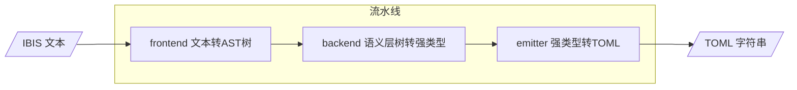
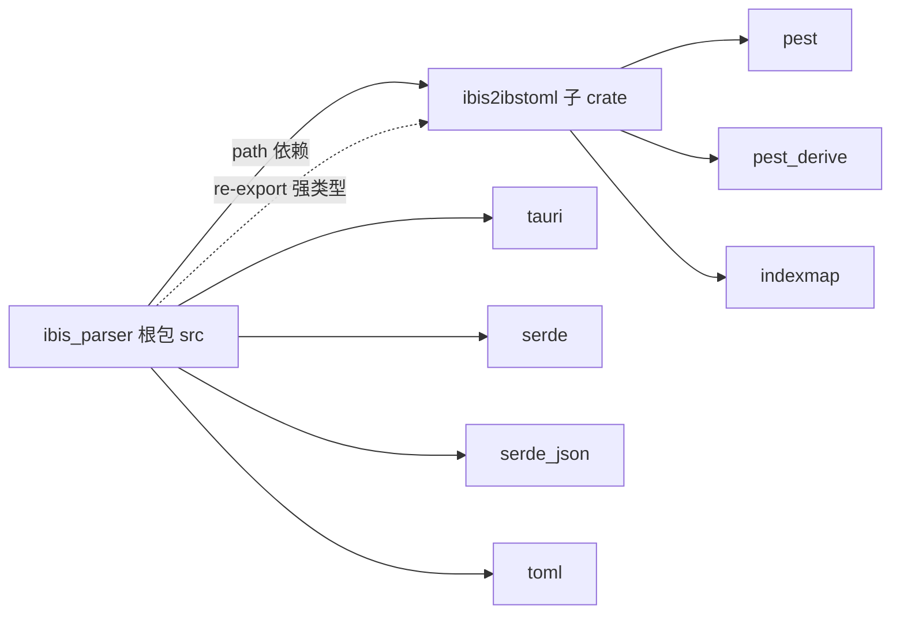
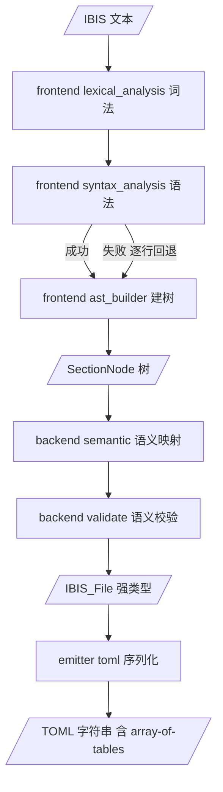
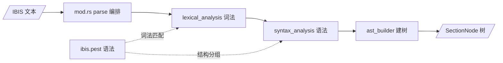
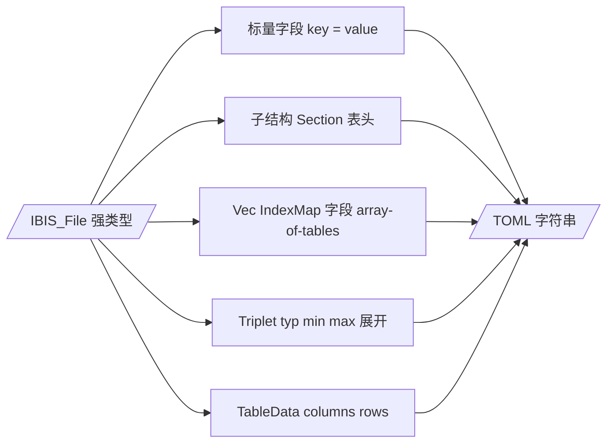

# ibis2ibstoml 架构书

> **本文档定位**：描述 `ibis2ibstoml` 独立 crate 的架构设计，是仓库中关于该 crate 的权威架构说明。
> 本文档描述**完整的三阶段流水线**：frontend（文本 → AST 树）→ backend（语义层：树 → 强类型）→ emitter（强类型 → TOML）。
> 根包 `ibis_parser`（re-export 兼容层）另见 [`ibis_parser_architecture.md`](ibis_parser_architecture.md:1)。

---

## 目录

1. [总体架构说明](#1-总体架构说明)
   - [1.1 设计概述](#11-设计概述)
   - [1.2 目录结构](#12-目录结构)
   - [1.3 公共 API](#13-公共-api)
   - [1.4 数据流总览](#14-数据流总览)
2. [frontend](#2-frontend)
   - [2.1 模块设计思路](#21-模块设计思路)
   - [2.2 模块结构](#22-模块结构)
   - [2.3 数据结构](#23-数据结构)
   - [2.4 输入输出](#24-输入输出)
3. [backend](#3-backend)
   - [3.1 模块设计思路](#31-模块设计思路)
   - [3.2 模块结构](#32-模块结构)
   - [3.3 数据结构](#33-数据结构)
   - [3.4 输入输出](#34-输入输出)
4. [emitter](#4-emitter)
   - [4.1 模块设计思路](#41-模块设计思路)
   - [4.2 模块结构](#42-模块结构)
   - [4.3 数据结构](#43-数据结构)
   - [4.4 输入输出](#44-输入输出)
5. [测试策略](#5-测试策略)
6. [附录](#6-附录)
   - [6.1 语义约定](#61-语义约定)
   - [6.2 明确不做（out-of-scope）](#62-明确不做out-of-scope)
   - [6.3 关键决策记录（ADR）](#63-关键决策记录adr)
   - [6.4 参考文件](#64-参考文件)

---

# 1. 总体架构说明

## 1.1 设计概述

`ibis2ibstoml` 是从主 crate 拆分出的**第一遍格式整形层**，读入 IBIS 文本，输出**语义化 TOML** 字符串。

**核心能力**：frontend 把所有值保留为原始字符串；backend 语义层在此基础上执行**语义映射与校验**（数值以原始字符串保留），产出强类型 AST；emitter 从强类型输出 TOML（含 `[[array-of-tables]]`）。

采用**三阶段流水线**：

1. **frontend** — 唯一公开接口 [`frontend::parse`](../crates/ibis2ibstoml/src/frontend/mod.rs:75)：IBIS 文本 → `SectionNode` AST 树。内部按词法 → 语法 → AST 建树三段式组织，各阶段能力为**模块内普通函数**（`fn`），不引入 trait / carrier 抽象。
2. **backend** — 语义层：消费 `SectionNode` 树，执行语义映射 / 校验（数值以原始字符串保留），产出强类型 [`IBIS_File`](../crates/ibis2ibstoml/src/backend/ibis_structure.rs:64)。
3. **emitter** — 将强类型 `IBIS_File` 递归序列化为 TOML 字符串（含 `[[array-of-tables]]`）。

**拆分动机**：

- **独立演进** — `ibis2ibstoml` 独立版本化、独立测试、独立发布
- **职责清晰** — 按 frontend → backend → emitter 分层，符合管道模型
- **编译隔离** — 主 crate 不再直接编译 pest 语法生成代码
- **可复用** — 其他工具链可直接依赖该 crate



## 1.2 目录结构

[`Cargo.toml`](../Cargo.toml:1) 定义 workspace：`members = ["crates/ibis2ibstoml"]`，`resolver = "3"`。根包 `ibis_parser` 通过 path 依赖 [`ibis2ibstoml`](../crates/ibis2ibstoml/Cargo.toml:1)。

| 引用方 | 用法 |
|--------|------|
| 根 [`src/lib.rs`](../src/lib.rs:31) | `pub use ibis2ibstoml;` — 根包重导出，兼容旧引用路径 |
| 根 [`src/main.rs`](../src/main.rs:8) | `use ibis2ibstoml::ibs2ibstoml;` 直接调用 |
| 根 [`src/ibis_parser/mod.rs`](../src/ibis_parser/mod.rs:8) | `pub use ibis2ibstoml::backend::ibis_structure;` — re-export 强类型，兼容 `ibis_parser::ibis_structure` 路径 |
| 根 [`tests/header_parse_test.rs`](../tests/header_parse_test.rs:22) | `use ibis2ibstoml::frontend::{parse, NodeKind, SectionNode};` |
| crate 内部 [`tests/examples_compat_test.rs`](../crates/ibis2ibstoml/tests/examples_compat_test.rs:12) | `use ibis2ibstoml::parse_to_toml;` |

**依赖说明**：

- `pest` / `pest_derive` **仅存在于** ibis2ibstoml crate 内（语法生成只在其中发生）
- `indexmap` 提供保序集合（强类型 AST 中的 `IndexMap` 字段）
- TOML 输出为**手写序列化**，不依赖 `toml` crate
- **强类型 AST** 定义于 `backend/ibis_structure.rs`，根包仅 re-export，规避循环依赖
- 根包持有 `tauri` / `serde` / `serde_json` / `toml`，与 ibis2ibstoml 解耦



**crate 目录结构**：

```text
crates/ibis2ibstoml/
├── Cargo.toml                  # name = "ibis2ibstoml"，deps: pest, pest_derive, indexmap
├── tests/
│   └── examples_compat_test.rs # 集成测试：真实样本 → 强类型 → 对照参考 .ibs.toml
└── src/
    ├── lib.rs                  # Crate 入口：parse_to_toml / ibs2ibstoml（流水线编排点）
    ├── frontend/
    │   ├── mod.rs              # 唯一公开接口 parse：IBIS 文本 → SectionNode 树
    │   ├── lexical_analysis.rs # 词法阶段（grammar / parser / extraction 子模块）
    │   ├── syntax_analysis.rs  # 语法阶段（line_type / block_grouping 子模块，含 recovery）
    │   ├── ast_builder.rs      # AST 阶段（ast_types / header_field / tree_builder 子模块）
    │   └── ibis.pest           # pest 语法文件
    ├── backend/
    │   ├── mod.rs              # 语义层编排入口 semantic_parse
    │   ├── ibis_structure.rs   # 强类型 AST（集合用 IndexMap 保序，数值以原始字符串承载）
    │   ├── semantic.rs         # 语义映射（SectionNode 树 → 各节段强类型）
    │   └── validate.rs         # 语义校验（必填 / 引用一致性 / 表格异常）
    └── emitter/
        ├── mod.rs              # 暴露导出接口
        └── toml.rs             # serialize_ibis_file / serialize_tree（强类型 → TOML）
```

## 1.3 公共 API

[`lib.rs`](../crates/ibis2ibstoml/src/lib.rs:80) 作为 crate 入口即流水线编排点，对外提供**完整流水线**与**分段暴露**两类 API。

**完整流水线 API**：

```rust
/// Parse IBIS content and produce semantically-typed TOML in a single pass.
pub fn parse_to_toml(content: &str) -> Result<String, String> {
    // Phase 1: frontend parsing → AST tree.
    let tree = frontend::parse(content)?;
    // Phase 2: backend semantic analysis → strongly-typed IBIS_File.
    let file = backend::semantic_parse(&tree)?;
    // Phase 3: emitter serialization → TOML.
    Ok(emitter::toml::serialize_ibis_file(&file))
}

/// Read an IBIS file and produce a `.ibs.toml` representation.
pub fn ibs2ibstoml<P: AsRef<Path>>(path: P) -> Result<String, String> {
    let content = fs::read_to_string(&path)
        .map_err(|e| format!("Failed to read file: {}", e))?;
    parse_to_toml(&content)
}
```

| 入口 | 作用 |
|------|------|
| [`parse_to_toml`](../crates/ibis2ibstoml/src/lib.rs:80) | 纯文本 → 语义化 TOML 字符串（三阶段一次完成） |
| [`ibs2ibstoml`](../crates/ibis2ibstoml/src/lib.rs:113) | 文件级 API，读盘后委托 `parse_to_toml` |

**分段暴露（供强类型消费者 / 调试）**：

```rust
pub fn parse_to_ast(content: &str) -> Result<Vec<SectionNode>, String>;            // frontend
pub fn semantic_parse(tree: &[SectionNode]) -> Result<IBIS_File, SemanticError>;   // backend
pub fn serialize_ibis_file(file: &IBIS_File) -> String;                            // emitter
```

| 分段入口 | 所属阶段 | 作用 |
|----------|----------|------|
| [`parse_to_ast`](../crates/ibis2ibstoml/src/lib.rs:139) | frontend | IBIS 文本 → `SectionNode` 树 |
| [`semantic_parse`](../crates/ibis2ibstoml/src/backend/mod.rs) | backend | `SectionNode` 树 → 强类型 `IBIS_File` |
| [`serialize_ibis_file`](../crates/ibis2ibstoml/src/emitter/toml.rs) | emitter | 强类型 `IBIS_File` → TOML 字符串 |

模块导出：`pub mod backend; pub mod emitter; pub mod frontend;`

## 1.4 数据流总览

三阶段通过公共 API 首尾相接，形成完整流水线：



**阶段职责边界**：

| 阶段 | 职责 | 不承担 |
|------|------|--------|
| frontend | 文本 → `SectionNode` 树 | 不做语义分析、数值转换、`[[...]]` 区分 |
| backend | 树 → 强类型 `IBIS_File`；语义校验 | 不做文本解析（复用 frontend 树）；不做 TOML 序列化 |
| emitter | 强类型 → TOML（含 `[[...]]`） | 不做语义处理、不解析文本 |

**边界原则**：阶段间通过公共 API 通信；backend 只读 frontend 产出的 `SectionNode` 树与 `Rule` 枚举，禁止反向引用 frontend 内部类型；emitter 只消费强类型，不接触 `SectionNode` 树。

---

# 2. frontend

## 2.1 模块设计思路

`frontend` 是流水线的第一段：读入 IBIS 文本，输出 [`SectionNode`](../crates/ibis2ibstoml/src/frontend/ast_builder.rs:17) 树。

**划分思路**：按「读取 → 分组 → 建树」三段式组织为三个文件——`lexical_analysis` 只负责**读取**，`syntax_analysis` 只负责**分组**（折叠为扁平块列表，含容错回退），`ast_builder` 只负责**建树**（扁平块 → 层级树）。三个文件在 [`mod.rs`](../crates/ibis2ibstoml/src/frontend/mod.rs:28) 中声明为私有子模块，由 `parse` 按顺序编排调用；各阶段能力以模块内普通函数暴露，不引入 trait / carrier 抽象。



**时机门控**：`parse` 先尝试 pest 全量解析（主路径：lexical → syntax → ast）；失败时由 `syntax_analysis` 内部逐行回退，两条路径复用同一批词法/语法原语与同一 AST 构建器，保证行为一致。

> 各文件的职责与关键能力见 2.2 模块结构；具体函数与调用细节见源码注释。

## 2.2 模块结构

三个文件在 [`mod.rs`](../crates/ibis2ibstoml/src/frontend/mod.rs:28) 中声明为私有子模块，仅通过 `pub fn parse` 暴露能力；跨阶段被消费的函数以 `pub use` / `pub(crate) use` re-export 到阶段顶层。

```text
src/frontend/
├── mod.rs              # 编排入口 parse：IBIS 文本 → SectionNode 树
├── lexical_analysis.rs # 词法阶段（grammar / parser / extraction 子模块）
├── syntax_analysis.rs  # 语法阶段（line_type / block_grouping 子模块，含 recovery）
├── ast_builder.rs      # AST 阶段（ast_types / header_field / tree_builder 子模块）
└── ibis.pest           # pest 语法文件
```

| 文件 | 职责 | 关键能力 |
|------|------|----------|
| [`mod.rs`](../crates/ibis2ibstoml/src/frontend/mod.rs:28) | 编排 `parse`：按词法 → 语法 → 建树顺序调用各文件，对外 re-export 公共类型 | `parse`、`NodeKind` / `SectionNode` / `ParsedBlock` / `Rule` |
| [`lexical_analysis.rs`](../crates/ibis2ibstoml/src/frontend/lexical_analysis.rs) | 词法阶段：绑定 [`ibis.pest`](../crates/ibis2ibstoml/src/frontend/ibis.pest) 语法生成 `Rule` / `IbisParser`，提供关键词名与内容行的读取原语，并适配到 pest pair 供各阶段共用 | `IbisParser`、`Rule`、`keyword_name`、`parse_content_line`、`extract_keyword_name`、`extract_line_content` |
| [`syntax_analysis.rs`](../crates/ibis2ibstoml/src/frontend/syntax_analysis.rs) | 语法阶段：分类行角色（`\|` 续行/注释），把输入折叠为扁平 `ParsedBlock` 列表；主路径消费 pest pairs，失败时逐行回退 | `group_pairs_to_blocks`、`recover_blocks`、`is_continuation_line` |
| [`ast_builder.rs`](../crates/ibis2ibstoml/src/frontend/ast_builder.rs) | AST 阶段：定义 AST 数据结构，识别文件头字段（大小写不敏感），把扁平块递归建为层级树 | `NodeKind` / `SectionNode` / `ParsedBlock`、`build_section_tree`、`is_header_field_keyword` |
| [`ibis.pest`](../crates/ibis2ibstoml/src/frontend/ibis.pest) | pest 语法文件：定义词法原语（`si_number` 等）与关键词规则，仅供 `lexical_analysis` 绑定 | 词法 / 语法规则定义 |

> 各文件内部子模块（`grammar` / `parser` / `extraction` / `line_type` / `block_grouping` / `ast_types` / `header_field` / `tree_builder`）的组成与可见性、`parse` 编排的调用细节见源码注释。

## 2.3 数据结构

定义于 [`ast_builder::ast_types`](../crates/ibis2ibstoml/src/frontend/ast_builder.rs)：

```rust
/// Role of a section node in the TOML output.
#[derive(Debug, Clone, PartialEq)]
pub enum NodeKind {
    FileHeader,  // `[File_Header]` — virtual container for file header fields.
    Regular,     // `[Section]` or `[Parent.Child]` — regular section.
}

/// A node in the hierarchical IBIS section tree.
#[derive(Debug, Clone)]
pub struct SectionNode {
    pub keyword: String,       // Keyword name (e.g., "Component", "IBIS ver", "Pin").
    pub kind: NodeKind,        // Role determining TOML output format.
    pub content: Vec<String>,  // Content lines belonging directly to this section.
    pub line_number: usize,    // 1-based source line of the section header (for diagnostics).
    pub children: Vec<SectionNode>, // Child sections nested under this node.
}

/// A parsed keyword block with its content lines.
#[derive(Debug, Clone)]
pub struct ParsedBlock {
    pub keyword: String,   // Raw keyword name (e.g., "Component", "IBIS ver", "Package").
    pub rule: Rule,        // Pest rule variant that matched this keyword header.
    pub content: Vec<String>, // Content lines belonging to this block.
    pub line_number: usize,   // 1-based source line of the keyword header (for diagnostics).
}
```

**设计要点**：

- `NodeKind` 仅区分 `FileHeader`（虚拟容器）与 `Regular`——`[[array-of-tables]]` 与 `[...]` 的区分**由 backend 的强类型化隐式决定**（`Vec` / `IndexMap` 字段序列化为 `[[...]]`）
- `FileHeader` 虚拟父节点在[树构建 Phase A](../crates/ibis2ibstoml/src/frontend/ast_builder.rs:103) 收集所有连续文件头字段
- 文件头字段判定（[`header_field`](../crates/ibis2ibstoml/src/frontend/ast_builder.rs:49)）在 **Rust 端**维护已知关键词集合 + **大小写不敏感**匹配

## 2.4 输入输出

**唯一公开入口** [`frontend::parse`](../crates/ibis2ibstoml/src/frontend/mod.rs:75)：

| 项 | 内容 |
|----|------|
| 输入 | `content: &str` — IBIS 文件的完整文本 |
| 输出 | `Ok(Vec<SectionNode>)` — 根级 AST，包含 `[File_Header]` 虚拟节点 |
| 错误 | `Err(String)` — 人类可读错误消息；容错回退路径保证解析尽量成功 |

```rust
pub fn parse(content: &str) -> Result<Vec<SectionNode>, String>
```

**输入约定**：接收原始 IBIS 文本，frontend 不要求任何语义合法，所有值保留为原始字符串。

**输出约定**：产出扁平块列表建树后的多级 `SectionNode` 树；`File_Header` 虚拟节点收纳连续文件头字段；`[End]` 标记被跳过不产出节点。

---

# 3. backend

## 3.1 模块设计思路

`backend` 是流水线的**语义层**：消费 frontend 产出的 [`SectionNode`](../crates/ibis2ibstoml/src/frontend/ast_builder.rs) 树，产出强类型 [`IBIS_File`](../crates/ibis2ibstoml/src/backend/ibis_structure.rs)。沿用 frontend「模块内普通函数」风格，不引入 trait / carrier 抽象。

**划分思路**：按「映射 → 校验」依次处理——`semantic` 先分析 keyword（查声明式映射表定位目标结构、以原始字符串填充强类型），`validate` 最后做语义一致性校验。两个文件在 [`mod.rs`](../crates/ibis2ibstoml/src/backend/mod.rs:1) 中声明，由 `semantic_parse` 编排调用。


**语义映射**：`semantic` 以 [`ibis_structure.rs`](../crates/ibis2ibstoml/src/backend/ibis_structure.rs) 定义的强类型结构为**数据来源**，只针对其中的结构进行填充——通过一份**声明式映射表**（keyword → 目标结构 + 字段规则）驱动通用遍历，而不是为 `component` / `model` / `submodel` 等各节段逐个手写 `build_*` 样板代码，避免代码随节段数量线性膨胀。各节段树位置到强类型目标的对照见 3.3 数据结构；字段填充遵循以下规则：

**字段映射规则**：

- **单值字段**：`content` 单行 → 原始字符串字段。
- **corner 字段**（如 `R_pkg` 三列）：`content` 拆 3 列 → `Triplet<String>`（保留原始字符串）。
- **表格字段**（如 `Pulldown` / `Pullup`）：多行 → [`IBIS_TableData`](../crates/ibis2ibstoml/src/backend/ibis_structure.rs:51)，首行为列头（`columns`），后续行为 `rows`（字符串）。
- **子节段**：`children` 递归映射到强类型子结构。
- **重复节段**（如多个 `Model` / 多个 `Pin`）：映射为 `IndexMap` / `Vec` 项。

**校验策略**（严格模式）：

| 校验项 | 策略 |
|--------|------|
| 必填字段缺失（如 `[Model]` 缺 `Model_type`） | 报错（`MissingRequiredField`） |
| 引用一致性（Pin 引用不存在的 model） | 报错（`ReferenceNotFound`） |
| 表格列数不一致 | 报错（`TableMalformed`） |

> 是否提供宽松（warning-only）校验模式作为可选增强，见附录 6.3 ADR。

## 3.2 模块结构

```text
src/backend/
├── mod.rs                # 编排入口 semantic_parse：SectionNode 树 → IBIS_File
├── ibis_structure.rs     # 强类型 AST（集合用 IndexMap 保序，数值以原始字符串承载）
├── semantic.rs           # 语义映射（以 ibis_structure.rs 为数据源，映射表驱动填充）
└── validate.rs           # 语义校验（必填、引用一致性、表格异常）
```

| 模块 | 职责 | 关键能力 |
|------|------|----------|
| [`mod.rs`](../crates/ibis2ibstoml/src/backend/mod.rs:1) | 编排 `semantic` + `validate`，暴露公共入口与错误类型 | `semantic_parse`、`SemanticError` |
| [`ibis_structure.rs`](../crates/ibis2ibstoml/src/backend/ibis_structure.rs) | 强类型定义（数值以原始字符串承载），保持 `#![allow(non_camel_case_types)]` | `IBIS_File` 及全部子结构 |
| [`semantic.rs`](../crates/ibis2ibstoml/src/backend/semantic.rs) | 以 `ibis_structure.rs` 为数据源，按声明式映射表驱动树 → 强类型填充 | 映射表、通用遍历器、`semantic_parse` |
| [`validate.rs`](../crates/ibis2ibstoml/src/backend/validate.rs) | 必填字段、Pin↔Model 引用一致性 | `validate_ibis_file` |

> 映射表按 `ibis_structure.rs` 中的结构维护；新增节段时只增补映射条目，无需为各节段重复编写构建函数。

## 3.3 数据结构

**根结构** [`IBIS_File`](../crates/ibis2ibstoml/src/backend/ibis_structure.rs:64)，聚合所有一级节段：

```rust
pub struct IBIS_File {
    pub header: IBIS_FileHeader,
    pub components: Vec<IBIS_Component>,
    pub model_selectors: Vec<IBIS_ModelSelector>,
    pub models: IndexMap<String, IBIS_Model>,
    pub submodels: IndexMap<String, IBIS_Submodel>,
    pub external_circuits: Vec<IBIS_ExternalCircuit>,
    pub test_data: Vec<IBIS_TestData>,
    pub test_loads: IndexMap<String, IBIS_TestLoad>,
    pub package_models: IndexMap<String, IBIS_DefinePackageModel>,
    pub interconnect_model_sets: Vec<IBIS_InterconnectModelSet>,
}
```

**通用容器**：

- [`Triplet<T>`](../crates/ibis2ibstoml/src/backend/ibis_structure.rs:37) — typ/min/max 角点三元组；角点值以原始字符串承载（`Triplet<String>`）
- [`IBIS_TableData`](../crates/ibis2ibstoml/src/backend/ibis_structure.rs:51) — `columns: Vec<String>` + `rows: Vec<Vec<String>>`（数值保留原始字符串）

**各节段强类型**（均位于 `backend/ibis_structure.rs`）：

| 类型 | 对应 SectionNode 树位置 | 说明 |
|------|------------------------|------|
| [`IBIS_FileHeader`](../crates/ibis2ibstoml/src/backend/ibis_structure.rs:85) | `File_Header` 虚拟节点（children） | 每个 header 字段子节点映射一个字段 |
| [`IBIS_Component`](../crates/ibis2ibstoml/src/backend/ibis_structure.rs:221) | `Component` | 含 `Manufacturer` / `Package` / `Pin` / `Pin Mapping` 等 children |
| [`IBIS_Model`](../crates/ibis2ibstoml/src/backend/ibis_structure.rs:366) | `Model` | 含 `Model Spec` / `Ramp` / `Pulldown` / `Rising Waveform` 等 children |
| [`IBIS_Submodel`](../crates/ibis2ibstoml/src/backend/ibis_structure.rs:450) | `Submodel` | |
| [`IBIS_ExternalCircuit`](../crates/ibis2ibstoml/src/backend/ibis_structure.rs:474) | `External Circuit` | |
| [`IBIS_TestData`](../crates/ibis2ibstoml/src/backend/ibis_structure.rs:491) | `Test Data` | |
| [`IBIS_TestLoad`](../crates/ibis2ibstoml/src/backend/ibis_structure.rs:508) | `Test Load` | |
| [`IBIS_DefinePackageModel`](../crates/ibis2ibstoml/src/backend/ibis_structure.rs:557) | `Define Package Model` | |
| [`IBIS_InterconnectModelSet`](../crates/ibis2ibstoml/src/backend/ibis_structure.rs:588) | `Interconnect Model Set` | |
| [`IBIS_ModelSelector`](../crates/ibis2ibstoml/src/backend/ibis_structure.rs:250) | `Model Selector` | |

**IBIS_File 容器类型**：

| 字段 | 类型 | 来源 |
|------|------|------|
| `models` | `IndexMap<String, IBIS_Model>` | 每个 `[Model]`，以 `model` 字段为 key |
| `submodels` | `IndexMap<String, IBIS_Submodel>` | 每个 `[Submodel]` |
| `components` | `Vec<IBIS_Component>` | 每个 `[Component]` |
| `test_loads` | `IndexMap<String, IBIS_TestLoad>` | 每个 `[Test Load]` |
| `package_models` | `IndexMap<String, IBIS_DefinePackageModel>` | 每个 `[Define Package Model]` |

## 3.4 输入输出

**公共入口**：

```rust
pub fn semantic_parse(tree: &[SectionNode]) -> Result<IBIS_File, SemanticError>;
// 便捷包装：错误转为人类可读字符串（兼容旧 API 风格）
pub fn semantic_parse_string(tree: &[SectionNode]) -> Result<IBIS_File, String>;
```

| 项 | 内容 |
|----|------|
| 输入 | `tree: &[SectionNode]` — frontend 产出的 AST 树 |
| 输出 | `Ok(IBIS_File)` — 强类型语义 AST |
| 错误 | `Err(SemanticError)` — 结构化语义错误 |

**错误模型**（结构化错误 enum）：

```rust
/// Structured semantic error emitted by the backend.
#[derive(Debug, Clone, PartialEq)]
pub enum SemanticError {
    MissingRequiredField { section: String, field: String },
    UnknownKeyword { keyword: String },
    ReferenceNotFound { from: String, target: String },
    TableMalformed { section: String },
}
```

---

# 4. emitter

## 4.1 模块设计思路

`emitter` 是流水线的第三段：将强类型 [`IBIS_File`](../crates/ibis2ibstoml/src/backend/ibis_structure.rs:64) 序列化为 TOML 字符串（含 `[[array-of-tables]]`）。

**文件职责**：序列化实现在 [`toml.rs`](../crates/ibis2ibstoml/src/emitter/toml.rs:1)，由 [`mod.rs`](../crates/ibis2ibstoml/src/emitter/mod.rs:14) 声明并 re-export 入口——实现与导出分离，调用方只依赖 `mod.rs` 的导出接口。

**序列化思路**：从 `IBIS_File` 根开始**递归**——标量字段直接输出 key-value；子结构输出 `[Section]` 表头后递归其字段；`Vec` / `IndexMap` 字段输出 `[[...]]` array-of-tables 并为每项展开表头；`Triplet` 按 typ/min/max 展开；`IBIS_TableData` 输出 columns 与 rows。整体是「形态 → 语法」的直接映射，不引入中间表示。



**要点**：

- `[[array-of-tables]]` 由强类型的 `Vec` / `IndexMap` 字段隐式决定，backend 无需单独标注
- `Option<None>` 不输出该 key（TOML 无 null）
- `toml_section_name` 仅在输出层执行空格 → 下划线替换
- 序列化结果与 [`ibis_struct.toml`](ibis_struct.toml:1) schema 对齐

## 4.2 模块结构

[`emitter/mod.rs`](../crates/ibis2ibstoml/src/emitter/mod.rs:14) 声明 `pub mod toml;`，重导出强类型序列化入口。

[`emitter/toml.rs`](../crates/ibis2ibstoml/src/emitter/toml.rs:1) 序列化函数：

| 函数 | 作用 |
|------|------|
| [`escape_toml_string`](../crates/ibis2ibstoml/src/emitter/toml.rs:22) | 转义 `\` 与 `"`，包裹双引号 |
| [`toml_section_name`](../crates/ibis2ibstoml/src/emitter/toml.rs:38) | 关键词名 → section 名（空格 → 下划线） |
| [`serialize_ibis_file`](../crates/ibis2ibstoml/src/emitter/toml.rs) | 入口：强类型 `IBIS_File` → TOML 字符串（含 `[[...]]`） |
| [`serialize_tree`](../crates/ibis2ibstoml/src/emitter/toml.rs:67) | 辅助：递归序列化 `SectionNode` 树（调试 / 测试用） |

## 4.3 数据结构

**输入**：强类型 [`IBIS_File`](../crates/ibis2ibstoml/src/backend/ibis_structure.rs:64)（及其子结构、`Triplet`、`IBIS_TableData`）。

**输出**：TOML 字符串。

**强类型形态 → TOML 输出**：

| 强类型形态 | TOML 输出 |
|------------|-----------|
| 标量字段（`String` / `Option<String>`） | `key = "value"` |
| 子结构（`IBIS_Component` 等） | `[Component]` |
| `Vec<T>` / `IndexMap<K, T>`（`pins`、`models`、`rising_waveforms`） | `[[...]]` array-of-tables |
| [`Triplet<String>`](../crates/ibis2ibstoml/src/backend/ibis_structure.rs:37) | corner 三元组字段（typ/min/max 展开） |
| [`IBIS_TableData`](../crates/ibis2ibstoml/src/backend/ibis_structure.rs:51) | 表格序列化（columns + rows） |

## 4.4 输入输出

| 入口 | 输入 | 输出 |
|------|------|------|
| [`serialize_ibis_file`](../crates/ibis2ibstoml/src/emitter/toml.rs) | `&IBIS_File` | `String`（TOML，含 `[[...]]`） |
| [`serialize_tree`](../crates/ibis2ibstoml/src/emitter/toml.rs:67) | `&[SectionNode]` | `String`（TOML，调试 / 测试用） |

```rust
pub fn serialize_ibis_file(file: &IBIS_File) -> String;
pub fn serialize_tree(nodes: &[SectionNode], parent_path: &str, output_buffer: &mut String);
```

---

# 5. 测试策略

测试分单元、crate 集成、根包集成三层，覆盖各阶段能力：

| 测试类型 | 位置 | 覆盖 |
|----------|------|------|
| 单元测试 | 各源文件末尾 `#[cfg(test)]` 模块 | 词法原语、行分类、块分组、建树、语义映射、校验、序列化 |
| backend semantic 单测 | `backend/semantic.rs` | 映射表驱动的各节段树 → 强类型填充 |
| backend validate 单测 | `backend/validate.rs` | 必填缺失、引用一致性、表格异常 |
| emitter 单测 | `emitter/toml.rs` | 强类型 → TOML，含 `[[...]]`、`Triplet`、`TableData` |
| crate 集成测试 | [`tests/examples_compat_test.rs`](../crates/ibis2ibstoml/tests/examples_compat_test.rs:19) | 真实样本 → 强类型 → 对照参考 `.ibs.toml`（存在时逐字匹配） |
| 根包集成测试 | [`tests/header_parse_test.rs`](../tests/header_parse_test.rs:100) | 经 `frontend::parse` 从真实样本解析文件头，映射到 `IBIS_FileHeader` |

参考样本：`tests/examples/` 下 `cyclone2.ibs`、`f103c8.ibs`、`invchain_test_0614.ibs`、`u26a_800.ibs`、`virtex5.ibs`，其中前两者带 `.ibs.toml` 参考输出。

> 参考输出随 emitter 的 `[[...]]` 设计对齐而演进，需要时按 emitter 重新生成。

---

# 6. 附录

## 6.1 语义约定

1. **关键词大小写**：pest `kw_*` 规则为**精确匹配**（大小写敏感，如 `"IBIS ver"`）；未识别关键词落入通用 [`keyword`](../crates/ibis2ibstoml/src/frontend/ibis.pest:55) 规则原样保留。**文件头字段分类**在 AST 阶段**大小写不敏感**（`to_ascii_lowercase()` 比对）。空格/特殊符号差异导致的匹配不上属输入文件问题，程序不纠错。
2. **下划线仅属 TOML 输出层**：分析层不解析/还原下划线；仅 emitter 输出时 `replace(' ', "_")`。
3. **`[Comment Char]` 中途改注释符：out-of-scope**，`|` 硬编码。`line_type::parse_continuation_content` 作为保留能力，供多行字段 / `[Comment Char]` 处理使用（标注 `#[allow(dead_code)]`）。
4. **pest 分组 vs 具体规则**：Rust 端只需处理 `first_level_keyword` / `second_level_keyword` / `kw_end` / `keyword` 四种规则类型；具体 `kw_*` 规则全部在 pest 端维护。
5. **数值保持原始字符串**：全流水线不解析 / 不转换数值，`content` 原样保留并输出为字符串；pest `si_number` 仅用于匹配。
6. **`[[array-of-tables]]` 归属**：由 backend 强类型化（`Vec` / `IndexMap`）隐式决定，emitter 按字段形态输出，backend 不做独立标注。
7. **强类型落点**：强类型 AST 定义在 `backend/ibis_structure.rs`；根包 re-export 保持 `ibis_parser::ibis_structure` 路径兼容。

## 6.2 明确不做（out-of-scope）

- `[Comment Char]` 中途更换注释符号
- 分析层对下划线的解析/还原
- 由空格/特殊符号差异导致的 keyword 不匹配纠错
- backend 不做文本解析（复用 frontend 的 `SectionNode` 树）
- 不做数值解析 / 单位缩放（数值以原始字符串保留，仅用于生成 TOML）
- 不引入 serde / 反序列化依赖（emitter 保持手写序列化；`toml` crate 仍留在根包）
- 宽松（warning-only）校验模式（见 6.3 ADR 待决策项）
- 为未出现的新需求预先定义抽象（trait / 接口层，需要时再加）

## 6.3 关键决策记录（ADR）

| 决策 | 选择 | 理由 |
|------|------|------|
| Workspace 布局 | 根包 + `crates/ibis2ibstoml` 子 crate | 符合 Cargo Workspace 惯例，根 `src/` 与 `src/ibis_parser` 保持原位 |
| crate 命名 | `ibis2ibstoml` | 与既有模块名一致，避免破坏引用 |
| 内部结构 | frontend / backend / emitter 三段式 | 按 Pipeline 阶段划分，不嵌套多余文件夹 |
| frontend 阶段命名 | `lexical_analysis` / `syntax_analysis` / `ast_builder` | 语义化命名 |
| 容错 recovery 归属 | 折叠进 `syntax_analysis::block_grouping::recover_blocks` | 与 `group_pairs_to_blocks` 输出同为扁平 `ParsedBlock`，不设独立模块 |
| 文件头字段分类 | Rust 端 `header_field::is_header_field_keyword`（大小写不敏感） | 避免 pest 分组冗余，集中管理；`second_level_keyword` 无法区分内层关键词 |
| 空白/换行处理 | `NEWLINE \| WHITESPACE` 作为 `ibis_file` 显式消耗项 | 避免 pest `~` WS 跳跃歧义，确保正确匹配真实 IBIS 内容 |
| `NodeKind` 设计 | 仅 `FileHeader` / `Regular` 两个变体 | 简化 AST 类型系统；`[[array-of-tables]]` 由强类型化隐式决定 |
| backend 定位 | 语义层：树 → 强类型 → emitter 输出 | 与「emitter 把强类型输出为 TOML」一致 |
| 强类型落点 | 定义于 `backend/ibis_structure.rs` | 规避循环依赖（根包已依赖子 crate） |
| 集合保序 | 强类型集合字段用 `IndexMap` | 保证 TOML 输出顺序与源文件一致 |
| 根包角色 | re-export 兼容层 | 保持 `ibis_parser::ibis_structure` 引用路径不破坏 |
| backend 模块风格 | 普通函数 + 数据驱动映射表（convert/semantic/validate） | 以 `ibis_structure.rs` 为数据源，不引入 trait 抽象 |
| 错误模型 | 结构化 `SemanticError` enum | 语义层错误种类多，结构化优于裸字符串 |
| 数值处理 | 数值以原始字符串保留，不解析 / 不缩放 | 本 crate 只做格式整形生成 TOML，不做数值解析 |
| 输出格式 | 强类型 → TOML 含 `[[...]]` | 对齐 [`ibis_struct.toml`](ibis_struct.toml:1) schema |
| pest / pest_derive 归属 | 移到新 crate | 语法生成只在 `ibis2ibstoml` 内发生 |
| 根包重导出 | 根 `lib.rs` 保留 `pub use ibis2ibstoml;` | 兼容旧引用路径 |
| 宽松校验模式 | 待决策 | 是否提供 warning-only 校验模式作为增强 |

## 6.4 参考文件

| 文件 | 内容 |
|------|------|
| [`ibis_parser_architecture.md`](ibis_parser_architecture.md:1) | 根包 `ibis_parser` 的 re-export 兼容层说明 |
| [`ibis_struct.toml`](ibis_struct.toml:1) | 强类型序列化参考 schema |
| [`coding_standards.md`](coding_standards.md:1) | 编码规范 |
| [`architecture.drawio`](architecture.drawio:1) | 架构示意图 |
