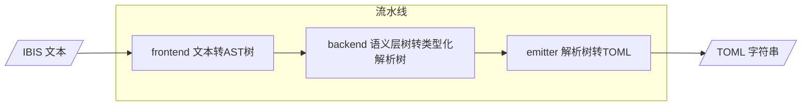
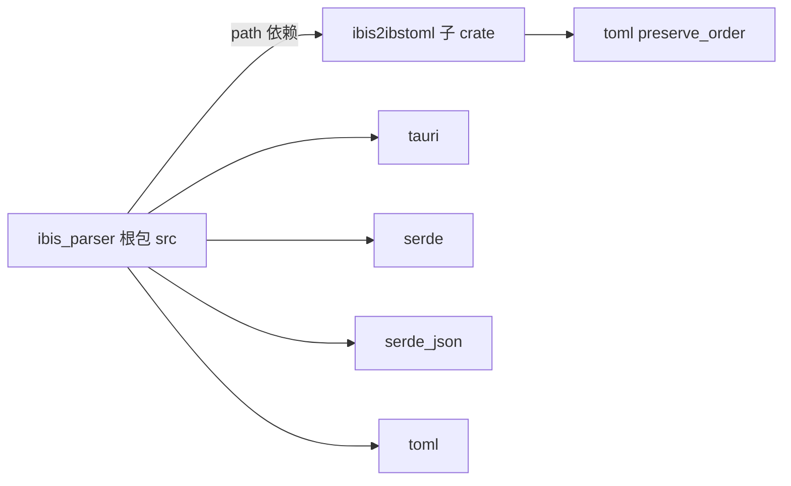
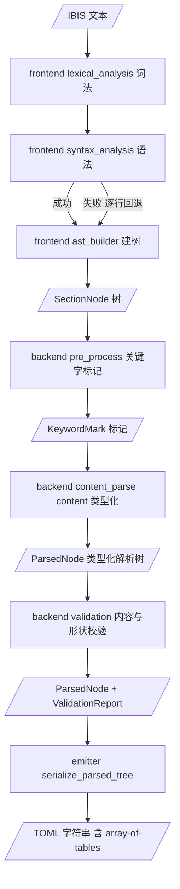
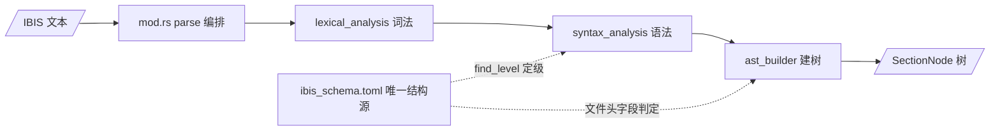
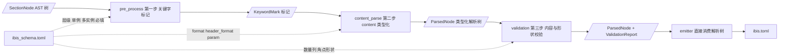
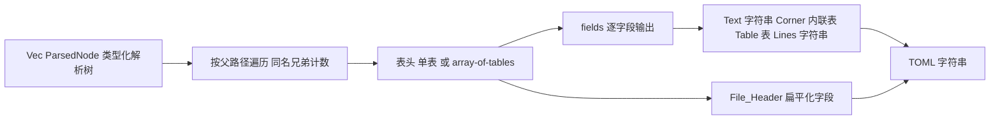

# ibis2ibstoml 架构书

> **本文档定位**：描述 `ibis2ibstoml` 独立 crate 的架构设计，是仓库中关于该 crate 的权威架构说明。
> 本文档描述**完整的三阶段流水线**：frontend（文本 → AST 树）→ backend（语义层：树 → 类型化解析树 + 诊断报告）→ emitter（类型化解析树 → TOML）。
> 根包 `ibis_parser`（re-export 兼容层）仅重导出本 crate，其引用方式见 §1.2。

---

## 目录

1. [总体架构说明](#1-总体架构说明)
   - [1.1 设计概述](#11-设计概述)
   - [1.2 目录结构](#12-目录结构)
   - [1.3 公共 API](#13-公共-api)
   - [1.4 数据流总览](#14-数据流总览)
2. [frontend](#2-frontend)
   - [2.1 模块设计思路](#21-模块设计思路)
   - [2.2 模块结构](#22-模块结构)
   - [2.3 数据结构](#23-数据结构)
   - [2.4 输入输出](#24-输入输出)
3. [backend](#3-backend)
   - [3.1 模块设计思路](#31-模块设计思路)
   - [3.2 模块结构](#32-模块结构)
   - [3.3 数据结构](#33-数据结构)
   - [3.4 输入输出](#34-输入输出)
4. [emitter](#4-emitter)
   - [4.1 模块设计思路](#41-模块设计思路)
   - [4.2 模块结构](#42-模块结构)
   - [4.3 数据结构](#43-数据结构)
   - [4.4 输入输出](#44-输入输出)
5. [测试策略](#5-测试策略)
6. [参考文件](#6-参考文件)

---

# 1. 总体架构说明

## 1.1 设计概述

`ibis2ibstoml` 是从主 crate 拆分出的**第一遍格式整形层**，读入 IBIS 文本，输出**语义化 TOML** 字符串。

**核心能力**：frontend 把所有值保留为原始字符串；backend 语义层在此基础上执行**关键字标记、内容类型化与形状校验**，产出保真的**类型化解析树**（[`ParsedNode`](../crates/ibis2ibstoml/src/backend/content_parse.rs:142)）与**诊断报告**；emitter 从解析树输出 TOML（含 `[[array-of-tables]]`）。

采用**三阶段流水线**：

1. **frontend** — 唯一公开接口 [`frontend::parse`](../crates/ibis2ibstoml/src/frontend/mod.rs:75)：IBIS 文本 → `SectionNode` AST 树。内部按词法 → 语法 → AST 建树三段式组织，各阶段能力为**模块内普通函数**（`fn`），不引入 trait / carrier 抽象。
2. **backend** — 语义层：消费 `SectionNode` 树，按「关键字标记（`pre_process`）→ 内容类型化（`content_parse`）→ 内容与形状校验（`validation`）」三阶段处理，产出类型化解析树 [`ParsedNode`](../crates/ibis2ibstoml/src/backend/content_parse.rs:142) 与 [`ValidationReport`](../crates/ibis2ibstoml/src/backend/validation.rs:144)。校验提供严格 / 宽松双模式。
3. **emitter** — 将类型化解析树递归序列化为 TOML 字符串（含 `[[array-of-tables]]`）。

**backend 三条核心设计原则**：

- **AST 只读，解析树重建（Rebuild）**：AST 仅用作**一次性语法结构**，backend 只读解构它、不保留、不原地改写。在第二步中把它彻底解构并**重建**为干净的类型化解析树（字段 + 子节段，树形与 AST 同构）。
- **schema 驱动**：keyword 层级、单例 / 多实例、必填、正文形态（`__schema__.format`）、关键字行形态（`__header__.format`）与具名参数类型（`__param__`）全部来自 [`ibis_schema.toml`](../crates/ibis2ibstoml/src/schema/ibis_schema.toml:1)（唯一结构规范）。改规范只改 schema，不改代码。
- **文本保真（零数值归一化）**：进入 backend 后**不换算任何数值**。带工程单位的文本保持原文（`1.65V` 仍是 `"1.65V"`、`1.12p` 仍是 `"1.12p"`）；角点解析为 [`Corner`](../crates/ibis2ibstoml/src/backend/content_parse.rs:99) 三元组 `(typ, min, max)`；行式数据与 IV / VT 曲线统一以 [`ParsedTable`](../crates/ibis2ibstoml/src/backend/content_parse.rs:107) `{ header, data }` 承载。数值仅在**校验时被读取**（[`split_number_unit`](../crates/ibis2ibstoml/src/backend/content_parse.rs:501)）以判断形状，绝不写回或缩放。`NA` 与空 token 一律视为**缺失**。

> **命名约定**：类型沿用当前实现命名（`ParsedNode` / `ParsedField` / `ParsedValue` / `Corner` / `ParsedTable`）。旧版强类型（`IBIS_File` / `IBIS_Component` / `IBIS_Model` / `PinInfo` / `Triplet<f64>` / `ViPoint`）与「IR」系列命名（`IRNode` / `Quantity` / `Ratio`）**均已废弃**，本文档不再引用。

**拆分动机**：

- **独立演进** — `ibis2ibstoml` 独立版本化、独立测试、独立发布
- **职责清晰** — 按 frontend → backend → emitter 分层，符合管道模型
- **编译隔离** — 主 crate 不直接编译 `ibis2ibstoml` 内部的解析实现
- **可复用** — 其他工具链可直接依赖该 crate



## 1.2 目录结构

[`Cargo.toml`](../Cargo.toml:1) 定义 workspace：`members = ["crates/ibis2ibstoml"]`，`resolver = "3"`。根包 `ibis_parser` 通过 path 依赖 [`ibis2ibstoml`](../crates/ibis2ibstoml/Cargo.toml:1)。

| 引用方 | 用法 |
|--------|------|
| 根 [`src/lib.rs`](../src/lib.rs:35) | `pub use ibis2ibstoml;` — 根包重导出，兼容旧引用路径 |
| 根 [`src/main.rs`](../src/main.rs:8) | `use ibis2ibstoml::ibs2ibstoml;` 直接调用 |
| 根 [`src/ibis_parser/mod.rs`](../src/ibis_parser/mod.rs:16) | `pub use ibis2ibstoml::backend as keyword_hierarchy;`（另以 `model` 同名再导出），保持旧路径可用 |
| 根 [`tests/header_parse_test.rs`](../tests/header_parse_test.rs:24) | `use ibis2ibstoml::frontend::{parse, NodeKind, SectionNode};` 与 `use ibis2ibstoml::{parse_to_parsed, ParsedNode, ParsedValue};` |

**依赖说明**：

- frontend **不使用任何语法引擎**：keyword 层级直接读自 [`ibis_schema.toml`](../crates/ibis2ibstoml/src/schema/ibis_schema.toml:1)；旧 pest 语法已归档到 [`plans/legacy/ibis.pest`](legacy/ibis.pest:1)（仅供参考，不参与编译）
- `toml` crate 用于**加载** [`ibis_schema.toml`](../crates/ibis2ibstoml/src/schema/ibis_schema.toml:1)，且**必须**开启 `preserve_order`（`__param__` 的声明顺序即字段顺序）
- TOML **输出**为**手写序列化**，不依赖 `toml` crate
- crate `Cargo.toml` 另声明了 `indexmap` / `serde` / `validator`，但**当前源码未引用**（历史遗留，见 §6.3）
- 根包持有 `tauri` / `serde` / `serde_json` / `toml`，与 ibis2ibstoml 解耦



**crate 目录结构**：

```text
crates/ibis2ibstoml/
├── Cargo.toml                  # name = "ibis2ibstoml"；实际使用 toml(preserve_order)
└── src/
    ├── lib.rs                  # Crate 入口：parse_to_toml / parse_to_parsed / ibs2ibstoml（流水线编排点）
    ├── schema/                 # ★ IBIS 规范唯一数据源（"抄手册"集中地）
    │   ├── mod.rs              # 薄编排：模块声明 + 公共 re-export
    │   ├── spec.rs             # 语义层 types（全部类型 + 值模型 + 固定词汇）与语法层 naming
    │   ├── loader.rs           # ibis_schema.toml → 缓存 SectionSpec 树（cache / section / decode 三个内联 mod）
    │   ├── lookup.rs           # 查询原语（schema / keyword / param 三个内联 mod）
    │   └── ibis_schema.toml    # IBIS 7.0 结构：keyword 树 + 同名 section + 字段类型（抄手册格式）
    ├── frontend/
    │   ├── mod.rs              # 唯一公开接口 parse：IBIS 文本 → SectionNode 树
    │   ├── lexical_analysis.rs # 词法阶段（parser 子模块：纯字符串读取原语）
    │   ├── syntax_analysis.rs  # 语法阶段（line_type / block_grouping 子模块；用 find_level 定级）
    │   └── ast_builder.rs      # AST 阶段（keyword_level / ast_types / header_field / tree_builder 子模块；header_field 读 schema）
    ├── backend/
    │   ├── mod.rs              # 语义层编排入口 semantic_parse / semantic_parse_lenient
    │   ├── pre_process.rs      # 第一步：关键字标记（occurrence / scope_path / spec）+ 作用域解析
    │   ├── content_parse.rs    # 第二步：content 类型化（值模型来自 schema）→ ParsedNode 树
    │   └── validation.rs       # 第三步：内容与形状校验 + 诊断模型（Diagnostic / Rule / Severity / ValidationReport）
    └── emitter/
        ├── mod.rs              # 暴露导出接口
        └── toml.rs             # serialize_parsed_tree（ParsedNode 树 → TOML）
```

> 旧版 backend 的 `semantic.rs` / `symbol.rs` / `reference.rs` / `content.rs`，以及曾计划的 `ir.rs` / `rules.rs` / `unit.rs` / `keyword_valid.rs` / `symbol_table_build.rs` / `data_valid.rs` / `ibis_structure.rs` / `schema/model.rs` / `schema/keyword_hierarchy.rs` **均不存在于当前仓库**；职责收敛为 `pre_process.rs` / `content_parse.rs` / `validation.rs`。crate 内**没有** `tests/` 目录，测试全部落在各源文件的 `#[cfg(test)]` 模块与根包 `tests/`。

## 1.3 公共 API

[`lib.rs`](../crates/ibis2ibstoml/src/lib.rs:45) 作为 crate 入口即流水线编排点，对外提供**完整流水线**与**分段暴露**两类 API。

**完整流水线 API**：

```rust
/// Parses IBIS content into the backend's typed parsed tree (strict mode).
pub fn parse_to_parsed(content: &str) -> Result<Vec<ParsedNode>, String> {
    let tree = frontend::parse(content)?;
    semantic_parse(&tree).map_err(|error| error.to_string())
}

/// Parses IBIS content and returns the TOML document.
pub fn parse_to_toml(content: &str) -> Result<String, String> {
    let parsed = parse_to_parsed(content)?;
    Ok(emitter::serialize_parsed_tree(&parsed))
}
```

| 入口 | 作用 |
|------|------|
| [`parse_to_parsed`](../crates/ibis2ibstoml/src/lib.rs:73) | 纯文本 → 类型化解析树（frontend + backend，严格校验） |
| [`parse_to_parsed_lenient`](../crates/ibis2ibstoml/src/lib.rs:92) | 同 `parse_to_parsed`，但校验宽松（问题写入 `ValidationReport`，不阻断） |
| [`parse_to_toml`](../crates/ibis2ibstoml/src/lib.rs:124) | 纯文本 → 语义化 TOML 字符串（三阶段一次完成，严格校验） |
| [`parse_to_toml_lenient`](../crates/ibis2ibstoml/src/lib.rs:140) | 同 `parse_to_toml`，额外返回 `ValidationReport` |
| [`ibs2ibstoml`](../crates/ibis2ibstoml/src/lib.rs:160) | 文件级 API，读盘后委托 `parse_to_toml` |

**分段暴露（供强类型消费者 / 调试）**：

```rust
pub fn parse(content: &str) -> Result<Vec<SectionNode>, String>;                    // frontend
pub fn semantic_parse(tree: &[SectionNode]) -> Result<Vec<ParsedNode>, Diagnostic>; // backend（严格）
pub fn semantic_parse_lenient(tree: &[SectionNode])
    -> Result<(Vec<ParsedNode>, ValidationReport), Diagnostic>;                     // backend（宽松）
pub fn serialize_parsed_tree(nodes: &[ParsedNode]) -> String;                       // emitter
```

| 分段入口 | 所属阶段 | 作用 |
|----------|----------|------|
| [`frontend::parse`](../crates/ibis2ibstoml/src/frontend/mod.rs:75) | frontend | IBIS 文本 → `SectionNode` 树 |
| [`backend::semantic_parse`](../crates/ibis2ibstoml/src/backend/mod.rs:76) | backend | `SectionNode` 树 → 类型化解析树 `Vec<ParsedNode>`（严格：首个 `Severity::Error` 即返回） |
| [`backend::semantic_parse_lenient`](../crates/ibis2ibstoml/src/backend/mod.rs:99) | backend | `SectionNode` 树 → `Vec<ParsedNode>` + `ValidationReport`（宽松：收集全部问题，当前恒成功） |
| [`emitter::serialize_parsed_tree`](../crates/ibis2ibstoml/src/emitter/toml.rs:63) | emitter | `Vec<ParsedNode>` → TOML 字符串 |

模块导出：`pub mod backend; pub mod emitter; pub mod frontend; pub mod schema;`；crate 根 re-export `semantic_parse` / `semantic_parse_lenient` / `Corner` / `Diagnostic` / `ParsedField` / `ParsedNode` / `ParsedTable` / `ParsedValue` / `Rule` / `Severity` / `ValidationReport` / `SectionNode`。

> `Rule` 现在**只剩一个**：`ibis2ibstoml::backend::Rule`（crate 根同名），即**诊断规则枚举**（`UnknownKeyword` / `MissingRequiredKeyword` / `InvalidFormat`）。frontend 曾有的 pest 规则枚举 `frontend::Rule` 已随 pest 弃用而删除，keyword 级别改由整数 `ParsedBlock.level` 表达（见 §2.3）。

## 1.4 数据流总览

三阶段通过公共 API 首尾相接，形成完整流水线：



**阶段职责边界**：

| 阶段 | 职责 | 不承担 |
|------|------|--------|
| frontend | 文本 → `SectionNode` 树（全部值保留原始字符串） | 不做语义分析、类型化、`[[...]]` 区分 |
| backend | 树 → 类型化解析树 `ParsedNode`；按三步走做标记 / 类型化 / 校验 | 不做文本解析（复用 frontend 树）；不做 TOML 序列化 |
| emitter | 解析树 → TOML（含 `[[...]]`） | 不做语义处理、不解析文本 |

> backend 内部三步走：第一步 `pre_process`（关键字标记 + 作用域解析）→ 第二步 `content_parse`（content 类型化）→ 第三步 `validation`（内容与形状校验）。严格模式取报告中首个 `Severity::Error` 返回 `Err`；宽松模式把问题整体写入 `ValidationReport` 后继续。

**边界原则**：阶段间通过公共 API 通信；backend 只读 frontend 产出的 `SectionNode` 树，禁止反向引用 frontend 内部类型；emitter 只消费类型化解析树，不接触 `SectionNode` 树。

---

# 2. frontend

## 2.1 模块设计思路

`frontend` 是流水线的第一段：读入 IBIS 文本，输出 [`SectionNode`](../crates/ibis2ibstoml/src/frontend/ast_builder.rs:32) 树。

**划分思路**：按「读取 → 分组 → 建树」三段式组织为三个文件——`lexical_analysis` 只负责**读取**，`syntax_analysis` 只负责**分组**（折叠为扁平块列表，含容错回退），`ast_builder` 只负责**建树**（扁平块 → 层级树）。三个文件在 [`mod.rs`](../crates/ibis2ibstoml/src/frontend/mod.rs:28) 中声明为私有子模块，由 `parse` 按顺序编排调用；各阶段能力以模块内普通函数暴露，不引入 trait / carrier 抽象。



**单一路径**：`parse` 只走一条链路（lexical → syntax → ast）。语法阶段逐行扫描，遇到 `[Keyword]` 即开新块，并用 `find_level` 从 schema 取该 keyword 的嵌套级别；分组是逐行全量的，**永不失败**，因此不存在需要与之保持同步的第二条解析路径。

> 各文件的职责与关键能力见 2.2 模块结构；具体函数与调用细节见源码注释。

## 2.2 模块结构

三个文件在 [`mod.rs`](../crates/ibis2ibstoml/src/frontend/mod.rs:28) 中声明为私有子模块，仅通过 `pub fn parse` 暴露能力；跨阶段被消费的函数与类型以 `pub use` / `pub(crate) use` re-export 到阶段顶层。

```text
src/frontend/
├── mod.rs              # 编排入口 parse：IBIS 文本 → SectionNode 树
├── lexical_analysis.rs # 词法阶段（grammar / parser / extraction 子模块）
├── syntax_analysis.rs  # 语法阶段（line_type / block_grouping 子模块，含 recovery）
└── ast_builder.rs      # AST 阶段（ast_types / header_field / tree_builder 子模块）
```

| 文件 | 职责 | 关键能力 |
|------|------|----------|
| [`mod.rs`](../crates/ibis2ibstoml/src/frontend/mod.rs:28) | 编排 `parse`：按词法 → 语法 → 建树顺序调用各文件，对外 re-export 公共类型 | `parse`、`NodeKind` / `SectionNode` / `ParsedBlock` |
| [`lexical_analysis.rs`](../crates/ibis2ibstoml/src/frontend/lexical_analysis.rs:1) | 词法阶段：提供关键词名与内容行的纯字符串读取原语 | `keyword_name`、`parse_content_line` |
| [`syntax_analysis.rs`](../crates/ibis2ibstoml/src/frontend/syntax_analysis.rs:1) | 语法阶段：分类行角色（`\|` 续行/注释），把输入逐行折叠为扁平 `ParsedBlock` 列表，并用 `find_level` 从 schema 定级 | `group_lines_to_blocks`、`classify_block_level`、`is_continuation_line` |
| [`ast_builder.rs`](../crates/ibis2ibstoml/src/frontend/ast_builder.rs:1) | AST 阶段：定义 AST 数据结构与 `keyword_level` 常量，识别文件头字段（大小写不敏感，集合来自 schema），按整数级别把扁平块递归建为层级树 | `keyword_level`、`NodeKind` / `SectionNode` / `ParsedBlock`、`build_section_tree`、`is_header_field_keyword` |

> 各文件内部子模块（`grammar` / `parser` / `extraction` / `line_type` / `block_grouping` / `ast_types` / `header_field` / `tree_builder`）的组成与可见性、`parse` 编排的调用细节见源码注释。

## 2.3 数据结构

定义于 [`ast_builder::ast_types`](../crates/ibis2ibstoml/src/frontend/ast_builder.rs:17)：

```rust
/// Role of a section node in the TOML output.
#[derive(Debug, Clone, PartialEq)]
pub enum NodeKind {
    FileHeader,  // `[File_Header]` — virtual container for file header fields.
    Regular,     // `[Section]` or `[Parent.Child]` — regular section.
}

/// A node in the hierarchical IBIS section tree.
#[derive(Debug, Clone)]
pub struct SectionNode {
    pub keyword: String,            // Keyword name (e.g., "Component", "IBIS ver", "Pin").
    pub kind: NodeKind,             // Role determining TOML output format.
    pub content: Vec<String>,       // Content lines belonging directly to this section.
    pub children: Vec<SectionNode>, // Child sections nested under this node.
}

/// A parsed keyword block with its content lines.
#[derive(Debug, Clone)]
pub struct ParsedBlock {
    pub keyword: String,      // Raw keyword name (e.g., "Component", "IBIS ver", "Package").
    pub level: usize,         // Nesting level read from the schema (TERMINATOR 0 / ROOT 1 / SECOND_LEVEL 2 ...).
    pub content: Vec<String>, // Content lines belonging to this block.
}
```

**设计要点**：

- `NodeKind` 仅区分 `FileHeader`（虚拟容器）与 `Regular`——`[[array-of-tables]]` 与 `[...]` 的区分**由 backend 的 `occurrence` 决定**（见 §3.3）
- `ParsedBlock.level` 是**从 schema 读出的整数深度**（[`find_level`](../crates/ibis2ibstoml/src/schema/mod.rs:298)）：`0` = `[End]` 终止符，`1` = 顶层节段（`Component` / `Model` …），`2` = 二级节段（`Component.Manufacturer` / `Component.Package` …），`N` = 更深的节段。三者同属「深度 N」一个家族——建树时只分支 `TERMINATOR` 与 `ROOT`，**其余所有 level（2、3、4…）一律按子节段处理**
- schema 树中没有登记的 keyword（如 `virtex5.ibs` 的 `[R Series]`）按二级节段（`keyword_level::SECOND_LEVEL`）处理——它直接挂在所出现的顶层节段之下，与 `Component.Manufacturer` 同级
- `FileHeader` 虚拟父节点在[树构建 Phase A](../crates/ibis2ibstoml/src/frontend/ast_builder.rs:105) 收集所有连续文件头字段
- 文件头字段判定（[`is_header_field_keyword`](../crates/ibis2ibstoml/src/frontend/ast_builder.rs:58)）的**已知集合来自 schema 的 `File_Header` 容器 `fields`**（不再在 Rust 端硬编码），匹配经 `normalize_keyword` **大小写不敏感**
- AST **不携带行号**：`SectionNode` / `ParsedBlock` 均无 `line_number` 字段，因此诊断只给出作用域路径（见 §3.4）

## 2.4 输入输出

**唯一公开入口** [`frontend::parse`](../crates/ibis2ibstoml/src/frontend/mod.rs:75)：

| 项 | 内容 |
|----|------|
| 输入 | `content: &str` — IBIS 文件的完整文本 |
| 输出 | `Ok(Vec<SectionNode>)` — 根级 AST，包含 `[File_Header]` 虚拟节点 |
| 错误 | `Err(String)` — 人类可读错误消息；**当前实现恒返回 `Ok`**（分组是逐行全量的，不会失败） |

```rust
pub fn parse(content: &str) -> Result<Vec<SectionNode>, String>
```

**输入约定**：接收原始 IBIS 文本，frontend 不要求任何语义合法，所有值保留为原始字符串。

**输出约定**：产出扁平块列表建树后的多级 `SectionNode` 树；`File_Header` 虚拟节点收纳连续文件头字段；`[End]` 标记被跳过不产出节点。

---

# 3. backend

## 3.1 模块设计思路

`backend` 是流水线的**语义层**：消费 frontend 产出的 [`SectionNode`](../crates/ibis2ibstoml/src/frontend/ast_builder.rs:32) AST 树（**frontend 的输出保持不变**，backend 只读、不回写），产出两样东西——**类型化解析树**（[`ParsedNode`](../crates/ibis2ibstoml/src/backend/content_parse.rs:142)）与**诊断报告**（[`ValidationReport`](../crates/ibis2ibstoml/src/backend/validation.rs:144)）。沿用「模块内普通函数」风格，不引入 trait / carrier 抽象。

**三条设计原则**：

1. **AST 只读，解析树重建**：AST 仅作语法结构；backend 只读解构、不回写，并重建为干净的类型化解析树（`ParsedNode` 与 AST **树形同构**：保父子、保兄弟顺序）。重建时 keyword 与 occurrence 被**规范化**（schema 规范名 + `Once` / `Multiple`），schema 不认识的 keyword 保留原文并记一条诊断。
2. **schema 驱动**：keyword 层级、单例 / 多实例、必填、正文形态（`__schema__.format`）、关键字行形态（`__header__.format`）与具名参数类型（`__param__`）全部来自 [`ibis_schema.toml`](../crates/ibis2ibstoml/src/schema/ibis_schema.toml:1)（唯一结构规范）；内容形态判定 = schema 占位字段 + 值形状启发式。
3. **文本保真**：backend **不做任何数值归一化**——带单位文本原样保留（`1.65V` → `Text("1.65V")`），角点保留三个原文元素，表 cell 保留原文。数值只在校验时被**读取**（[`split_number_unit`](../crates/ibis2ibstoml/src/backend/content_parse.rs:501)）用于形状判断，绝不写回或缩放。`NA` / 空 token 视为**缺失**。

**三步走流水线**（数据源：`ibis_schema.toml` 结构规范 + 各阶段的解析原语）：

1. **第一步 [`pre_process`](../crates/ibis2ibstoml/src/backend/pre_process.rs:1)** — 关键字标记：前序遍历 AST，为每个节点标注 schema 规范名、`Occurrence`、`scope_path` 与所属 [`SectionSpec`](../crates/ibis2ibstoml/src/schema/mod.rs:126)，产出 [`KeywordMark`](../crates/ibis2ibstoml/src/backend/pre_process.rs:33) 列表；schema 不认识的 keyword 记为 `UnknownKeyword` 诊断（不中断）。
2. **第二步 [`content_parse`](../crates/ibis2ibstoml/src/backend/content_parse.rs:307)** — 内容类型化：消费 AST 与 marks（共享同一前序游标），按 `format` 分派正文解析器，把每行 `content` 变成类型化字段，产出 `ParsedNode` 树。
3. **第三步 [`validation`](../crates/ibis2ibstoml/src/backend/validation.rs:1)** — 内容与形状校验，全部在**解析树**上执行：依赖必填（`Rule::MissingRequiredKeyword`，Error）与参数形状（`Rule::InvalidFormat`，Warning）。



**内容类型化细节**（`content_parse` 内部）：

- **决策顺序「内容驱动优先，schema 辅助」**：schema 说明有哪些 param、每个 param 消耗几个 token；**文本形状**决定 keyword 自身值是什么。`__header__.format` 只是弱提示——真实文件常与之不符。
- **表列名解析顺序**：`IV-table` 固定列名 → 声明的 `__param__` 列（schema 优先）→ keyword 行列名 → 首行内容列名 → 无列名（`header = []`）。手册未命名、数据行却存在的前导列统一由 schema 记为 `col0`（`[Pin]`、`[Diff Pin]`、`[Pin Mapping]`…）。
- **未匹配内容不丢**：未被任何声明消费的行汇入 `lines` 字段（[`UNMATCHED_LINES_KEY`](../crates/ibis2ibstoml/src/backend/content_parse.rs:90)）；具名 param 多余的 token 也回落到 `lines`。`NA` / 空值不产生值。
- **行内注释**：`collect_content_lines` 按 `|` 截断行内注释后取非空行，注释列名因此不可用。

**校验策略**（严格 / 宽松双模式）：`semantic_parse` 取报告中首个 `Severity::Error` 返回 `Err(Diagnostic)`；`semantic_parse_lenient` 将问题整体写入 `ValidationReport`（errors + warnings），不阻断转换。

## 3.2 模块结构

```text
src/backend/
├── mod.rs             # 编排 semantic_parse / semantic_parse_lenient（run_backend：pre_process → content_parse → validation）
├── pre_process.rs     # 第一步：关键字标记与作用域解析（KeywordMark / mark_keywords / resolve_spec）
├── content_parse.rs   # 第二步：content → 类型化字段（ParsedNode 及值类型；parse_format / parse_value / helper 子模块）
└── validation.rs      # 第三步：内容与形状校验 + 诊断模型（diagnostics / valid_kw_tree / valid_param 子模块）
```

| 模块 | 职责 | 关键能力 |
|------|------|----------|
| [`mod.rs`](../crates/ibis2ibstoml/src/backend/mod.rs:44) | 编排三步走，暴露公共入口并 re-export 类型化树与诊断类型 | `semantic_parse`、`semantic_parse_lenient`、`run_backend` |
| [`pre_process.rs`](../crates/ibis2ibstoml/src/backend/pre_process.rs:51) | 第一步：单例 / 多实例标记 + 作用域路径 + schema spec | `mark_keywords`、`KeywordMark`、`resolve_spec`、`find_section_anywhere` |
| [`content_parse.rs`](../crates/ibis2ibstoml/src/backend/content_parse.rs:307) | 第二步：content 类型化，产出解析树（值模型定义在 `schema`，此处只 re-export） | `content_parse`、`NodeParser`、`ParsedNode`、`ParamCollector` |
| [`content_parse::parse_format`](../crates/ibis2ibstoml/src/backend/content_parse.rs:326) | 正文形态分派（`format` → 正文解析器） | `parse_file_header_body`、`parse_text_body`、`parse_table_body`、`parse_vt_table_body` |
| [`content_parse::parse_value`](../crates/ibis2ibstoml/src/backend/content_parse.rs:480) | 值类型读取（`param_type` → `ParsedValue`） | `parse_param_value`、`parse_self_value`、`split_number_unit`、`is_quantity_token`、`is_missing_token` |
| [`content_parse::helper`](../crates/ibis2ibstoml/src/backend/content_parse.rs:662) | 平铺工具（行 / token / 表 / 字段） | `collect_content_lines`、`split_tokens`、`split_field_line`、`split_header_line`、`resolve_table_header_and_rows` |
| [`validation.rs`](../crates/ibis2ibstoml/src/backend/validation.rs:208) | 第三步：在解析树上做内容与形状校验 | `validate`、`validate_keyword_tree`、`validate_parameters` |
| [`validation::diagnostics`](../crates/ibis2ibstoml/src/backend/validation.rs:66) | 诊断模型 | `Severity`、`Rule`、`Diagnostic`、`ValidationReport`、`ValidationCollector` |
| [`schema/mod.rs`](../crates/ibis2ibstoml/src/schema/mod.rs:1) | 薄编排：声明 `spec` / `loader` / `lookup` 并 re-export 公共名称 | `pub use lookup::{...}`、`pub use spec::{...}` |
| [`schema/spec.rs`](../crates/ibis2ibstoml/src/schema/spec.rs:1) | 语义层与语法层 | `types`（节段与参数类型 + 值模型 `Corner` / `ParsedTable` / `ParsedValue` / `ParsedField` + 固定词汇 `keyword_level` / `FILE_HEADER_CONTAINER` / `TERMINATOR_KEYWORD` / `UNMATCHED_LINES_KEY` / `IV_COLUMN_NAMES` / `VT_COLUMN_NAMES` / `CORNER_NAMES`；每个元数据枚举自带 `ALL` 与 `from_schema_str` 与 `as_schema_str`）、`naming`（`is_metadata_key` / `normalize_keyword` / `to_snake_key`） |
| [`schema/loader.rs`](../crates/ibis2ibstoml/src/schema/loader.rs:1) | `ibis_schema.toml` → 缓存 `SectionSpec` 树 | `cache`（`tables` / `build_tables`）、`section`（`split_section_value` / `build_section` / `read_*`）、`decode`（`parse_*`） |
| [`schema/lookup.rs`](../crates/ibis2ibstoml/src/schema/lookup.rs:1) | 查询原语 | `schema`（`load_schema` / `file_header_section`）、`keyword`（`find_root` / `find_level` / `find_child` / `find_descendant`）、`param`（`find_field`） |
| [`schema/ibis_schema.toml`](../crates/ibis2ibstoml/src/schema/ibis_schema.toml:1) | IBIS 7.0 结构（唯一规范数据源） | keyword 树 + 同名 section + `__schema__` / `__header__` / `__param__` |
| [`plans/legacy/ibis.pest`](legacy/ibis.pest:1) | 已归档的 pest 语法（**仅供参考，不参与编译**） | 历史遗存，勿重新接入构建 |

**要点**：

- `pre_process` 的 marks 与 `content_parse` 的遍历**共享同一前序游标**，逐节点对齐消费：`NodeParser::parse` 优先采用 mark 的 spec，故 keyword 解析只做一次。
- **schema 是唯一语义来源**：值模型（`Corner` / `ParsedTable` / `ParsedValue` / `ParsedField`）与一切固定词汇（层级、容器名、终止符、固定列名）都定义在 `schema::spec`；frontend / backend / emitter 一律导入，不自行定义。
- backend **不定义任何 IBIS 领域强类型模型**：它只定义解析器（`NodeParser` / `ParamCollector`）、文档树节点 `ParsedNode` 与诊断模型，值模型仅由 `backend` re-export；keyword 不反向影响数据结构。
- schema 查找有**三层容错**：父作用域 → 后代 → 全局。因为 frontend 只对顶层节段（`level == ROOT`）递归，三级节段在 AST 中会被摊平为二级兄弟，故 [`resolve_spec`](../crates/ibis2ibstoml/src/backend/pre_process.rs:66) 提供 child → descendant → anywhere 回退（歧义名取 schema 顺序首个匹配，属已知限制）。

## 3.3 数据结构

**AST 输入**：frontend 的 [`SectionNode`](../crates/ibis2ibstoml/src/frontend/ast_builder.rs:32)（见 §2.3）。

**类型化解析树**（值类型定义于 [`schema/spec.rs`](../crates/ibis2ibstoml/src/schema/spec.rs:1) 并由 `backend` re-export，节点类型 `ParsedNode` 仍在 [`content_parse.rs`](../crates/ibis2ibstoml/src/backend/content_parse.rs:88)；backend 唯一产物，emitter 直接消费）：

```rust
/// A corner triple in IBIS order: typical, minimum, maximum.
/// Each element keeps the original text; an absent or `NA` element is an empty string.
pub struct Corner(pub String, pub String, pub String);

/// A row-oriented table: the column names plus the data rows.
pub struct ParsedTable {
    pub header: Vec<String>,     // Column names; inferred from text when the schema declares none.
    pub data: Vec<Vec<String>>,  // Cell text in column order; a short row means trailing cells were absent.
}

/// The value carried by one parsed field.
pub enum ParsedValue {
    Text(String),       // Plain text: identifiers, enumerations and quantities as written (`1.65V`).
    Corner(Corner),     // Corner triple `(typ, min, max)`.
    Table(ParsedTable), // Row-oriented table (`{ header, data }`).
    Lines(Vec<String>), // Ordered free-text lines no declaration accounted for.
}

/// One typed field of a parsed node.
pub struct ParsedField {
    pub key: String,        // Output key: the keyword's own snake key or a param name.
    pub value: ParsedValue, // Typed value of the field.
}

/// One parsed keyword node — the AST node with its content turned into fields.
pub struct ParsedNode {
    pub keyword: String,           // Canonical schema name; the raw keyword when unknown.
    pub occurrence: Occurrence,    // Single (`[X]`) or multiple (`[[X]]`) inside its parent.
    pub fields: Vec<ParsedField>,  // Keyword's own value (if any), then its named params.
    pub children: Vec<ParsedNode>, // Child sections in source order.
}
```

**字段约定常量**（同文件顶部）：`UNMATCHED_LINES_KEY = "lines"`（未匹配内容行的键）、`IV_COLUMN_NAMES = ["Voltage", "I(typ)", "I(min)", "I(max)"]`、`VT_COLUMN_NAMES = ["Time", "V(typ)", "V(min)", "V(max)"]`。

**content 形态 → 字段判定**：

| AST content 特征 | 产出字段 |
|------|------|
| keyword 行即值（`[Manufacturer] Acme`） | `Text`，键 = keyword 的 snake 名（`manufacturer`） |
| 多行自由文本（`Notes` / `Source` / `Model Selector` 的列表行） | `Lines` |
| `key 值` 或 `key = 值` 具名参数行（值可为单值 / corner 三元组） | 按 `__param__` 类型 → `Text` / `Corner` |
| 表头 + 数值行（`Pin` / `Diff Pin` / `Pulldown` / 波形 / `Add Submodel`…） | `Table` |
| 表形态但无列名（`Node_Declarations`） | `Table { header: [], data: [[...]] }` |
| 未被任何声明消费的行 / param 多余 token | `Lines`，键 `lines` |
| 空内容 | 无字段 |

**AST → 解析树示例**（`[Model]` 片段，含字段、corner 与子节段）：

```text
源 IBIS                              AST content                  ParsedNode（类型化结果）
[Model] IO8FT
Model_type  I/O                      ["IO8FT",                    keyword    = "Model"
C_comp  1.12p 0.79p 1.15p             "Model_type  I/O",          occurrence = Multiple
                                      "C_comp  1.12p ..."]        fields     = [
   （Ramp / Pulldown 为子节段）                                       model      = Text("IO8FT")            ← 键 = keyword snake 名
                                                                     model_type = Text("I/O")
                                                                     c_comp     = Corner("1.12p", "0.79p", "1.15p") ]
                                                                  children   = [
                                                                    Ramp     → fields = [
                                                                                 "dv/dt_r" = Corner("1.926/597.107p", …),
                                                                                 r_load    = Text("1k") ]
                                                                    Pulldown → fields = [
                                                                                 pulldown  = Table {
                                                                                   header: ["Voltage","I(typ)","I(min)","I(max)"],
                                                                                   data:   [["-3.3","-2mA","-2mA","-1mA"], …] } ] ]
```

**第一步产物**（定义于 [`pre_process.rs`](../crates/ibis2ibstoml/src/backend/pre_process.rs:33)）：

```rust
pub struct KeywordMark {
    pub keyword: String,                    // Canonical schema name; the raw keyword when unknown.
    pub occurrence: Occurrence,             // Single (`[X]`) or multiple (`[[X]]`) inside its parent.
    pub scope_path: String,                 // Dotted path from the root, e.g. "Component.Pin".
    pub spec: Option<&'static SectionSpec>, // Schema spec of the keyword; `None` when unknown.
}
```

**数值读取原语**（定义于 [`content_parse::parse_value`](../crates/ibis2ibstoml/src/backend/content_parse.rs:480)，**只读判断，不写回**）：

```rust
pub(crate) fn split_number_unit(token: &str) -> Option<(f64, Option<String>)>; // 数值 + 单位原文，不缩放
pub(super)  fn is_quantity_token(token: &str) -> bool;  // 数量或 IBIS 比值（1.9/597p）
pub(super)  fn is_missing_token(token: &str) -> bool;   // 空 / NA
```

## 3.4 输入输出

**公共入口**（输出类型化解析树）：

```rust
// 严格模式：取报告中首个 Error 即返回
pub fn semantic_parse(tree: &[SectionNode]) -> Result<Vec<ParsedNode>, Diagnostic>;
// 宽松模式：收集全部诊断，不阻断转换（当前实现恒为 Ok）
pub fn semantic_parse_lenient(tree: &[SectionNode])
    -> Result<(Vec<ParsedNode>, ValidationReport), Diagnostic>;
```

| 项 | 内容 |
|----|------|
| 输入 | `tree: &[SectionNode]` — frontend 产出的 AST 树（**保持不变**） |
| 输出 | `Ok(Vec<ParsedNode>)` — 类型化解析树（根级节点，含 `File_Header`；宽松模式附带 `ValidationReport`） |
| 错误 | `Err(Diagnostic)` — 严格模式下报告里的首个 `Severity::Error` |

**下游消费**：[`lib.rs`](../crates/ibis2ibstoml/src/lib.rs:124) 的 `parse_to_toml` 将解析树交给 [`emitter::serialize_parsed_tree`](../crates/ibis2ibstoml/src/emitter/toml.rs:63) 产出 TOML：

```rust
pub fn parse_to_toml(content: &str) -> Result<String, String> {
    let tree = frontend::parse(content)?;                       // frontend AST（不变）
    let parsed = backend::semantic_parse(&tree)?;               // 类型化解析树
    Ok(emitter::serialize_parsed_tree(&parsed))                 // 解析树 → TOML
}
```

**诊断模型**（结构化，定义于 [`validation::diagnostics`](../crates/ibis2ibstoml/src/backend/validation.rs:66)）：

```rust
/// How serious one finding is.
pub enum Severity { Error, Warning }

/// The inspection item that produced a finding — one variant per rule.
pub enum Rule {
    UnknownKeyword,         // Keyword the schema does not know; reported by `pre_process`.
    MissingRequiredKeyword, // Child a present keyword must carry, but does not.
    InvalidFormat,          // Corner or table value that is not a quantity, or a missing header.
}
impl Rule {
    pub fn severity(self) -> Severity;       // 规则自带严重级
    pub fn name(self) -> &'static str;       // 稳定 snake_case 标签
}

/// One finding: the rule that fired, its severity, the scope and the detail.
pub struct Diagnostic {
    pub rule: Rule,
    pub severity: Severity,
    pub scope: String,   // Dotted scope path of the node, or "(file)" at the root.
    pub message: String, // Human-readable detail, quoting the offending text.
}

/// Findings collected while running the phases, split by severity.
pub struct ValidationReport {
    pub errors: Vec<Diagnostic>,   // Findings that stop strict mode.
    pub warnings: Vec<Diagnostic>, // Findings a lenient run reports and keeps going on.
}
```

> `Diagnostic` 携带作用域路径但**不携带行号**：解析树不含源行号，诊断只点名节点（scope path）并引用违规文本。

**编排实现**（`mod.rs` 内三步走接线，校验直接作用于解析树）：

```rust
fn run_backend(tree: &[SectionNode]) -> (Vec<ParsedNode>, ValidationReport) {
    let mut collector = ValidationCollector::new();
    // 第一步：关键字标记（occurrence / scope_path / spec）。
    let marks = pre_process::mark_keywords(tree, &mut collector);
    // 第二步：content 类型化，产出解析树。
    let parsed = content_parse::content_parse(tree, &marks);
    // 第三步：在解析树上做内容与形状校验。
    validation::validate(&parsed, &mut collector);
    (parsed, collector.into_report())
}
```

**文本契约（保真，不归一化）**：

- 带单位文本一律保留原文：`1.65V` → `Text("1.65V")`、`1.12p` → `Corner("1.12p", …)`；比值 `1.9/597p` 同样保留原文。
- `NA` / 空 token → 缺失：具名参数整条丢弃（`Vinh+ NA` 不产生字段）；corner 缺失元素记为空串；表 cell **保留原文**以不丢行信息。
- 标识符 / 枚举 / 自由文本（`model`、`model_type`、`Notes`、`Copyright` 等）保持 `Text` / `Lines`。
- 声明类型限定 token 消耗数（`text` 取全部、`quantity` 取 1、`corner` 取 3），余下 token 回落到 `lines` 字段。

---

# 4. emitter

## 4.1 模块设计思路

`emitter` 是流水线的末段：**直接消费 backend 产出的类型化解析树（`Vec<ParsedNode>`）**，序列化为 TOML 字符串（含 `[[array-of-tables]]`）。它不触碰 frontend AST，也不做任何语义工作——每个值按解析结果**原样写出**（数量保留单位）。

**文件职责**：序列化实现在 [`toml.rs`](../crates/ibis2ibstoml/src/emitter/toml.rs:63)，由 [`mod.rs`](../crates/ibis2ibstoml/src/emitter/mod.rs:18) 声明并 re-export 入口——实现与导出分离，调用方只依赖 `mod.rs` 的导出接口。

**序列化思路**：从根节点开始**递归**（[`TomlWriter`](../crates/ibis2ibstoml/src/emitter/toml.rs:75) 走树并累加文本，[`text`](../crates/ibis2ibstoml/src/emitter/toml.rs:167) 子模块负责纯格式化），三类规则驱动：

1. **occurrence → 表头**：同一父路径下逐个节点输出；`ParsedNode.occurrence == Multiple` **或**同名兄弟多于一个 → `[[Path.Keyword]]`，否则 `[Path.Keyword]`（后者保证被摊平的树仍是合法 TOML）。
2. **body → 值形态**：`fields` 在当前表内逐字段输出 `key = 值`；`Text` → 字符串（数量含单位）；`Corner` → 单行内联表 `{ header = ["typ", "min", "max"], data = [...] }`；`Table` → `{ header = [...], data = [[...]] }`（`data` 每行独占一行）；`Lines` → 空串 / 普通字符串 / 多行基本字符串。
3. **特殊布局**：虚拟容器 `[File_Header]` **扁平化**——其子节点的字段直接写进 `[File_Header]` 表（`ibis_ver = "2.1"`），不再嵌套子表；非 bare key（`dv/dt_r`、`vinh+`、含空格者）按 schema 拼写加引号。



**要点**：

- `[[...]]` / `[...]` 由 `ParsedNode.occurrence` 与**同名兄弟计数**共同决定，信息在解析树上显式携带（emitter 不查 schema）。
- `Text` 一律按原文输出（保留单位，如 `"1.65V"`）；缺失的字段不输出该 key。
- 表与曲线统一以 `{ header = [...], data = [[...]] }` 表达，角点复用同一形状（单行）。
- 键与路径段统一经 [`key_segment`](../crates/ibis2ibstoml/src/emitter/toml.rs:257) 判定（bare key 才免引号），字符串统一转义。
- 输出与参考文件（[`tests/examples/f103c8.ibs.toml`](../tests/examples/f103c8.ibs.toml:1)）逐字一致。

## 4.2 模块结构

[`emitter/mod.rs`](../crates/ibis2ibstoml/src/emitter/mod.rs:18) 声明 `pub mod toml;`，重导出序列化入口。

[`emitter/toml.rs`](../crates/ibis2ibstoml/src/emitter/toml.rs:1) 序列化函数：

| 函数 / 类型 | 作用 |
|------|------|
| [`serialize_parsed_tree`](../crates/ibis2ibstoml/src/emitter/toml.rs:63) | 入口：`&[ParsedNode]` → TOML 字符串（含 `[[...]]`） |
| [`TomlWriter`](../crates/ibis2ibstoml/src/emitter/toml.rs:75) | 走树并累加文档：`write_siblings`、`write_node`、`write_table_header`、`write_field`、`is_array_of_tables` |
| [`text`](../crates/ibis2ibstoml/src/emitter/toml.rs:167) | 纯格式化：`render_value`、`render_corner`、`render_table`、`render_lines`、`render_string_array`、`key_segment`、`quote`、`escape_basic` |

## 4.3 数据结构

**输入**：backend 产出的类型化解析树（[`ParsedNode`](../crates/ibis2ibstoml/src/backend/content_parse.rs:142) 树，见 §3.3）。

**输出**：TOML 字符串。

**解析树形态 → TOML 输出**：

| 解析树形态 | TOML 输出 |
|---------|-----------|
| `occurrence Multiple` 或同名兄弟 > 1 | `[[Path.Keyword]]` array-of-tables |
| 否则 | `[Path.Keyword]` 单表 |
| `keyword == "File_Header"` | `[File_Header]` + 子节点字段**扁平**写入 |
| `ParsedValue::Text` | `key = "原文"`（数量含单位，如 `"1.65V"`） |
| `ParsedValue::Corner` | `key = { header = ["typ", "min", "max"], data = [...] }` |
| `ParsedValue::Table` | `key = { header = [...], data = [[...]] }`（`data` 逐行换行） |
| `ParsedValue::Lines` | 空 → `""`；单行 → `"…"`；多行 → `"""\n…\n"""`（闭合 `"""` 独占一行） |
| 非 bare 键（`dv/dt_r` / `vinh+`） | `"dv/dt_r" = …` |

## 4.4 输入输出

| 入口 | 输入 | 输出 |
|------|------|------|
| [`serialize_parsed_tree`](../crates/ibis2ibstoml/src/emitter/toml.rs:63) | `&[ParsedNode]` | `String`（TOML，含 `[[...]]`） |

```rust
pub fn serialize_parsed_tree(nodes: &[ParsedNode]) -> String;
```

**下游接线**：`lib.rs` 的 [`parse_to_toml`](../crates/ibis2ibstoml/src/lib.rs:124) 按 frontend → `semantic_parse`（解析树）→ `serialize_parsed_tree` 完成一次转换（见 §3.4）。

---

# 5. 测试策略

测试分「源文件内单元测试」与「根包集成测试」两层；crate 内**没有** `tests/` 目录：

| 测试类型 | 位置 | 覆盖 |
|----------|------|------|
| 单元测试 | 各源文件末尾 `#[cfg(test)]` 模块 | 词法原语、行分类、块分组、建树、内容类型化、标记、校验、序列化 |
| schema 单测 | [`schema/mod.rs`](../crates/ibis2ibstoml/src/schema/mod.rs:624) | `normalize_keyword` / `to_snake_key` / `find_level`（深度 1 / 2 / 3 与未登记关键字）；`File_Header` 九个条目且非顶层 section；root / child occurrence（`[X]` vs `[[X]]`）；`[Pin]` 列序与类型（含 `col0`）；符号键拼写（`dv/dt_r`、`vinh+`）；`Package` 全 corner 参数 |
| frontend 单测 | [`lexical_analysis.rs`](../crates/ibis2ibstoml/src/frontend/lexical_analysis.rs:88) / [`syntax_analysis.rs`](../crates/ibis2ibstoml/src/frontend/syntax_analysis.rs:1) / [`ast_builder.rs`](../crates/ibis2ibstoml/src/frontend/ast_builder.rs:177) | 关键词名与内容行提取、`[Keyword]` 头识别（拒绝行内 `[Submodel]`）、逐行分组与 schema 定级（含三级节段、以及 schema 未登记的 `[R Series]`）、`[File_Header]` 分组、父子建树、`[End]` 跳过 |
| backend 标记单测 | [`pre_process.rs`](../crates/ibis2ibstoml/src/backend/pre_process.rs:169) | scope path（`Component.Manufacturer`）、occurrence（`Component` 多实例、`Pin` 单例）、三级节段后代回退、未知 keyword 诊断 |
| backend 类型化单测 | [`content_parse.rs`](../crates/ibis2ibstoml/src/backend/content_parse.rs:823) | keyword 自身值键名、corner 参数、表列名五种来源、短行保留、`Model` 两种拼写与符号键、`NA` 缺失、多余 token 回落 `lines`、IV / VT 固定列名、`split_number_unit` 与 `is_quantity_token` |
| backend 校验单测 | [`validation.rs`](../crates/ibis2ibstoml/src/backend/validation.rs:438) | 依赖必填（父在则子必在、父不在不报）、完整 `[Component]` 无发现、角点非数量告警、曲线 cell 非数值告警、缺列名行告警、`Rule` 名称与严重级稳定 |
| backend 模式单测 | [`backend/mod.rs`](../crates/ibis2ibstoml/src/backend/mod.rs:138) | 严格模式返回首个问题、宽松模式仍产出解析树、报告汇总各阶段发现 |
| emitter 单测 | [`emitter/toml.rs`](../crates/ibis2ibstoml/src/emitter/toml.rs:285) | `File_Header` 扁平字段、`[[...]]`、corner 内联表、表 `data` 逐行换行、同名兄弟自动成数组、符号键引号、空表头、多行字符串（闭合符独占一行）、单行回落普通字符串；输出统一用 `toml::from_str` 反向校验合法性 |
| crate 入口单测 | [`lib.rs`](../crates/ibis2ibstoml/src/lib.rs:166) | `parse_to_parsed` / `parse_to_toml` 端到端断言（含 `[File_Header]`、`[[Model]]` 计数与 `toml::from_str` 校验） |
| 根包集成测试 | [`tests/header_parse_test.rs`](../tests/header_parse_test.rs:75) | 经 `frontend::parse` 取原始文件头字段 + `parse_to_parsed` 取解析树，逐项核对真实样本 `f103c8.ibs` |

参考样本：`tests/examples/` 下 `cyclone2.ibs`、`f103c8.ibs`、`invchain_test_0614.ibs`、`u26a_800.ibs`、`virtex5.ibs`；其中 [`f103c8.ibs.toml`](../tests/examples/f103c8.ibs.toml:1) 是由根包 [`src/main.rs`](../src/main.rs:10) 生成的 TOML 参考输出，可作为逐字回归比对的基准。

> 解析树以原文承载数值，输出随 schema 与解析规则演进；改动 `content_parse` 的列名或形状规则后需**重新生成** `f103c8.ibs.toml` 参考文件。

---

# 6 参考文件

| 文件 | 内容 |
|------|------|
| [`crates/ibis2ibstoml/src/schema/ibis_schema.toml`](../crates/ibis2ibstoml/src/schema/ibis_schema.toml:1) | IBIS 7.0 结构规范（唯一数据源，含 `__schema__` / `__header__` / `__param__` 约定说明） |
| [`crates/ibis2ibstoml/src/lib.rs`](../crates/ibis2ibstoml/src/lib.rs:1) | 流水线编排点与公共 API |
| [`crates/ibis2ibstoml/src/backend/mod.rs`](../crates/ibis2ibstoml/src/backend/mod.rs:1) | backend 三步走接线与严格 / 宽松入口 |
| [`crates/ibis2ibstoml/src/backend/content_parse.rs`](../crates/ibis2ibstoml/src/backend/content_parse.rs:1) | 类型化解析树的设计说明与实现 |
| [`crates/ibis2ibstoml/src/emitter/toml.rs`](../crates/ibis2ibstoml/src/emitter/toml.rs:1) | TOML 布局规则与值形态映射 |
| [`docs/IBIS Version 7.0 specification.pdf`](../docs/IBIS%20Version%207.0%20specification.pdf:1) | IBIS 7.0 规范原文（schema 的抄写依据） |
| [`coding_standards.md`](coding_standards.md:1) | 编码规范 |
| [`architecture.drawio`](architecture.drawio:1) | 架构示意图 |
