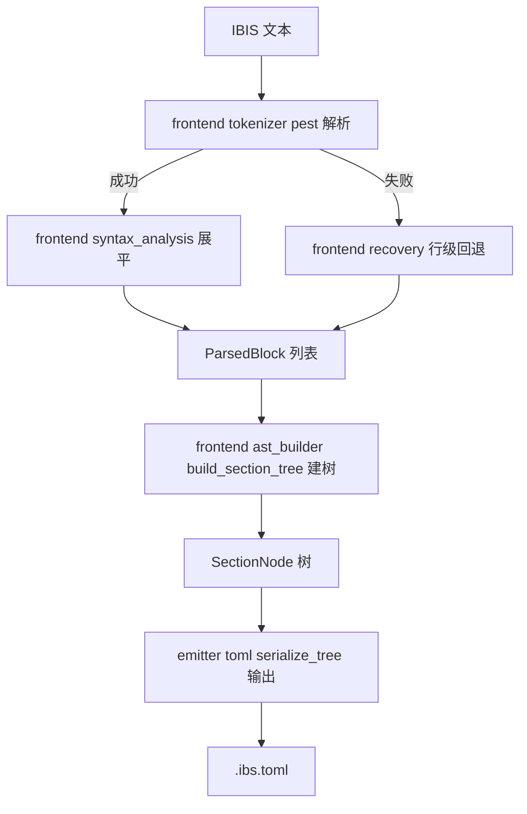
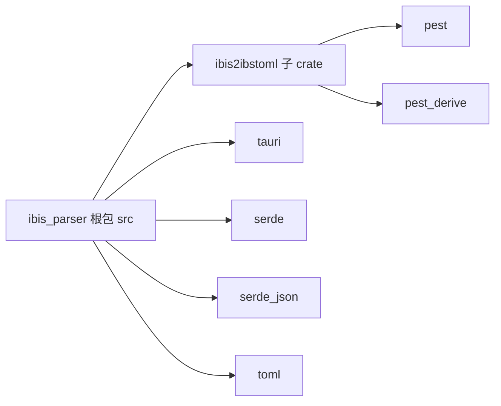

# IBIS Parser 技术方案（v6 多级 AST 树实现 + v7 Cargo Workspace 拆分）

## 1. 设计概述

本方案已实现基于 pest 语法的完整 IBIS 文件解析，采用 **多级 AST 树** 架构：

1. **Pest 语法** — 完整的关键词定义 + 行级内容匹配，`NEWLINE`/`WHITESPACE` 作为显式消耗项
2. **Flat blocks** — pest pairs 展平为 `ParsedBlock` 列表
3. **Section Tree** — 递归构建层次化 `SectionNode` 树
4. **TOML 序列化** — 递归将树序列化为 TOML

---

## 2. Pest 语法设计（当前实现）

### 2.1 关键词命名规范

所有关键词规则遵循 `kw_1级_2级_3级`：

```pest
// ============================ keyword headers ============================
// -------- file header keyword --------
kw_file_header_ibis_ver       = { "[" ~ "IBIS ver" ~ "]" }
kw_file_header_comment_char   = { "[" ~ "Comment Char" ~ "]" }
kw_file_header_file_name      = { "[" ~ "File name" ~ "]" }
kw_file_header_file_rev       = { "[" ~ "File Rev" ~ "]" }
kw_file_header_date           = { "[" ~ "Date" ~ "]" }
kw_file_header_source         = { "[" ~ "Source" ~ "]" }
kw_file_header_notes          = { "[" ~ "Notes" ~ "]" }
kw_file_header_disclaimer     = { "[" ~ "Disclaimer" ~ "]" }
kw_file_header_copyright      = { "[" ~ "Copyright" ~ "]" }

// -------- component keyword --------
kw_component                       = { "[" ~ "Component" ~ "]" }
kw_component_manufacturer          = { "[" ~ "Manufacturer" ~ "]" }
kw_component_package               = { "[" ~ "Package" ~ "]" }
kw_component_pin                   = { "[" ~ "Pin" ~ "]" }
kw_component_pin_mapping           = { "[" ~ "Pin Mapping" ~ "]" }
kw_component_package_model         = { "[" ~ "Package Model" ~ "]" }
kw_component_series_pin_mapping    = { "[" ~ "Series Pin Mapping" ~ "]" }
kw_component_differential_pin_mapping = { "[" ~ "Differential Pin Mapping" ~ "]" }

// -------- model keyword --------
kw_model                          = { "[" ~ "Model" ~ "]" }
kw_model_model_spec               = { "[" ~ "Model Spec" ~ "]" }
kw_model_temperature_range        = { "[" ~ "Temperature Range" ~ "]" }
kw_model_voltage_range            = { "[" ~ "Voltage Range" ~ "]" }
kw_model_pulldown                 = { "[" ~ "Pulldown" ~ "]" }
kw_model_pullup                   = { "[" ~ "Pullup" ~ "]" }
kw_model_gnd_clamp                = { "[" ~ "GND Clamp" ~ "]" }
kw_model_power_clamp              = { "[" ~ "POWER Clamp" ~ "]" }
kw_model_gnd_table                = { "[" ~ "GND Table" ~ "]" }
kw_model_power_table              = { "[" ~ "POWER Table" ~ "]" }
kw_model_ramp                     = { "[" ~ "Ramp" ~ "]" }
kw_model_rising_waveform          = { "[" ~ "Rising Waveform" ~ "]" }
kw_model_falling_waveform         = { "[" ~ "Falling Waveform" ~ "]" }
kw_model_series_current           = { "[" ~ "Series Current" ~ "]" }
kw_model_series_mosfet            = { "[" ~ "Series MOSFET" ~ "]" }
kw_model_threshold_sensitivity    = { "[" ~ "Threshold Sensitivity" ~ "]" }
kw_model_driver_schedule          = { "[" ~ "Driver Schedule" ~ "]" }
kw_model_reference_supply         = { "[" ~ "Reference Supply" ~ "]" }

// -------- submodel keyword --------
kw_submodel                       = { "[" ~ "Submodel" ~ "]" }
kw_submodel_pulldown              = { "[" ~ "Pulldown" ~ "]" }
kw_submodel_pullup                = { "[" ~ "Pullup" ~ "]" }
kw_submodel_gnd_clamp             = { "[" ~ "GND Clamp" ~ "]" }
kw_submodel_power_clamp           = { "[" ~ "POWER Clamp" ~ "]" }
kw_submodel_ramp                  = { "[" ~ "Ramp" ~ "]" }

// -------- external circuit keyword --------
kw_external_circuit               = { "[" ~ "External Circuit" ~ "]" }
kw_external_circuit_circuit_model = { "[" ~ "Circuit Model" ~ "]" }
kw_external_circuit_port_map      = { "[" ~ "Port Map" ~ "]" }

// -------- test data keyword --------
kw_test_data                      = { "[" ~ "Test Data" ~ "]" }

// -------- test load keyword --------
kw_test_load                      = { "[" ~ "Test Load" ~ "]" }
kw_test_load_reference_supply     = { "[" ~ "Reference Supply" ~ "]" }
kw_test_load_pulldown             = { "[" ~ "Pulldown" ~ "]" }
kw_test_load_pullup               = { "[" ~ "Pullup" ~ "]" }
kw_test_load_gnd_clamp            = { "[" ~ "GND Clamp" ~ "]" }
kw_test_load_power_clamp          = { "[" ~ "POWER Clamp" ~ "]" }

// -------- define package model keyword --------
kw_define_package_model           = { "[" ~ "Define Package Model" ~ "]" }
kw_define_package_model_package_model = { "[" ~ "Package Model" ~ "]" }
kw_define_package_model_pin_mapping   = { "[" ~ "Pin Mapping" ~ "]" }

// -------- interconnect model set keyword --------
kw_interconnect_model_set                = { "[" ~ "Interconnect Model Set" ~ "]" }
kw_interconnect_model_set_interconnect_model = { "[" ~ "Interconnect Model" ~ "]" }
kw_interconnect_model_set_port_map       = { "[" ~ "Port Map" ~ "]" }
kw_interconnect_model_set_manchester_encoder = { "[" ~ "Manchester Encoder" ~ "]" }
kw_interconnect_model_set_pin_mapping    = { "[" ~ "Pin Mapping" ~ "]" }

// -------- model selector keyword --------
kw_model_selector                 = { "[" ~ "Model Selector" ~ "]" }
kw_model_selector_model_list      = { "[" ~ "Model List" ~ "]" }

// End marker
kw_end                 = { "[" ~ "End" ~ "]" }
```

### 2.2 Pest 分组规则

```pest
// ======================== keyword container groups ========================
// -------- Generic keyword fallback (for unrecognized keywords) --------
keyword                = @{ "[" ~ (ASCII_ALPHA | "_" | " ")+ ~ "]" }

// -------- first-level container group --------
first_level_keyword = {
    kw_component | kw_model | kw_submodel | kw_external_circuit
    | kw_test_data | kw_test_load | kw_define_package_model
    | kw_interconnect_model_set | kw_model_selector
}

// -------- second-level container group --------
second_level_keyword = {
    kw_file_header_ibis_ver | kw_file_header_comment_char
    | kw_file_header_file_name | kw_file_header_file_rev
    | kw_file_header_date | kw_file_header_source
    | kw_file_header_notes | kw_file_header_disclaimer
    | kw_file_header_copyright
    | kw_component_manufacturer | kw_component_package | kw_component_pin
    | kw_component_pin_mapping | kw_component_package_model
    | kw_component_series_pin_mapping | kw_component_differential_pin_mapping
    | kw_model_model_spec | kw_model_temperature_range | kw_model_voltage_range
    | kw_model_pulldown | kw_model_pullup | kw_model_gnd_clamp
    | kw_model_power_clamp | kw_model_gnd_table | kw_model_power_table
    | kw_model_ramp | kw_model_rising_waveform | kw_model_falling_waveform
    | kw_model_series_current | kw_model_series_mosfet
    | kw_model_threshold_sensitivity | kw_model_driver_schedule
    | kw_model_reference_supply
    | kw_submodel_pulldown | kw_submodel_pullup | kw_submodel_gnd_clamp
    | kw_submodel_power_clamp | kw_submodel_ramp
    | kw_external_circuit_circuit_model | kw_external_circuit_port_map
    | kw_test_load_reference_supply | kw_test_load_pulldown
    | kw_test_load_pullup | kw_test_load_gnd_clamp | kw_test_load_power_clamp
    | kw_define_package_model_package_model | kw_define_package_model_pin_mapping
    | kw_interconnect_model_set_interconnect_model
    | kw_interconnect_model_set_port_map
    | kw_interconnect_model_set_manchester_encoder
    | kw_interconnect_model_set_pin_mapping
    | kw_model_selector_model_list
}
```

### 2.3 空白/换行处理（当前实现）

实际采用 **混合方案**：将 `NEWLINE` 和 `WHITESPACE` 作为 `ibis_file` 中显式可消耗的项，与关键词、内容行、注释并列：

```pest
// -------- basic symbols --------
WHITESPACE  = _{ " " | "\t" }
NEWLINE     = _{ "\r\n" | "\n" | "\r" }

// -------- line-level content (matches one full line) --------
text_line   = @{ (!("\r" | "\n") ~ ANY)* }

// -------- file topology (line-oriented) --------
ibis_file = {
    SOI ~
    ( NEWLINE | WHITESPACE
    | first_level_keyword | second_level_keyword | kw_end | keyword
    | content_line | comment
    )*
    ~ EOI
}
```

**设计要点**：

1. `WHITESPACE` 和 `NEWLINE` 均定义为 `_{ }` 静默规则，不会在 pest pair 树中产生节点
2. `ibis_file` 使用 `~` 操作符（非 `@{ ... }`），因此 WHITESPACE 会在 `~` 连接的序列间自动被消耗
3. `NEWLINE | WHITESPACE` 作为显式的 `()` 分组内备选项，确保 pest 在迭代匹配时能跳过任意数量的空白和换行
4. `text_line` 使用 `@{ ... }` 原子规则匹配单行内容（不含换行符），用于注释行 `| ...` 的匹配
5. `content_line` 使用普通 `{ ... }` 规则，利用 `~` 自动消耗 WHITESPACE 来匹配 `si_number`、`ident` 等 token

---

## 3. Rust 多级 AST 树设计（当前实现）

### 3.1 树节点类型

实际实现简化了 `NodeKind`：仅区分 **FileHeader**（虚拟容器）和 **Regular**（所有真实节段），不再区分 FirstLevel / SecondLevel / Unknown。TOML 序列化时统一使用 `[Section]` 或 `[Parent.Child]` 格式。

```rust
/// Role of a section node in the TOML output.
///
/// The frontend does NOT distinguish array-of-tables (`[[...]]`)
/// from regular tables (`[...]`); that is a backend concern.
#[derive(Debug, Clone, PartialEq)]
enum NodeKind {
    /// `[File_Header]` — virtual container for file header fields.
    FileHeader,
    /// `[Section]` or `[Parent.Child]` — regular section.
    Regular,
}

/// A node in the hierarchical IBIS section tree.
#[derive(Debug, Clone)]
struct SectionNode {
    /// Keyword name (e.g., "Component", "IBIS ver", "Pin").
    keyword: String,
    /// Role determining TOML output format.
    kind: NodeKind,
    /// Content lines belonging directly to this section.
    content: Vec<String>,
    /// Child sections nested under this node.
    children: Vec<SectionNode>,
}
```

### 3.2 树构建算法（当前实现）

已实现递归的 [`build_section_tree`](src/ibis2ibstoml/frontend.rs:289)：

```
build_section_tree(blocks, start_index, stop_rules) → (nodes, next_index)

对 blocks[start_index..] 做以下处理：

Phase A: 文件头收集
  如果当前 block 是文件头字段（通过 is_file_header_field 判断）:
    创建 FileHeader 虚拟父节点（kind: NodeKind::FileHeader）
    收集后续所有连续的文件头字段作为 Regular 子节点
    返回 ([FileHeader 节点], next_index)

Phase B: 一级容器处理
  如果当前 block 的 rule == first_level_keyword:
    创建 Regular 节点（keyword = block.keyword）
    block_index + 1
    递归收集子节点（stop_rules = [first_level_keyword, kw_end]）:
      每个子 block → Regular 子节点（不区分二级或通用）
    返回 ([Regular 节点], next_index)

Phase C: kw_end → 跳过（不输出）
Phase D: 其他 keyword → 作为单例 Regular 节点
```

```rust
fn build_section_tree(
    blocks: &[ParsedBlock],
    start: usize,
    stop_rules: &[Rule],
) -> (Vec<SectionNode>, usize) {
    let mut nodes: Vec<SectionNode> = Vec::new();
    let mut block_index = start;

    // ── Phase A: file header grouping ──
    if block_index < blocks.len() && is_file_header_field(&blocks[block_index]) {
        let mut children: Vec<SectionNode> = Vec::new();
        while block_index < blocks.len() && is_file_header_field(&blocks[block_index]) {
            children.push(SectionNode {
                keyword: blocks[block_index].keyword.clone(),
                kind: NodeKind::Regular,
                content: blocks[block_index].content.clone(),
                children: Vec::new(),
            });
            block_index += 1;
        }
        nodes.push(SectionNode {
            keyword: "File_Header".into(),
            kind: NodeKind::FileHeader,
            content: Vec::new(),
            children,
        });
        return (nodes, block_index);
    }

    // ── Phase B: process remaining blocks ──
    while block_index < blocks.len() {
        let block = &blocks[block_index];

        // Check stop rules
        if stop_rules.contains(&block.rule) {
            break;
        }

        if block.rule == Rule::kw_end {
            // Skip [End] marker
            block_index += 1;
            continue;
        }

        if block.rule == Rule::first_level_keyword {
            // First-level container: create parent node, recursively collect children
            let keyword_name = block.keyword.clone();
            let content = block.content.clone();
            block_index += 1;

            let (children, next_index) = build_section_tree(
                blocks,
                block_index,
                &[Rule::first_level_keyword, Rule::kw_end],
            );
            block_index = next_index;

            nodes.push(SectionNode {
                keyword: keyword_name,
                kind: NodeKind::Regular,
                content,
                children,
            });
        } else {
            // Second-level or generic keyword → child or singleton node
            nodes.push(SectionNode {
                keyword: block.keyword.clone(),
                kind: NodeKind::Regular,
                content: block.content.clone(),
                children: Vec::new(),
            });
            block_index += 1;
        }
    }

    (nodes, block_index)
}
```

### 3.3 树 → TOML 序列化（当前实现）

所有节段统一使用 `[Section]` 或 `[Parent.Child]` 格式。`[[array-of-tables]]` 是后端处理器的职责，前端不做区分。

```rust
fn serialize_tree(
    nodes: &[SectionNode],
    parent_path: &str,
    output_buffer: &mut String,
) {
    for node in nodes {
        let section_name = toml_section_name(&node.keyword);
        let full_path = if parent_path.is_empty() {
            section_name.clone()
        } else {
            format!("{}.{}", parent_path, section_name)
        };

        match node.kind {
            NodeKind::Regular => {
                // [Section] or [Parent.Child] — regular section
                let _ = writeln!(output_buffer, "[{}]", full_path);
                emit_content(output_buffer, &section_name, &node.content);
                let _ = writeln!(output_buffer);
                serialize_tree(&node.children, &full_path, output_buffer);
            }

            NodeKind::FileHeader => {
                // [File_Header] — emit section header then children
                let _ = writeln!(output_buffer, "[{}]", full_path);
                let _ = writeln!(output_buffer);
                if !node.children.is_empty() {
                    serialize_tree(&node.children, &full_path, output_buffer);
                }
            }
        }
    }
}
```

### 3.4 判断文件头字段（当前实现）

使用 `FILE_HEADER_FIELD_NAMES` 常量集 + [`is_file_header_field`](src/ibis2ibstoml/frontend.rs:40) 函数：

```rust
/// Known file header keyword names (for grouping under [File_Header]).
const FILE_HEADER_FIELD_NAMES: &[&str] = &[
    "IBIS ver", "Comment Char", "File name", "File Rev",
    "Date", "Source", "Notes", "Disclaimer", "Copyright",
];

/// Check whether a parsed block is a file header field.
fn is_file_header_field(block: &ParsedBlock) -> bool {
    FILE_HEADER_FIELD_NAMES.contains(&block.keyword.as_str())
}
```

**设计理由**：pest 的 `second_level_keyword` 分组规则匹配后 `pair.as_rule()` 统一返回 `Rule::second_level_keyword`，无法直接区分内层是文件头字段还是组件子字段。在 Rust 端维护已知集合比字符串前缀匹配更精确、更安全。

---

## 4. v6 数据流

```
IBIS 文本
  │
  ▼
[IbisParser::parse(Rule::ibis_file, content)]  ← pest 完整解析
  │  如果失败 → fallback_parse_to_toml 行级回退
  │
  ▼
[group_pairs_to_blocks()]                       ← 将 pest pairs 展平为 ParsedBlock 列表
  │  ├─ first_level_keyword / second_level_keyword / kw_end / keyword → 新 block
  │  └─ content_line → 追加到当前 block 的 content
  │
  ▼
[build_section_tree()]                          ← 递归构建多级 AST 树
  │  ├─ Phase A: 文件头字段 → 收集到 FileHeader 虚拟父节点 kind: FileHeader
  │  ├─ Phase B: first_level_keyword → Regular 节点 + 递归收集子节点
  │  ├─ Phase C: kw_end → 跳过
  │  └─ Phase D: 其他 → 单例 Regular 节点
  │
  ▼
[serialize_tree()]                              ← 递归序列化为 TOML
  │  ├─ NodeKind::FileHeader → [File_Header] + 子节点
  │  └─ NodeKind::Regular → [Section] 或 [Parent.Child]
  │
  ▼
.ibs.toml
```

---

## 5. 实施步骤（当前状态）

### ✅ 步骤 1：重命名 pest 规则（已完成）
- [`ibis.pest`](src/ibis2ibstoml/ibis.pest:99-107) 所有文件头关键词已重命名为 `kw_file_header_*`
- `file_header_keyword` 分组已删除，文件头字段已合并到 `second_level_keyword`

### ✅ 步骤 2：修复 pest 空白/换行处理（已完成）
- [`NEWLINE`](src/ibis2ibstoml/ibis.pest:21) 定义为静默规则
- [`ibis_file`](src/ibis2ibstoml/ibis.pest:199-206) 中 `NEWLINE | WHITESPACE` 作为显式消耗项

### ✅ 步骤 3：实现多级 AST 树（已完成）
- [`NodeKind`](src/ibis2ibstoml/frontend.rs:106-112) 枚举（FileHeader / Regular）和 [`SectionNode`](src/ibis2ibstoml/frontend.rs:114-125) 结构体
- [`build_section_tree()`](src/ibis2ibstoml/frontend.rs:289) 递归构建器
- [`serialize_tree()`](src/ibis2ibstoml/frontend.rs:379) 递归序列化器
- 旧的 `build_toml_from_blocks()` 已删除

### ✅ 步骤 4：更新测试（已完成）
- [`test_parse_to_toml_simple`](src/ibis2ibstoml/frontend.rs:584) 等测试已匹配新命名
- [`test_build_section_tree_file_header`](src/ibis2ibstoml/frontend.rs:675) 和 [`test_build_section_tree_component_with_children`](src/ibis2ibstoml/frontend.rs:688) 覆盖多级嵌套
- 真实 IBIS 样本（`cyclone2.ibs`, `f103c8.ibs` 等）在集成测试中使用

### 🔲 后续待办
- 集成真实 IBIS 样本的端到端测试
- 验证 `[[array-of-tables]]` 后端处理（当前前端统一使用 `[Section]`）

---

## 6. 关键决策记录

| 决策 | 选择 | 理由 |
|------|------|------|
| `kw_1级_2级` 命名 | 所有关键词规则 | 统一规范，命名自解释 |
| 文件头字段分类 | Rust 端 `FILE_HEADER_FIELD_NAMES` 常量 | 避免 pest 分组冗余，集中管理 |
| 空白/换行处理 | `NEWLINE \| WHITESPACE` 作为 `ibis_file` 的显式消耗项 | 避免 pest `~` WS 跳跃的歧义，确保正确匹配真实 IBIS 内容 |
| `NodeKind` 设计 | 仅 `FileHeader` / `Regular` 两个变体 | 简化 AST 类型系统；`[[array-of-tables]]` 留给后端处理 |
| 树结构 | 递归 `build_section_tree()` | 支持任意深度的节段嵌套 |
| TOML 序列化 | 递归 `serialize_tree()` | 与树结构一一对应 |
| pest 分组 vs 具体规则 | `group_pairs_to_blocks` 按 `rule` 分组，具体 `kw_*` 规则在 pest 端 | Rust 端只需处理 `first_level_keyword` / `second_level_keyword` / `keyword` 三种规则类型 |

---

## 7. v7 架构：Cargo Workspace + `ibis2ibstoml` 独立 crate（Pipeline 三段式）

> **修订说明**：本 v7 章节描述的拆分已在代码中实施，但因前端模块命名不合理
> （`parser.rs` / `builder.rs` / `fallback.rs` 等），现将代码**回滚到拆分前的旧代码状态**，
> 并按**修订后的命名**重新实施：
> `tokenizer`（词法）、`syntax_analysis`（语法）、`ast_builder`（抽象语法树）、
> `recovery`（容错）、`mod.rs`（流程编排）+ 新增 crate 级 `core.rs`（公用数据类型）。
> 回滚范围与命名决策见 [7.8 修订记录](#78-修订记录)。

### 7.1 动机

`src/ibis2ibstoml` 的功能持续增多（pest 语法、前端解析、TOML 序列化、行级回退解析、兼容 API、单元测试），
与主 crate 的语义层（`src/ibis_parser`）和 Tauri 应用耦合在同一包内。依据 Rust 官方的 Cargo Workspace 实践，
将其提取为独立 crate，并按 **Pipeline 阶段** 拆分模块，带来：

- **独立演进** — `ibis2ibstoml` 可独立版本化、独立测试、独立发布
- **职责清晰** — 按前端解析 → 后端语义 → 输出三个阶段分层，符合管道模型
- **编译隔离** — 主 crate 不再直接编译 pest 语法生成代码
- **可复用** — 其他工具链可直接依赖 `ibis2ibstoml` crate

### 7.2 Workspace 目标结构（根包 + `crates/` 子 crate）

```text
IBIS_Parser/
├── Cargo.toml                  # [workspace] members=["crates/ibis2ibstoml"] + [package] ibis_parser
├── Cargo.lock
├── src/                        # 根包 ibis_parser（lib + bin），ibis_parser 语义层不动
│   ├── lib.rs                  # pub mod ibis_parser;（主 crate 直接依赖外部 crate ibis2ibstoml）
│   ├── main.rs                 # use ibis2ibstoml::ibs2ibstoml（外部 crate）
│   └── ibis_parser/
│       └── ibis_structure.rs   # 第二层语义 AST（保持不变）
├── crates/
│   └── ibis2ibstoml/           # 独立 crate（由 src/ibis2ibstoml/ 迁出并按 Pipeline 拆分）
│       ├── Cargo.toml          # name = "ibis2ibstoml"，deps: pest, pest_derive
│       └── src/
│           ├── lib.rs                # Crate 入口：暴露 parse_to_toml / ibs2ibstoml
│           ├── core.rs               # 底层基础设施（pest 规则枚举 Rule 等跨阶段共用类型）
│           ├── compat.rs             # 兼容 API（parse_header_line 等，仅供集成测试的遗留工具）
│           ├── frontend/
│           │   ├── mod.rs            # 唯一公开接口 parse：IBIS 文本 → AST 树（子模块私有）
│           │   ├── tokenizer.rs      # 词法分析：IbisParser（pest 规则导出）+ 关键词/内容提取
│           │   ├── syntax_analysis.rs # 语法分析：group_pairs_to_blocks（pairs → 扁平 ParsedBlock）
│           │   ├── ast_builder.rs    # 抽象语法树：AST 数据结构 + build_section_tree（ParsedBlock → 树）
│           │   ├── recovery.rs       # 容错回退解析
│           │   └── ibis.pest         # pest 语法文件
│           ├── backend/
│           │   └── mod.rs      # 预留：后端语义处理 / 数据转换接口
│           └── emitter/
│               ├── mod.rs      # 暴露导出接口
│               └── toml.rs     # serialize_tree / emit_content（AST → TOML）
├── tests/                      # 根包集成测试（header_parse_test.rs + examples/）
├── docs/
└── plans/
```

### 7.3 新 crate 内部模块职责（从原 `frontend.rs` / `core.rs` 拆出）

| 新文件 | 职责 | 从原文件迁出的内容 |
|--------|------|--------------------|
| `src/lib.rs` | Pipeline 组装 + 公共 API | `parse_to_toml`、`ibs2ibstoml`（原 `core.rs`）|
| `src/core.rs` | 底层基础设施 | `pub use crate::frontend::Rule`（pest 规则枚举，跨阶段共用）|
| `src/compat.rs` | 兼容 API（遗留测试工具） | `parse_header_line`、`is_continuation_line`、`parse_continuation_content`、`identify_section_keyword` |
| `frontend/mod.rs` | 唯一公开接口 `parse`：IBIS 文本 → AST 树 | 子模块私有声明 + AST 类型 / `Rule` 重导出 |
| `frontend/tokenizer.rs` | 词法分析 | `IbisParser`（`#[derive(pest_derive::Parser)]`）、`extract_keyword_name`、`extract_line_content`（测试辅助）|
| `frontend/syntax_analysis.rs` | 语法分析 | `group_pairs_to_blocks`（pairs → 扁平 `ParsedBlock` 列表）|
| `frontend/ast_builder.rs` | 抽象语法树 | `NodeKind`、`SectionNode`、`ParsedBlock` + `build_section_tree`（`ParsedBlock` → `SectionNode` 树）+ 文件头分类 |
| `frontend/recovery.rs` | 容错回退解析 | `recover_blocks`（逐行 → 扁平 `ParsedBlock`，供 `parse` 复用建树）|
| `emitter/toml.rs` | TOML 输出 | `escape_toml_string`、`toml_section_name`、`toml_key_name`、`serialize_tree`、`emit_content` |
| `backend/mod.rs` | 预留 | 占位文档（语义处理 / 数据转换接口）|

### 7.4 Pipeline 组装与数据流

`lib.rs` 作为 Crate 入口组装整个 Pipeline：

```rust
// crates/ibis2ibstoml/src/frontend/mod.rs（唯一公开接口）
pub fn parse(content: &str) -> Result<Vec<SectionNode>, String> {
    // 1. tokenizer::IbisParser pest 完整解析（失败 → recovery::recover_blocks 容错回退）
    // 2. syntax_analysis::group_pairs_to_blocks → Vec<ParsedBlock>
    // 3. ast_builder::build_section_tree → Vec<SectionNode>（AST 树）
}

// crates/ibis2ibstoml/src/lib.rs（Crate 入口）
pub fn parse_to_toml(content: &str) -> Result<String, String> {
    let tree = frontend::parse(content)?;            // IBIS → AST 树
    Ok(emitter::toml::serialize_tree_to_string(&tree))
}

/// 文件级 API：读取 .ibs 文件并转换
pub fn ibs2ibstoml<P: AsRef<Path>>(path: P) -> Result<String, String> { ... }
```





### 7.5 依赖与引用方式

- 根包**不重导出** `ibis2ibstoml`，主 crate 仅保留 `pub mod ibis_parser;`（语义层）
- 主 crate 与集成测试通过 crate 级 path 依赖直接 `use ibis2ibstoml::...`
- `tests/header_parse_test.rs` 引用更新：`ibis_parser::ibis2ibstoml::frontend::...` → `ibis2ibstoml::compat::...`（前端仅保留 `parse` 接口）
- `ibs2ibstoml` 由 `core.rs` 上移到新 crate `lib.rs`，主 crate `main.rs` 引用路径改为 `ibis2ibstoml::ibs2ibstoml`

### 7.6 迁移步骤

| # | 操作 | 说明 |
|---|------|------|
| 1 | 更新根 `Cargo.toml` | 增加 `[workspace]`（`members = ["crates/ibis2ibstoml"]`、`resolver = "3"`）；新增 `ibis2ibstoml = { path = "crates/ibis2ibstoml" }`；移除 `pest` / `pest_derive` |
| 2 | 创建 `crates/ibis2ibstoml/Cargo.toml` | `name = "ibis2ibstoml"`，edition 2024，deps: `pest` / `pest_derive` |
| 3 | 迁移代码 | 将 `src/ibis2ibstoml/` 迁入 `crates/ibis2ibstoml/src/`，按 7.3 职责表拆分为 frontend / backend / emitter |
| 4 | 修正 grammar 路径 | `#[grammar = "frontend/ibis.pest"]`（pest_derive 路径相对 `src/`）|
| 5 | 更新根 `src/lib.rs` | 删除 `pub mod ibis2ibstoml;`，仅保留 `pub mod ibis_parser;`（不做重导出），更新 crate 级文档 |
| 6 | 更新根 `src/main.rs` | 删除 `mod ibis2ibstoml;` / `mod ibis_parser;`，`use ibis2ibstoml::ibs2ibstoml;` |
| 7 | 分发单元测试 | 原 `frontend.rs` 的 `#[cfg(test)]` 测试按模块迁入 tokenizer / syntax_analysis / ast_builder / recovery / compat / emitter / lib 对应位置，确保全部保留 |
| 8 | 修正引用 | 新 crate 内文档示例、主 crate 文档、`tests/header_parse_test.rs`：`ibis_parser::ibis2ibstoml::...` → `ibis2ibstoml::...` |
| 9 | 更新 `src/ibis_parser/mod.rs` 文档引用 + `README.md` | 反映 workspace 双 crate 架构 |
| 10 | 删除旧目录 | `src/ibis2ibstoml/` |
| 11 | 验证 | `cargo check --workspace`、`cargo test --workspace` |

### 7.7 关键决策记录（v7）

| 决策 | 选择 | 理由 |
|------|------|------|
| Workspace 布局 | 根包 + `crates/ibis2ibstoml` 子 crate | 符合 Rust 官方 Cargo Workspace 惯例，`src/` 与 `src/ibis_parser` 保持原位 |
| crate 命名 | `ibis2ibstoml` | 与既有模块名一致，避免破坏引用 |
| 内部结构 | frontend / backend / emitter 三段式 | 按 Pipeline 阶段划分，不嵌套多余文件夹 |
| 兼容方式 | 直接依赖 `ibis2ibstoml`，根包不重导出 | 主 crate / 测试直接用 `ibis2ibstoml::...`，依赖边界清晰 |
| 公共 API 位置 | `lib.rs` 组装并暴露 `parse_to_toml` / `ibs2ibstoml` | Crate 入口即 Pipeline 编排点，`core.rs` 合并入 `lib.rs` |
| grammar 关联 | `frontend/ibis.pest` + `#[grammar = "frontend/ibis.pest"]` | 语法文件与模块主程序 `core.rs` 归置同一模块 |
| 依赖归属 | pest / pest_derive 移到新 crate | 语法生成只在 `ibis2ibstoml` 内发生 |

### 7.8 修订记录（回滚 + 重新命名）

| 版本 | 说明 |
|------|------|
| v7a（已回滚） | 首次实施：`frontend/{mod,ast,parser,builder,fallback,compat}.rs` 拆分；`parser.rs` 命名不佳 |
| v7b（当前） | 回滚到拆分前旧代码；按 Pipeline 语义重新命名：`tokenizer` / `syntax_analysis` / `ast_builder` / `recovery` / `mod.rs` + 新增 crate 级 `core.rs` |

**回滚范围**：
- 根 `Cargo.toml`：恢复 `pest` / `pest_derive` 依赖，移除 `[workspace]` 与 `ibis2ibstoml` path 依赖
- 恢复 `src/ibis2ibstoml/{mod.rs, core.rs, frontend.rs, ibis.pest}` 原始文件
- 恢复根 `src/lib.rs`、`src/main.rs`、`tests/header_parse_test.rs`、`src/ibis_parser/mod.rs`、`README.md`
- 删除 `crates/ibis2ibstoml/`

**重新实施**：按 7.2 / 7.3 修订后的目标结构执行（前端命名：`tokenizer` → `syntax_analysis` → `ast_builder` → `recovery`，由 `mod.rs` 编排）。
