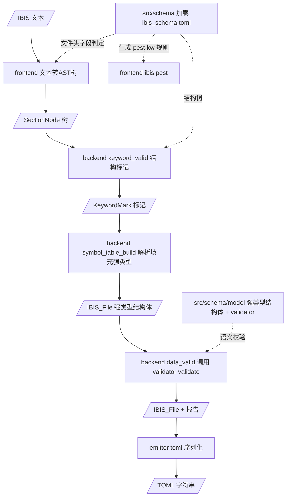

# ibis2ibstoml — ibis_schema.toml + validator 重构方案

> **本文档定位**：针对用户三大痛点（数据散落、模块耦合、缺乏 triplet/table 抽象）的专项重构方案。
> **已确认的决策**：
> 1. 新增公共 `schema/` 文件夹存放 IBIS 规范；
> 2. `ibis_schema.toml` 采用类似 [`plans/ibis_struct.toml`](ibis_struct.toml:1) 的格式，**直接抄手册**；
> 3. **每个 keyword 下必有同名 section**，第一个字段名 = keyword 名本身；有标识符 → `String`/`Option<String>`，**无标识符（空）→ `"()"`**；字段类型看手册；
> 4. 语义校验交给 **`validator` 框架**（`#[derive(Validate)]` + `#[validate(custom(...))]`）挂载到干净强类型结构体；
> 5. 保留干净强类型结构体（`IBISModel` 等），不做通用容器替换；
> 6. 用 `IBISCornerValue`（triplet）/ `IBISTableData`（table）做类型抽象。

---

## 1. 痛点与根因

IBIS 规范数据当前散落在 6 处，同一份信息被复制多遍：

| # | 数据维度 | 现状位置 | 问题 |
|---|---------|---------|------|
| 1 | 关键字作用域树（name/occurrence/required） | [`backend/keyword.rs`](../crates/ibis2ibstoml/src/backend/keyword.rs:314) | Rust 代码承载，改规范需改代码 |
| 2 | 单位 / 3.2 语法规则 | [`backend/spec.rs`](../crates/ibis2ibstoml/src/backend/spec.rs:1) | Rust 代码承载 |
| 3 | content 字段解析 | [`backend/symbol_table_build.rs`](../crates/ibis2ibstoml/src/backend/symbol_table_build.rs:148) | 硬编码在 `build_*` 函数 |
| 4 | 校验字段清单 | [`backend/data_valid.rs`](../crates/ibis2ibstoml/src/backend/data_valid.rs:87) | 硬编码（corner / IV 曲线 / 必填清单） |
| 5 | 输出字段清单 | [`emitter/toml.rs`](../crates/ibis2ibstoml/src/emitter/toml.rs:228) | 硬编码每个 struct 输出 |
| 6 | 前端关键词 / 文件头字段 | [`frontend/ibis.pest`](../crates/ibis2ibstoml/src/frontend/ibis.pest:58)、[`frontend/ast_builder.rs`](../crates/ibis2ibstoml/src/frontend/ast_builder.rs:56) | 重复副本 |

**分工**（本方案的目标）：
- **IBIS 结构（keyword 树 + 同名 section + content 字段 + 类型）** → 唯一存放于 `ibis_schema.toml`（还能生成 pest、当示例模板）；
- **语义校验** → 干净强类型结构体 + `validator` 声明式挂载；
- **数值化原语** → `unit.rs`（保留）。

---

## 2. 目标架构



**核心原则**：

- **IBIS 结构单一来源**：`ibis_schema.toml` 是 IBIS 手册结构的唯一存放位置；backend 结构校验、frontend pest / 文件头判定都从它读取。
- **同名 section 承载 content**：每个 keyword 下必有同名 section（**哪怕为空**），第一个字段名 = keyword 名本身；有标识符 → `String`/`Option<String>`，无标识符（空）→ `"()"`。
- **校验声明式**：语义校验（corner 范围、IV 单调性、必填、引用）用 `validator` 属性**隐式挂载**到结构体字段。
- **类型抽象**：`IBISCornerValue`（triplet）/ `IBISTableData`（table）/ `ViPoint` 作为复用抽象。
- **改规范只改 schema**：结构增删改 → 改 `ibis_schema.toml`；语义规则 → 改结构体 validator 属性。

---

## 3. ibis_schema.toml（直接抄手册）

### 3.1 核心约定

> **每个 keyword 下都有一个与之同名的 section，这个 section 书写规范中紧跟 keyword 后面的字符。该 section 的第一个字段名 = keyword 名本身：**
> - **有标识符** → `"Keyword" = "String"` / `"Option<String>"`（如 `"Model" = "String"`、`"SI Location" = "Option<String>"`）；
> - **无标识符（空类型）** → `"Keyword" = "()"`（如 `"Package" = "()"`、`"Pulldown" = "()"`），表示该 keyword 自身没有标识符值；
> - 其余字段 = keyword 后紧随的列 / 值，字段类型看手册。
>
> **同名 section 必须存在——哪怕它是空的**（即 keyword 没有 content 字段时也要写出同名 section 表头，第一行 `"Keyword" = "()"`），保证 `ibis_schema.toml` 完整覆盖全部 keyword。

例（IBIS 原文）：
```
[Pin]  signal_name          model_name           R_pin     L_pin     C_pin
[Manufacturer]   STMicroelectronics NV
```
- `[Pin]` 的同名 section 第一个字段 `"Pin"`（标识符，`String`），随后是 `signal_name model_name R_pin L_pin C_pin` 列；
- `[Manufacturer]` 的同名 section 第一个字段 `"Manufacturer"`（`String`），值即 `STMicroelectronics NV`。

### 3.2 字段类型检查（String / Option<String> / ()）

基于现有强类型模型（[`ibis_structure.rs`](../crates/ibis2ibstoml/src/backend/ibis_structure.rs:1)）与真实样本（[`tests/examples/*.ibs`](../tests/examples)）核对，**每个 keyword 同名 section 的第一个字段类型**如下：

| keyword | 第一个字段（= keyword 名） | 类型 | 说明 |
|---------|---------------------------|------|------|
| `[IBIS ver]` | "IBIS ver" | `String` | 必填 |
| `[Comment Char]` | "Comment Char" | `Option<String>` | 可选 |
| `[File name]` / `[File Rev]` | 同名 | `String` | 必填 |
| `[Date]` `[Source]` `[Notes]` `[Disclaimer]` `[Copyright]` | 同名 | `Option<String>` | 可选 |
| `[Component]` | "Component" | `String` | 组件名 |
| `[SI Location]` `[Timing Location]` | 同名 | `Option<String>` | 可选 |
| `[Manufacturer]` | "Manufacturer" | `String` | 必填 |
| `[Package]` | "Package" | `()` | **空类型**：无标识符，content 为 R_pkg/L_pkg/C_pkg 三元组 |
| `[Pin]` | "Pin" | `String` | 行式表，pin 名 |
| `[Pin Mapping]` | "Pin Mapping" | `String` | 行式表，pin 名 |
| `[Package Model]` | "Package Model" | `String` | 选择器名 |
| `[Diff Pin]` | "Diff Pin" | `String` | 行式表 |
| `[Bus Label]` `[Die Supply Pads]` `[Series Pin Mapping]` `[Series Switch Groups]` `[Circuit Call]` | 同名 | `String` | 行式表 / 单值 |
| `[Node Declarations]` | "Node Declarations" | `()` | **空类型**：content 为多行文本 |
| `[Model]` | "Model" | `String` | 模型名（符号表 key） |
| `[Model Spec]` `[Receiver Thresholds]` | 同名 | `()` | **空类型**：content 为字段行（Vinh 等） |
| `[Temperature Range]` `[Voltage Range]` | 同名 | `()` | **空类型**：content 即三元组 |
| `[Ramp]` | "Ramp" | `()` | **空类型**：content 为 dv/dt_r dv/dt_f R_load |
| `[Pulldown]` `[Pullup]` `[GND Clamp]` `[Power Clamp]` | 同名 | `()` | **空类型**：content 为 IV 曲线表 |
| `[Rising Waveform]` `[Falling Waveform]` | 同名 | `()` | **空类型**：content 为夹具参数 |
| `[Submodel]` | "Submodel" | `String` | 子模型名 |
| `[External Circuit]` | "External Circuit" | `String` | language |
| `[Test Data]` | "Test Data" | `String` | 测试名 |
| `[Test Load]` | "Test Load" | `String` | 负载名 |
| `[Define Package Model]` | "Define Package Model" | `String` | 封装模型名 |
| `[Interconnect Model Set]` | "Interconnect Model Set" | `String` | 互连模型集名 |
| `[Model Selector]` | "Model Selector" | `String` | 选择器名 |

> **结论**：
> - **空类型（`()`）**：`Package`、`Node Declarations`、`Model Spec`、`Receiver Thresholds`、`Temperature Range`、`Voltage Range`、`Ramp`、`Pulldown`、`Pullup`、`GND Clamp`、`Power Clamp`、`Rising Waveform`、`Falling Waveform` 等——同名 section 第一行 `"Keyword" = "()"`；
> - **`Option<String>`**：文件头可选字段（`Comment Char` / `Date` / `Source` / `Notes` / `Disclaimer` / `Copyright`）与 `SI Location` / `Timing Location`；
> - **`String`**：其余带标识符的节段（顶层节段与行式表）。

### 3.3 格式与示例

直接采用 [`ibis_struct.toml`](ibis_struct.toml:1) 的风格：表头表达层级与同名 section，`[[...]]` 表达多实例，`key = "Type"` 表达 content 字段与类型。字段名保留 IBIS 原始名（TOML 引号 key）。

```toml
# ============================================================
# ibis_schema.toml — IBIS 7.0 结构（唯一 IBIS 结构数据源）
#
# 核心约定：
#   - 每个 keyword 下都有同名 section（哪怕它是空的）；
#   - 第一个字段名 = keyword 名本身；
#       有标识符 → "Keyword" = "String" / "Option<String>"
#       无标识符   → "Keyword" = "()"
#   - 其余字段 = 紧跟 keyword 后的字符（列 / 值），类型看手册。
#
# 格式（与 ibis_struct.toml 一致）：
#   [Section]       单实例 keyword 的同名 section（TOML 单表）
#   [[Section]]     多实例 keyword 的同名 section（TOML 数组表）
#
# 用途：backend 结构校验、frontend pest 生成、示例模板
# ============================================================

# ---------- 文件头（虚拟容器，其字段名即 keyword 名） ----------
[File_Header]
"IBIS ver" = "String"
"Comment Char" = "Option<String>"
"File name" = "String"
"File Rev" = "String"
"Date" = "Option<String>"
"Source" = "Option<String>"
"Notes" = "Option<String>"
"Disclaimer" = "Option<String>"
"Copyright" = "Option<String>"

# ---------- Component ----------
[[Component]]
"Component" = "String"           # 第一个字段 = keyword 名 = 组件名
"SI Location" = "Option<String>"
"Timing Location" = "Option<String>"

    # [Manufacturer] 的同名 section
    [Component.Manufacturer]
    "Manufacturer" = "String"

    # [Package] 的同名 section（空类型：无标识符）
    [Component.Package]
    "Package" = "()"
    "R_pkg" = "IBISCornerValue"
    "L_pkg" = "IBISCornerValue"
    "C_pkg" = "IBISCornerValue"

    # [Pin] 的同名 section（行式表：第一字段为 pin 名）
    [[Component.Pin]]
    "Pin" = "String"
    "signal_name" = "String"
    "model_name" = "String"
    "R_pin" = "Option<f64>"
    "L_pin" = "Option<f64>"
    "C_pin" = "Option<f64>"

    # [Pin Mapping] 的同名 section（行式表）
    [[Component.Pin_Mapping]]
    "Pin Mapping" = "String"
    "pulldown_ref" = "String"
    "pullup_ref" = "String"
    "gnd_clamp_ref" = "Option<String>"
    "power_clamp_ref" = "Option<String>"
    "ext_ref" = "Option<String>"

    # [Node Declarations] 的同名 section（空类型）
    [Component.Node_Declarations]
    "Node Declarations" = "()"
    # ... 其余子节段

# ---------- Model ----------
[[Model]]
"Model" = "String"               # 第一个字段 = keyword 名 = 模型名
"Model_type" = "String"
"Polarity" = "Option<String>"
"Enable" = "Option<String>"
"C_comp" = "Option<IBISCornerValue>"
"Vref" = "Option<f64>"
# ...

    # [Model Spec] 的同名 section（空类型）
    [Model.Model_Spec]
    "Model Spec" = "()"
    "Vinh" = "Option<f64>"
    "Vinl" = "Option<f64>"
    # ...

    # [Temperature Range] 的同名 section（空类型：content 即三元组）
    [Model.Temperature_Range]
    "Temperature Range" = "()"
    "value" = "IBISCornerValue"

    [Model.Voltage_Range]
    "Voltage Range" = "()"
    "value" = "IBISCornerValue"

    # [Ramp] 的同名 section（空类型）
    [Model.Ramp]
    "Ramp" = "()"
    "dv/dt_r" = "IBISCornerValue"
    "dv/dt_f" = "IBISCornerValue"
    "R_load" = "Option<f64>"

    # [Pulldown] 的同名 section（空类型：IV 曲线表）
    [Model.Pulldown]
    "Pulldown" = "()"
    "data" = "IBISTableData"

    [Model.Pullup]
    "Pullup" = "()"
    "data" = "IBISTableData"

    [[Model.Rising_Waveform]]
    "Rising Waveform" = "()"
    "R_fixture" = "Option<f64>"
    "V_fixture" = "Option<f64>"
    # ...

# ---------- 其余一级节段 ----------
[[Submodel]]
"Submodel" = "String"
# ...

[[External_Circuit]]
"External Circuit" = "String"
# ...

[[Test_Data]]
"Test Data" = "String"
# ...

[[Test_Load]]
"Test Load" = "String"
# ...

[[Define_Package_Model]]
"Define Package Model" = "String"
# ...

[[Interconnect_Model_Set]]
"Interconnect Model Set" = "String"
# ...

[[Model_Selector]]
"Model Selector" = "String"
# ...
```

> **语义要点**：
> - `[Section]` vs `[[Section]]` 直接表达 occurrence（once / multiple），与 emitter 的 `[...]` / `[[...]]` 对齐；
> - 有标识符的 keyword 同名 section **第一个字段 = keyword 名本身**，作为实例标识符 / 符号表 key（如 `Model`、`Component`、`Pin`）；
> - **空类型 section**（`Package` / `Pulldown` / `Ramp` / `Temperature Range` 等）第一行 `"Keyword" = "()"`，表示无标识符，其后是 content 字段（三元组用 `IBISCornerValue`、曲线/表用 `IBISTableData`）；
> - 字段类型字符串（`String` / `Option<String>` / `Option<f64>` / `IBISCornerValue` / `IBISTableData` / `()`）即"字段的类型"，直接抄手册；
> - 不承载校验规则（如 min ≤ typ ≤ max）——语义校验由结构体 + validator 负责；
> - **行式表 / 通用表**：本方案先采用第一种写法（keyword 名 + 逐列字段）；"整表直接抄入"（如 `"pin_table" = # ...`）的第二种写法会带来抽象建模压力，**暂不采用**。

### 3.4 Rust 侧加载（`schema/mod.rs`）

```rust
//! schema — IBIS 结构规范数据源。

pub mod model;   // 强类型结构体 + validator（见第 4 节）

#[derive(Debug, Clone, PartialEq, Eq)]
pub enum Occurrence { Once, Multiple }

/// 加载后的节段结构（由 ibis_schema.toml 反序列化）。
pub struct SectionSpec {
    pub name: String,            // 节段名（如 "Model" / "Pin"）
    pub occurrence: Occurrence,  // 由 [..]/[[..]] 推断
    pub fields: Vec<FieldSpec>,  // content 字段（第一个字段 = keyword 名）
    pub children: Vec<SectionSpec>, // 子节段（递归）
}

pub struct FieldSpec {
    pub key: String,             // content 字段名（如 "IBIS ver" / "Pin" / "signal_name"）
    pub type_name: String,       // 类型字符串（"String" / "()" / "IBISCornerValue" ...）
}

/// 加载并解析 ibis_schema.toml（include_str! + toml），产出根节段列表。
pub fn load_schema() -> Vec<SectionSpec>;

/// 归一化：小写 + `_`/空格等价（3.2 §7），用作查找 key。
pub fn normalize_keyword(keyword: &str) -> String;
```

- 加载器用 `toml::Value` 遍历：`Table` → 单实例节段，`ArrayOfTables` → 多实例节段；成员中 `Value::String` 为 content 字段（key + 类型），`Value::Table` 为子节段（递归）；
- 提供 `find_root(name)` / `find_child(spec, name)` 辅助（迁移自 `keyword.rs`）。

---

## 4. 强类型结构体 + validator（`schema/model.rs`）

### 4.1 类型抽象（triplet / table）

```rust
/// 角点三元组：typ / min / max（triplet 抽象）。
#[derive(Debug, Clone, PartialEq, Default, Serialize, Deserialize)]
pub struct IBISCornerValue {
    pub typ: f64,
    pub min: Option<f64>,
    pub max: Option<f64>,
}

/// 通用表格数据（table 抽象）：首行列头，其余行为数值行。
#[derive(Debug, Clone, PartialEq, Default, Serialize, Deserialize)]
pub struct IBISTableData {
    pub columns: Vec<String>,
    pub rows: Vec<Vec<f64>>,
}

/// IV/VT 曲线数据点（表格的特化形态）。
#[derive(Debug, Clone, PartialEq, Serialize, Deserialize)]
pub struct ViPoint {
    pub voltage: f64,
    pub i_typ: f64,
    pub i_min: Option<f64>,
    pub i_max: Option<f64>,
}
```

### 4.2 干净结构体 + validator 挂载

沿用用户给出的示例风格，全部 IBIS 结构体集中于此文件：

```rust
#[derive(Debug, Clone, PartialEq, Default, Serialize, Deserialize, Validate)]
pub struct IBISModel {
    pub model: String,
    pub model_type: String,

    // 针对特定语义，隐式挂载对应的 validator 校验函数
    #[validate(custom(function = "validate_corner_temp"))]
    pub temperature_range: Option<IBISCornerValue>,

    #[validate(custom(function = "validate_iv_monotonicity"))]
    pub pulldown: Option<IBISTableData>,

    #[validate(custom(function = "validate_iv_monotonicity"))]
    pub pullup: Option<IBISTableData>,
    // ... 其余字段
}

/// corner 范围校验：min ≤ typ ≤ max（挂载到各 IBISCornerValue 字段）。
pub fn validate_corner_temp(corner: &Option<IBISCornerValue>) -> Result<(), ValidationError> {
    if let Some(corner) = corner {
        if let Some(min) = corner.min {
            if corner.typ < min {
                return Err(validation_error("min 超过 typ"));
            }
        }
        if let Some(max) = corner.max {
            if corner.typ > max {
                return Err(validation_error("typ 超过 max"));
            }
        }
    }
    Ok(())
}

/// IV/VT 单调性校验：电压严格递增（挂载到各曲线字段）。
pub fn validate_iv_monotonicity(table: &Option<IBISTableData>) -> Result<(), ValidationError> {
    if let Some(table) = table {
        let mut previous: Option<f64> = None;
        for row in &table.rows {
            let voltage = row.first().copied().unwrap_or(0.0);
            if let Some(previous_voltage) = previous {
                if voltage <= previous_voltage {
                    return Err(validation_error("电压未严格递增"));
                }
            }
            previous = Some(voltage);
        }
    }
    Ok(())
}
```

### 4.3 根容器

```rust
#[derive(Debug, Clone, Default, Serialize, Deserialize, Validate)]
pub struct IBISFile {
    #[validate] pub header: IBISFileHeader,
    #[validate] pub components: Vec<IBISComponent>,
    #[validate] pub models: IndexMap<String, IBISModel>,
    #[validate] pub submodels: IndexMap<String, IBISSubmodel>,
    // ... 其余一级节段
}
```

> `#[validate]` 递归校验子结构体（validator 支持嵌套）。
> **必填校验**用 validator 内置 `#[validate(required)]`（或自定义函数）替代 `data_valid` 的硬编码必填清单。

---

## 5. 各模块改造

| 模块 | 现状 | 改造后 |
|------|------|--------|
| [`schema/mod.rs`](../crates/ibis2ibstoml/src/schema/mod.rs) + `ibis_schema.toml` | 不存在 | 新建：手册结构 TOML + 加载 + 辅助函数 |
| [`schema/model.rs`](../crates/ibis2ibstoml/src/schema/model.rs) | 不存在 | 新建：强类型结构体 + triplet/table 抽象 + validator 校验函数 |
| [`backend/keyword.rs`](../crates/ibis2ibstoml/src/backend/keyword.rs:1) | 关键字作用域树 | **废弃**；数据迁入 `ibis_schema.toml`，`normalize_keyword` 迁入 schema |
| [`backend/spec.rs`](../crates/ibis2ibstoml/src/backend/spec.rs:1) | 单位/语法/内容规则 | 单位换算与 3.2 语法规则并入 `unit.rs`；内容校验规则由 validator 承担 |
| [`backend/ibis_structure.rs`](../crates/ibis2ibstoml/src/backend/ibis_structure.rs:1) | 强类型模型 | 内容迁入 `schema/model.rs`（加 serde + validator），本文件废弃或保留为空壳 |
| [`backend/unit.rs`](../crates/ibis2ibstoml/src/backend/unit.rs:1) | 数值化原语 | 保留：`parse_opt_f64` / `parse_triplet` → `IBISCornerValue` / `parse_vi_points` / `strip_inline_comment` |
| [`backend/keyword_valid.rs`](../crates/ibis2ibstoml/src/backend/keyword_valid.rs:50) | 遍历 `KEYWORD_REGISTRY` | 数据源切换为 `load_schema()`（逻辑不变） |
| [`backend/symbol_table_build.rs`](../crates/ibis2ibstoml/src/backend/symbol_table_build.rs:35) | 硬编码 `build_*` 产出强类型 | 保留 per-section build 函数（集中于此文件），解析填充 `schema/model.rs` 结构体；`required` 由结构体/validator 表达 |
| [`backend/data_valid.rs`](../crates/ibis2ibstoml/src/backend/data_valid.rs:23) | 硬编码校验清单 | **替换**为：对 `IBISFile` 调用 `.validate()`，将 `ValidationErrors` 映射为 `SemanticError` / `ValidationReport` |
| [`backend/mod.rs`](../crates/ibis2ibstoml/src/backend/mod.rs:191) | `semantic_parse → IBIS_File` | 返回 `schema::model::IBISFile`（强类型），错误模型沿用 |
| [`emitter/toml.rs`](../crates/ibis2ibstoml/src/emitter/toml.rs:370) | 硬编码每个 struct 输出 | 遍历强类型 `IBISFile` 输出；`[[...]]` 由 `Vec`/`IndexMap` 集合字段推断（现状不变） |
| [`frontend/ast_builder.rs`](../crates/ibis2ibstoml/src/frontend/ast_builder.rs:56) | 硬编码 9 个文件头字段 | `is_header_field_keyword` 改为从 `load_schema()` 的 `File_Header` 字段读取 |
| [`frontend/ibis.pest`](../crates/ibis2ibstoml/src/frontend/ibis.pest:58) | `kw_*` 规则手写 | 保留（兼容），新增 build.rs 或脚本从 `ibis_schema.toml` **生成 `kw_*` 规则**（消除重复副本） |
| [`Cargo.toml`](../crates/ibis2ibstoml/Cargo.toml:1) | deps: pest / pest_derive / indexmap | **新增 `serde`(derive) + `toml` + `validator`(derive)** |

### 5.1 校验流程（data_valid → validator）

```rust
pub fn data_valid(file: &IBISFile, collector: &mut ValidationCollector) {
    match file.validate() {
        Ok(()) => {}
        Err(errors) => {
            for (path, field_errors) in errors.field_errors() {
                for field_error in field_errors {
                    collector.error(SemanticError::from_validator(path, field_error));
                }
            }
        }
    }
}
```

> `SemanticError` 新增 `from_validator(path, error)` 构造，把 validator 错误映射为既有错误模型（`ValueOrderViolation` / `NonMonotonicCurve` / `MissingRequiredField` 等），严格 / 宽松双模式不变。

### 5.2 解析（symbol_table_build）

- 结构体字段类型即"content 字段类型"：`String` / `Option<f64>` / `Option<IBISCornerValue>` / `Option<IBISTableData>` / `Vec<ViPoint>` 等；
- `build_model` 等函数按字段类型调用 `unit.rs` 原语解析（现状逻辑复用，仅类型名从 `ibis_structure` 改为 `schema::model`）；
- 数值化失败仍记 `InvalidNumber` / `TableMalformed`，宽松模式以 `None` / 默认值占位。

### 5.3 pest 生成（可选增强）

- 新增 `build.rs`：读 `ibis_schema.toml` → 生成 `kw_<一级>_<二级>` 规则文本 → 写入生成文件（如 `out/pest_keywords.pest`），由 `ibis.pest` 引入；
- 首期可先做**一致性测试**（从 `load_schema()` 提取节段名，断言与 pest `kw_*` 覆盖一致），build.rs 生成列为后续增强。

---

## 6. 兼容性与测试策略

### 6.1 根包兼容层

- [`src/ibis_parser/mod.rs`](../src/ibis_parser/mod.rs:12) 由 re-export `ibis_structure` 改为 re-export `ibis2ibstoml::schema::model`（`IBISFile` / `IBISModel` / `IBISCornerValue` 等），保持 `ibis_parser::*` 路径可用；
- [`tests/header_parse_test.rs`](../tests/header_parse_test.rs:23) 改用 `schema::model::IBISFileHeader`（或经 emitter 验证）；
- [`src/main.rs`](../src/main.rs:8) / [`src/lib.rs`](../src/lib.rs:35) 仅调 `ibs2ibstoml`，无需改动。

### 6.2 测试

| 层级 | 位置 | 覆盖 |
|------|------|------|
| schema 加载单测 | `schema/mod.rs` | `ibis_schema.toml` 可解析、结构完整、**每个 keyword 必有同名 section（哪怕为空）**、无重复节段名、首字段类型正确 |
| schema↔pest 一致性 | 集成 | 从 `load_schema()` 提取节段名，断言与 pest `kw_*` 一致 |
| validator 单测 | `schema/model.rs` | corner 范围、IV 单调性、必填、嵌套校验 |
| 解析器单测 | `backend/symbol_table_build.rs` | 各字段类型解析、`NA` → `None`、失败占位 |
| 校验集成 | `backend/mod.rs` | `.validate()` 错误 → `SemanticError` / `ValidationReport` |
| 输出单测 | `emitter/toml.rs` | 强类型 → TOML（含 `[[...]]` / triplet / table） |
| 集成 | `tests/examples_compat_test.rs` | 真实样本全量转换 + `[File_Header]` 断言 |

### 6.3 演进顺序

1. 新增依赖（serde / toml / validator），新建 `src/schema/`：`ibis_schema.toml`（抄手册格式，按 3.2 检查表标注类型）+ `mod.rs` + `model.rs`（先迁移 keyword 树与强类型结构体）；
2. 为结构体挂 validator 校验函数，`data_valid` 改为 `.validate()`；
3. 切换 `keyword_valid` 数据源、适配 `backend/mod.rs` 与 `symbol_table_build`；
4. 前端 `header_field` 从 schema 读取，pest 生成评估；
5. 更新根包 re-export 与测试；
6. 更新架构文档。

---

## 7. 关键决策记录（ADR）

| 决策 | 选择 | 理由 |
|------|------|------|
| IBIS 结构数据源 | `ibis_schema.toml`（`[Section]`/`[[Section]]` + `key = "Type"`，直接抄手册） | 声明式、易编辑、可生成 pest / 当 example；`[[...]]` 天然表达 occurrence |
| 同名 section 约定 | 每个 keyword 下必有同名 section（**哪怕为空**）；第一个字段 = keyword 名本身 | 直接映射手册；schema 完整覆盖全部 keyword |
| 空类型表达 | 无标识符 keyword 的第一行 `"Keyword" = "()"` | 统一格式；空类型也显式声明 |
| 字段类型判定 | 空类型 `()`、`Option<String>`（文件头可选 / SI Location）、`String`（其余标识符节段） | 基于现有结构体与样本核对 |
| 行式表写法 | 采用第一种（keyword 名 + 逐列字段）；不采用"整表抄入" | 避免抽象建模压力 |
| 字段类型表达 | TOML 值直接写类型字符串（`String` / `Option<f64>` / `IBISCornerValue` / `IBISTableData` / `()`） | 简洁直接，与 `ibis_struct.toml` 对齐 |
| 语义校验 | `validator` 框架 `#[derive(Validate)]` + `#[validate(custom(...))]` 隐式挂载 | 校验规则随结构体字段声明，替代 data_valid 硬编码清单 |
| 类型抽象 | `IBISCornerValue`（triplet）/ `IBISTableData`（table）/ `ViPoint` | 满足"triplet/table 抽象"诉求 |
| 强类型模型 | 保留干净结构体（集中 `schema/model.rs`） | 契合 validator 声明式校验与 serde 输出 |
| 解析 | 保留 per-section build 函数（集中），按结构体字段类型调用 `unit.rs` 原语 | 结构体即字段清单，build 函数为机械填充 |
| 校验触发 | 对 `IBISFile.validate()`，映射 `ValidationErrors` → `SemanticError` | 严格 / 宽松双模式不变 |
| pest | 保留手写 + 一致性测试；后续 build.rs 从 TOML 生成 `kw_*` | 消除前端 keyword 副本 |
| 根包兼容 | re-export 切换为 `schema::model` | 保持 `ibis_parser::*` 路径可用 |
